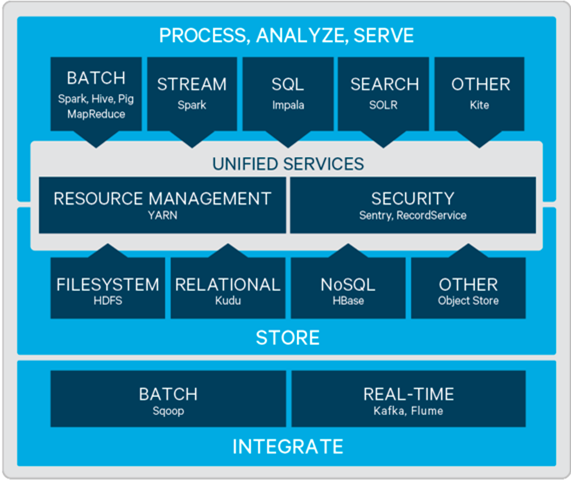
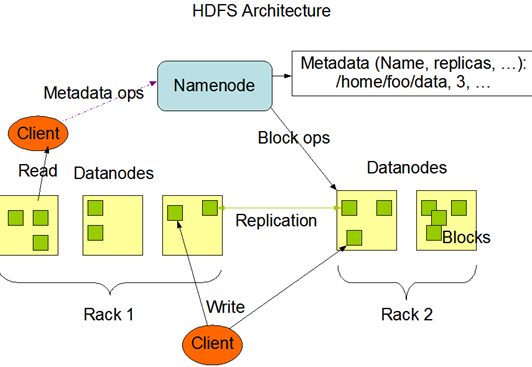

### 大数据

#### 01 大数据

**大数据启蒙**

▪分而治之

▪并行计算

▪计算向数据移动

▪数据本地化读取

▪以上这些点是学习大数据技术时需要关心的重点

**大数据生态**



**hadoop-hdfs**

分布式文件系统那么多为什么hadoop项目中还要开发一个hdfs文件系统？

原因主要是hdfs数据读取 ：下载一个文件其实是获取文件的所有的block元数据，那么子集获取某些block应该成立。Hdfs支持client给出文件的offset自定义连接哪些block的DN，自定义获取数据
这个是支持计算层的分治、并行计算的核心。

**hadoop-hdfs 理论知识点**

•存储模型：

```xml
文件线性按字节切割成块(block)，具有offset，id
文件与文件的block大小可以不一样
一个文件除最后一个block，其他block大小一致
block的大小依据硬件的I/O特性调整
block被分散存放在集群的节点中，具有location
Block具有副本(replication)，没有主从概念，副本不能出现在同一个节点
副本是满足可靠性和性能的关键
文件上传可以指定block大小和副本数，上传后只能修改副本数
一次写入多次读取，不支持修改
支持追加数据
```

•架构设计：

```xml
HDFS是一个主从(Master/Slaves)架构
由一个NameNode和一些DataNode组成
面向文件包含：文件数据(data)和文件元数据(metadata)
NameNode负责存储和管理文件元数据，并维护了一个层次型的文件目录树
DataNode负责存储文件数据(block块)，并提供block的读写
DataNode与NameNode维持心跳，并汇报自己持有的block信息
Client和NameNode交互文件元数据和DataNode交互文件block数据
```




•角色功能

```xm;
NameNode
完全基于内存存储文件元数据、目录结构、文件block的映射
需要持久化方案保证数据可靠性
提供副本放置策略
DataNode
基于本地磁盘存储block(文件的形式)
并保存block的校验和数据保证block的可靠性
与NameNode保持心跳，汇报block列表状态
```

•元数据持久化

```xml
任何对文件系统元数据产生修改的操作，Namenode都会使用一种称为EditLog的事务日志记录下来
使用FsImage存储内存所有的元数据状态
使用本地磁盘保存EditLog和FsImage
EditLog具有完整性，数据丢失少，但恢复速度慢，并有体积膨胀风险
FsImage具有恢复速度快，体积与内存数据相当，但不能实时保存，数据丢失多
NameNode使用了FsImage+EditLog整合的方案：
滚动将增量的EditLog更新到FsImage，以保证更近时点的FsImage和更小的EditLog体积
```

•安全模式

```xml
Namenode启动后会进入一个称为安全模式的特殊状态。
处于安全模式的Namenode是不会进行数据块的复制的。
Namenode从所有的 Datanode接收心跳信号和块状态报告。
每当Namenode检测确认某个数据块的副本数目达到这个最小值，那么该数据块就会被认为是副本安全(safely replicated)的。
在一定百分比（这个参数可配置）的数据块被Namenode检测确认是安全之后（加上一个额外的30秒等待时间），Namenode将退出安全模式状态。
接下来它会确定还有哪些数据块的副本没有达到指定数目，并将这些数据块复制到其他Datanode上。
```

•副本放置策略

```xml
第一个副本：放置在上传文件的DN；如果是集群外提交，则随机挑选一台磁盘不太满，CPU不太忙的节点。
第二个副本：放置在于第一个副本不同的 机架的节点上。
第三个副本：与第二个副本相同机架的节点。
更多副本：随机节点。
```

•读写流程:  提供流式计算也可以看做变种的并行计算

```xml
<!--写流程-->
Client和NN连接创建文件元数据
NN判定元数据是否有效
NN处发副本放置策略，返回一个有序的DN列表
Client和DN建立Pipeline连接
Client将块切分成packet（64KB），并使用chunk（512B）+chucksum（4B）填充
Client将packet放入发送队列dataqueue中，并向第一个DN发送
第一个DN收到packet后本地保存并发送给第二个DN
第二个DN收到packet后本地保存并发送给第三个DN
这一个过程中，上游节点同时发送下一个packet
生活中类比工厂的流水线：结论：流式其实也是变种的并行计算
Hdfs使用这种传输方式，副本数对于client是透明的
当block传输完成，DN们各自向NN汇报，同时client继续传输下一个block
所以，client的传输和block的汇报也是并行的

<!--读流程-->
为了降低整体的带宽消耗和读取延时，HDFS会尽量让读取程序读取离它最近的副本。
如果在读取程序的同一个机架上有一个副本，那么就读取该副本。
如果一个HDFS集群跨越多个数据中心，那么客户端也将首先读本地数据中心的副本。
语义：下载一个文件：
Client和NN交互文件元数据获取fileBlockLocation
NN会按距离策略排序返回
Client尝试下载block并校验数据完整性
语义：下载一个文件其实是获取文件的所有的block元数据，那么子集获取某些block应该成立
Hdfs支持client给出文件的offset自定义连接哪些block的DN，自定义获取数据
这个是支持计算层的分治、并行计算的核心
```

