### A.1 计算机基础

##### 多线程与高并发

**trylock 与lock的区别**

1）lock(), 拿不到lock就不罢休，不然线程就一直block。 比较无赖的做法。
2）tryLock()，马上返回，拿到lock就返回true，不然返回false。 比较潇洒的做法。

**守护线程和用户线程**

守护线程，是个服务线程，准确地来说就是服务其他的线程。比如垃圾回收线程，就是最典型的守护线程。

用户线程，就是应用程序里的自定义线程。

### A.2  计算机网络

### A.3 框架知识

### A.4 中间件技术

### B.1 项目经历

**城市爆管预警管理系统**

该系统主要是管理和可视化城市地下管网，主要使用SSM搭建项目框架，利用Arcgis API 实现地下管网的可视化。其中主要整体框架的搭建和用户数据的管理。通过将用户分为管理人员和维护人员，赋予不同的权限实现不同用户的操作不同的功能模块。维护用户主要有浏览管网数据，和地下管网爆管点添加功能，以及管网水流分析功能等。管理人员除了维护人员的功能外，还可以对维护人员进行增删改查操作。

具体实现包括创建用户表，角色表，权限表以及用户-角色表、角色-权限表。用户表记录用户信息包括用户ID、 username、 email、password、phoneNum、status等信息。角色表包括角色ID、角色名、角色描述等信息。权限表包括权限权限ID、权限名、和权限描述信息。用户-角色表将用户和角色进行关联、角色-权限表将角色和权限进行关联。为每一个用户设置不同的用户角色。

通过利用Spring security设置不同模块的权限，并在界面进行相对应的控制。UserDetails、UserDetailsService、@PreAuthorize

**城市爆管预警系统的关键知识**

配置文件

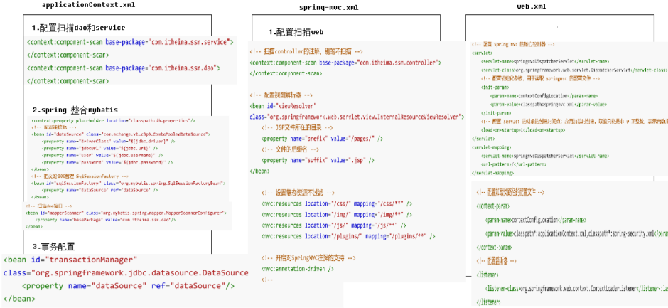

pagehelper分页使用

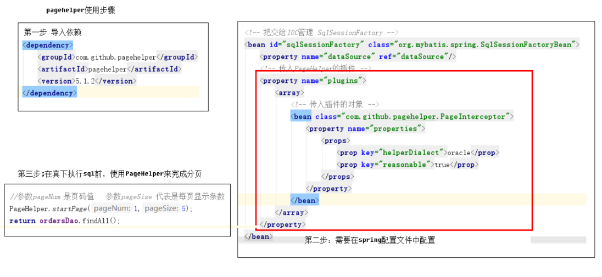

数据表设计

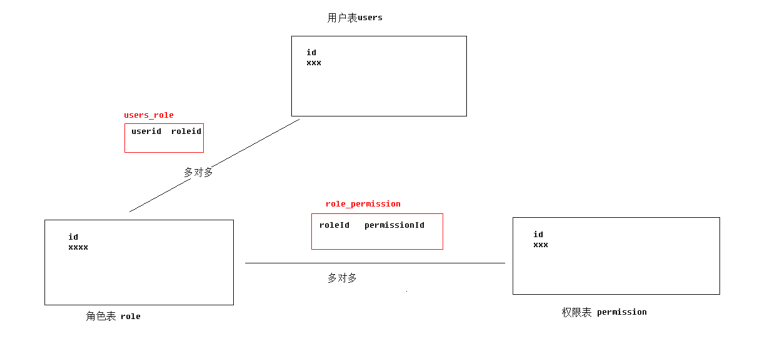

spring security快速入门

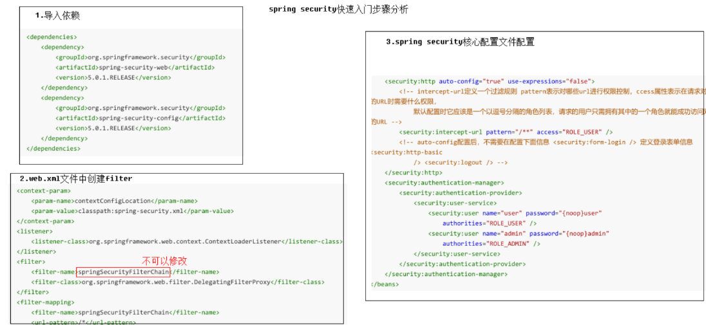

spring security 认证操作

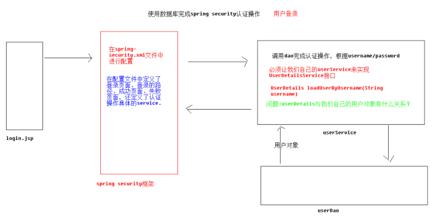

spring security 权限控制

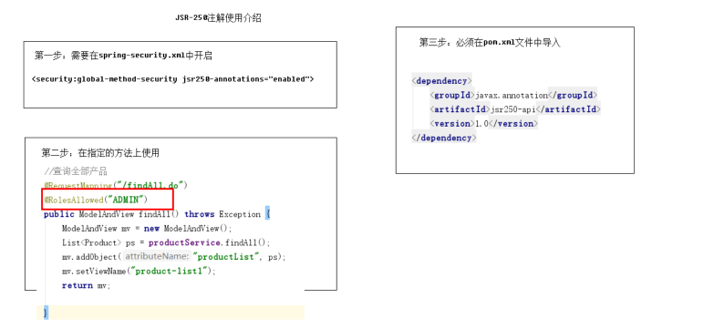

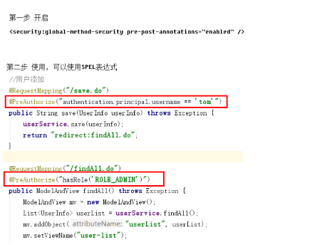

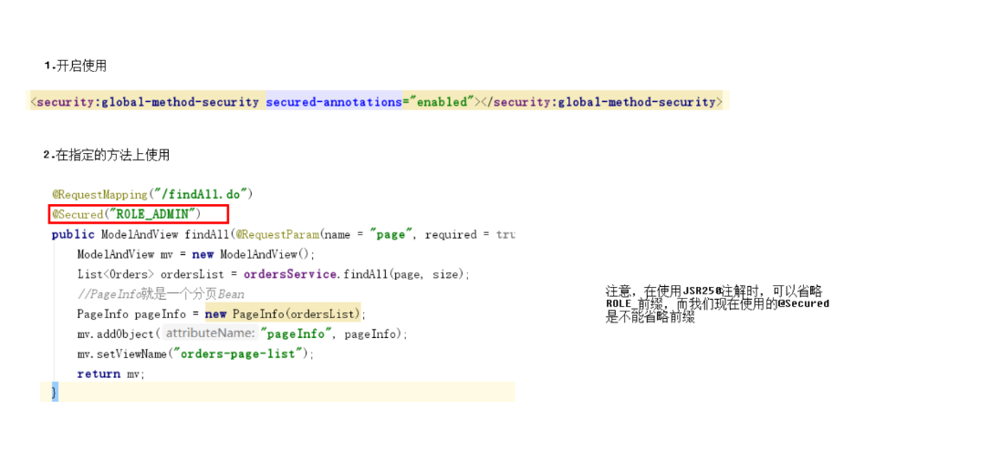

spring security 页面权限控制

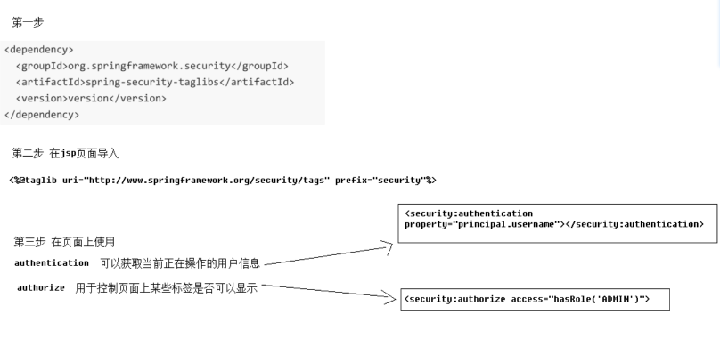

**秒杀系统**

利用spring boot 搭建了商品秒杀系统，系统主要实现商品秒杀，要求单个用户只能购买一件。用户抢购成功生成订单信息并通过邮箱发送给用户。

利用redis作为缓存提高用户并发，分别利用zookeeper和redis 实现分布式锁保证商品数据一致性。使用rabbitm的死信队列实现用户订单邮箱的发送以及订单的超时作废功能。

基于redis实现分布式锁：

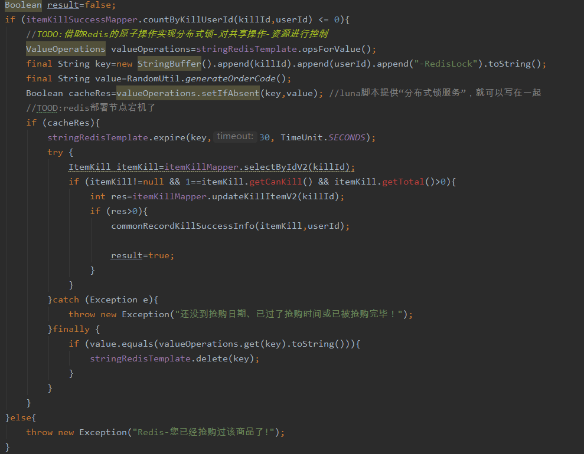

基于redisson实现分布式锁：

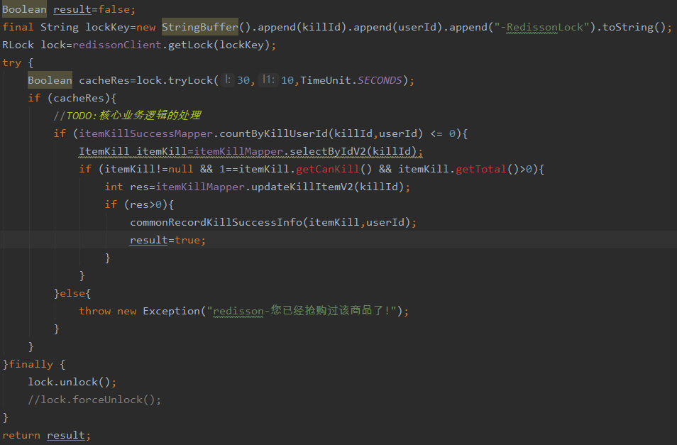

基于zookeeper实现分布锁：

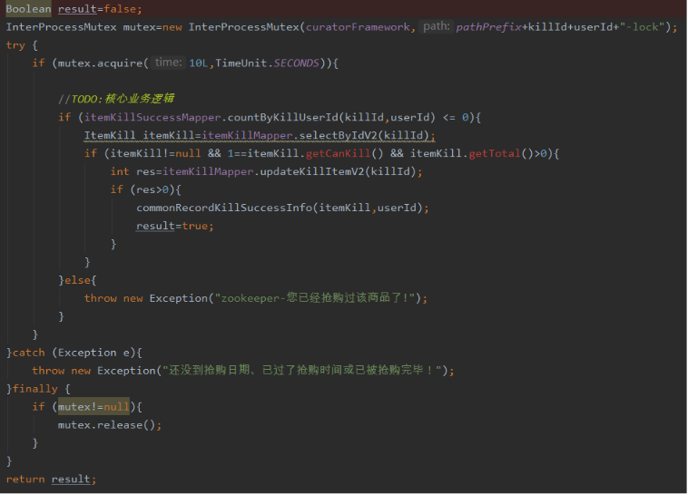

**利用缓存提高并发：**

`单线程`：


` redis  缓存`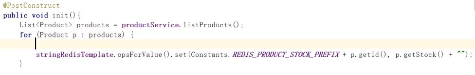

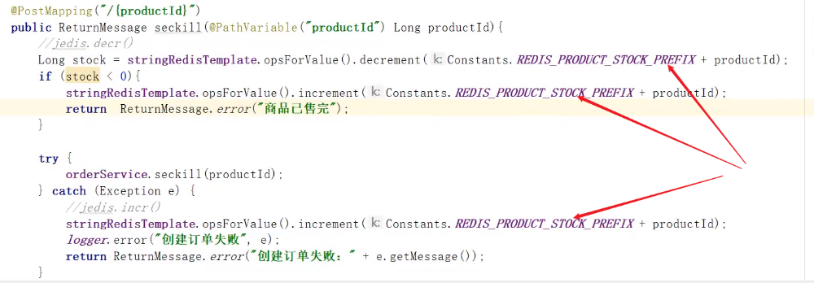

`concurrenthashmap + zookeeper`

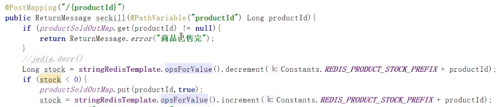

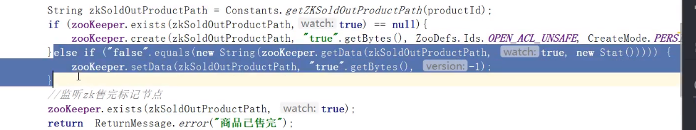

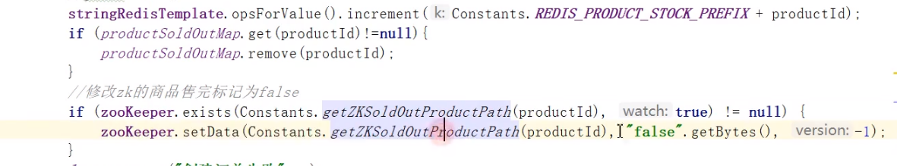

`zookeeper监听`

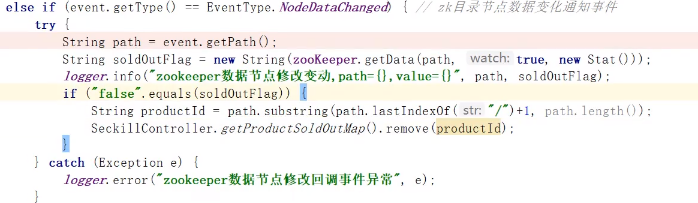

**springboot_shrio**

Subject： 用户主体（把操作交给SecurityManager）

SecurityManager：安全管理器（关联Realm）

Realm：Shiro连接数据的桥梁

```java
public class UserRealm extends AuthorizingRealm{
	/**
	 * 执行授权逻辑
	 */
	@Override
	protected AuthorizationInfo doGetAuthorizationInfo(PrincipalCollection arg0) {
		System.out.println("执行授权逻辑");
        //给资源进行授权
		SimpleAuthorizationInfo info = new SimpleAuthorizationInfo();
		//添加资源的授权字符串
		//info.addStringPermission("user:add");
        Subject subject = SecurityUtils.getSubject();
		User user = (User)subject.getPrincipal();
		User dbUser = userSerivce.findById(user.getId());
		info.addStringPermission(dbUser.getPerms());
		return null;
	}
	/**
	 * 执行认证逻辑
	 */
	@Override
	protected AuthenticationInfo doGetAuthenticationInfo(AuthenticationToken arg0) throws AuthenticationException {
		System.out.println("执行认证逻辑");
        //编写shiro判断逻辑，判断用户名和密码
		//1.判断用户名
		UsernamePasswordToken token = (UsernamePasswordToken)arg0;
		User user = userSerivce.findByName(token.getUsername());
		if(user==null){
			//用户名不存在
			return null;//shiro底层会抛出UnKnowAccountException
		}
		//2.判断密码
		return new SimpleAuthenticationInfo("",user.getPassword(),"");
		return null;
	}

}


@Configuration
public class ShiroConfig {
	/**
	 * 创建ShiroFilterFactoryBean
	 */
    @Bean
	public ShiroFilterFactoryBean getShiroFilterFactoryBean(@Qualifier("securityManager")DefaultWebSecurityManager securityManager){
		ShiroFilterFactoryBean shiroFilterFactoryBean = new ShiroFilterFactoryBean();

		//设置安全管理器
		shiroFilterFactoryBean.setSecurityManager(securityManager);	
		//添加Shiro内置过滤器
		/**
		 * Shiro内置过滤器，可以实现权限相关的拦截器
		 *    常用的过滤器：
		 *       anon: 无需认证（登录）可以访问
		 *       authc: 必须认证才可以访问
		 *       user: 如果使用rememberMe的功能可以直接访问
		 *       perms： 该资源必须得到资源权限才可以访问
		 *       role: 该资源必须得到角色权限才可以访问
		 */
		Map<String,String> filterMap = new LinkedHashMap<String,String>();
		/*filterMap.put("/add", "authc");
		filterMap.put("/update", "authc");*/
		filterMap.put("/testThymeleaf", "anon");	
		filterMap.put("/*", "authc");
        //设置未认证提示页面
		shiroFilterFactoryBean.setLoginUrl("/toLogin");      
		//授权过滤器 注意：当前授权拦截后，shiro会自动跳转到未授权页面
		filterMap.put("/add", "perms[user:add]");
        //设置未授权提示页面
		shiroFilterFactoryBean.setUnauthorizedUrl("/noAuth");
        shiroFilterFactoryBean.setFilterChainDefinitionMap(filterMap);
		return shiroFilterFactoryBean;
	}	
	/**
	 * 创建DefaultWebSecurityManager
	 */
	@Bean(name="securityManager")
	public DefaultWebSecurityManager getDefaultWebSecurityManager(@Qualifier("userRealm")UserRealm userRealm){
		DefaultWebSecurityManager securityManager = new DefaultWebSecurityManager();
		//关联realm
		securityManager.setRealm(userRealm);
		return securityManager;
	}
	
	/**
	 * 创建Realm
	 */
	@Bean(name="userRealm")
	public UserRealm getRealm(){
		return new UserRealm();
	}
    
    /**
	 * 配置ShiroDialect，用于thymeleaf和shiro标签配合使用
	 */
	@Bean
	public ShiroDialect getShiroDialect(){
		return new ShiroDialect();
	}

}


     /**
	 * 登录逻辑处理
	 */
	@RequestMapping("/login")
	public String login(String name,String password,Model model){
		
		/**
		 * 使用Shiro编写认证操作
		 */
		//1.获取Subject
		Subject subject = SecurityUtils.getSubject();
		//2.封装用户数据
		UsernamePasswordToken token = new UsernamePasswordToken(name,password);
		//3.执行登录方法
		try {
			subject.login(token);
			
			//登录成功
			//跳转到test.html
			return "redirect:/testThymeleaf";
		} catch (UnknownAccountException e) {
			//e.printStackTrace();
			//登录失败:用户名不存在
			model.addAttribute("msg", "用户名不存在");
			return "login";
		}catch (IncorrectCredentialsException e) {
			//e.printStackTrace();
			//登录失败:密码错误
			model.addAttribute("msg", "密码错误");
			return "login";
		}
	}


#在页面上使用shiro标签   com.github.theborakompanioni.thymeleaf-extras-shiro
<div shiro:hasPermission="user:update"> <div>
```


### B.2 相关题目