## 面试问题总结

## 自我介绍

您好我叫邵鑫，本科毕业于郑州大学，专业是地理信息科学，后以专业成绩第一保送至武汉大学，专业是地图学地理信息系统，导师是王艳东老师。本科期间多次参加数学建模比赛 获得过国赛全国第二，美赛H奖的成绩。在校期间积极参与科研项目，本科期间参与并负责城市管网爆管预警项目，实现地下管网的可视化管理，并能根据管网爆管位置及时输出解决方案。主要负责后端的实现，利用SSM框架实现用户数据管理和业务处理，利用 Arcgis 提供的 API 实现具体地图相关操作能，研究生期间参与国家重点研发计划中国产遥感卫星典型要素提取课题，负责众源数据与遥感影像的自动配准部分。主要利用 Pytorch 框架构建深度学习模型，通过样本学习实现众源数据与遥感影像的自动配准,在课余时间也不断学习新的技术包括spring Boot，spring Cloud相关技术栈，并独自开发简单的商品秒杀系统。6月至今在滴滴出行数据发版后端研发岗位实习，主要从事数据一致性自动化检验与修复工作相关工作。以上就是我主要的个人情况。 

层次分析确定权重

1、建立层次结构模型。在深入分析实际问题的基础上，将有关的各个因素按照不同属性自上而下地分解成若干层次，同一层的诸因素从属于上一层的因素或对上层因素有影响，同时又支配下一层的因素或受到下层因素的作用。最上层为目标层，通常只有1个因素，最下层通常为方案或对象层，中间可以有一个或几个层次，通常为准则或指标层。当准则过多时（譬如多于9个）应进一步分解出子准则层。

2、构造成对比较阵。从层次结构模型的第2层开始，对于从属于（或影响）上一层每个因素的同一层诸因素，用[成对比较法](https://baike.baidu.com/item/成对比较法/1801020)和1—9比较尺度构造[成对比较阵](https://baike.baidu.com/item/成对比较阵/7949725)，直到最下层。

3、计算[权向量](https://baike.baidu.com/item/权向量)并做一致性检验。对于每一个成对比较阵计算最大特征根及对应[特征向量](https://baike.baidu.com/item/特征向量)，利用一致性指标、随机一致性指标和一致性比率做一致性检验。若检验通过，特征向量（[归一化](https://baike.baidu.com/item/归一化/2215161)后）即为权向量：若不通过，需重新构造成对比较阵。

4、计算组合权向量并做组合一致性检验。计算最下层对目标的组合权向量，并根据公式做组合一致性检验，若检验通过，则可按照组合[权向量](https://baike.baidu.com/item/权向量/6316153)表示的结果进行[决策](https://baike.baidu.com/item/决策)，否则需要重新考虑模型或重新构造那些一致性比率较大的[成对比较阵](https://baike.baidu.com/item/成对比较阵/7949725)。

### 1 各种排序算法的时间复杂度和空间复杂度

https://www.zhihu.com/search?type=content&q=排序算法

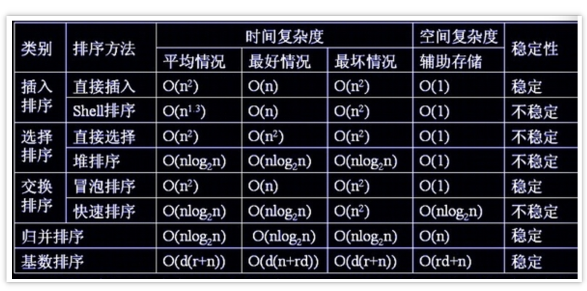

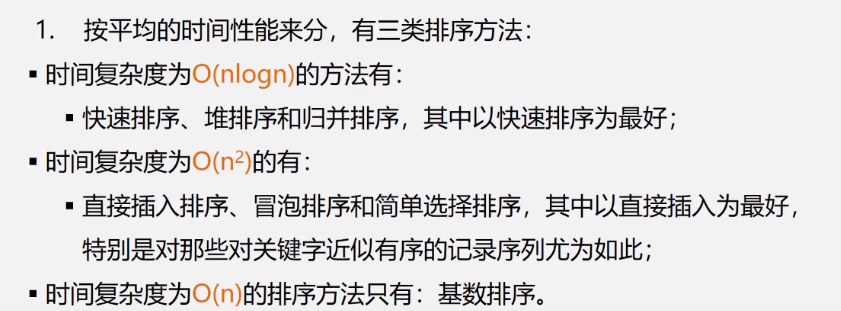

**希尔排序**:

- 选择一个增量序列t1，t2，…，tk，其中ti>tj，tk=1；
- 按增量序列个数k，对序列进行k 趟排序；
- 每趟排序，根据对应的增量ti，将待排序列分割成若干长度为m 的子序列，分别对各子表进行直接插入排序。仅增量因子为1 时，整个序列作为一个表来处理，表长度即为整个序列的长度。

```js
  function shellSort(arr) {
    var len = arr.length;
    for (var gap = Math.floor(len / 2); gap > 0; gap = Math.floor(gap / 2)) {
        // 注意：这里和动图演示的不一样，动图是分组执行，实际操作是多个分组交替执行；floor向下取整
        for (var i = gap; i < len; i++) {
            var j = i;
            var current = arr[i];
            while (j - gap >= 0 && current < arr[j - gap]) {
                 arr[j] = arr[j - gap];
                 j = j - gap;
            }
            arr[j] = current;
        }
    }
    return arr;
}
```


**堆排序**
堆积是一个近似完全二叉树的结构，并同时满足堆积的性质：即子结点的键值或索引总是小于（或者大于）它的父节点。

- 将初始待排序关键字序列(R1,R2….Rn)构建成大顶堆，此堆为初始的无序区；
- 将堆顶元素R[1]与最后一个元素R[n]交换，此时得到新的无序区(R1,R2,……Rn-1)和新的有序区(Rn),且满足R[1,2…n-1]<=R[n]；
- 由于交换后新的堆顶R[1]可能违反堆的性质，因此需要对当前无序区(R1,R2,……Rn-1)调整为新堆，然后再次将R[1]与无序区最后一个元素交换，得到新的无序区(R1,R2….Rn-2)和新的有序区(Rn-1,Rn)。不断重复此过程直到有序区的元素个数为n-1，则整个排序过程完成。

```js
var len;  
function buildMaxHeap(arr) {   // 建立大顶堆
    len = arr.length;
    for (var i = Math.floor(len/2); i >= 0; i--) {
        heapify(arr, i);
    }
}
 
function heapify(arr, i) {  // 堆调整
    var left = 2 * i + 1,
        right = 2 * i + 2,
        largest = i;
 
    if (left < len && arr[left] > arr[largest]) {
        largest = left;
    }
 
    if (right < len && arr[right] > arr[largest]) {
        largest = right;
    }
 
    if (largest != i) {
        swap(arr, i, largest);
        heapify(arr, largest);
    }
}
 
function swap(arr, i, j) {
    var temp = arr[i];
    arr[i] = arr[j];
    arr[j] = temp;
}
 
function heapSort(arr) {
    buildMaxHeap(arr);
 
    for (var i = arr.length - 1; i > 0; i--) {
        swap(arr, 0, i);
        len--;
        heapify(arr, 0);
    }
    return arr;
}
```

​                                                                                                                                                                                                                                                                                                                                                                                                                                                                                                                                                                                                                                                                                                                                                                                                                                                                                                                                                                                                                                                                                                                                                                                                                                                                                                                                                                                                                                                                                                                                                                                                                                                                                                                                                                                                                                                                                                                                                                                                                                                                                                                                                                                                                                                                                                                                                                                                                                                                                                                                                                                                                                                                                                                                                                                                                                                                                                                                                                                                                                                                                                                                                                                                                                                                                                                                                                                                                                                                                                                                                                                                                                                                                                                                                                                                                                                                                                                                                                                                                                                                                                                                                                                                                                                                                                                                                                                                                                                                                                                                                                                                                                                                                                                                                                                                                                                                                                                                                                                                                                                                                                                                                                                                                                                                                                                                                                                                                                                                                                                                                                                                                                                                                                                                                                                                                                                                                                                                                                                                                                                                                                                                                                                                                                                                                                                                                                                                                                                                                                                                                                                                                                                                                                                                                                                                                                                                                                                                                                                                                                                                                                                                                                                                                                                                                                                                                                                                                                                                                                                                                                                                                                                                                                                                                                                                                                                                                                                                                                                                                                                                                                                                                                                                                                                                                                                                                                                                                                                                                                                                                                                                                                                                                                                                                                                                                                                                                                                                                                                                                                                                                                                                                                                                                                                                                                                                                                                                                                                                                                                                                                                                                                                                                                                                                                                                                                                                                                                                                                                                                                                                                                                                                                                                                                                                            

**快速排序**

- 从数列中挑出一个元素，称为 “基准”（pivot）
- 重新排序数列，所有元素比基准值小的摆放在基准前面，所有元素比基准值大的摆在基准的后面（相同的数可以到任一边）。在这个分区退出之后，该基准就处于数列的中间位置。这个称为分区（partition）操作；
- 递归地（recursive）把小于基准值元素的子数列和大于基准值元素的子数列排序

```js
function quickSort(arr, left, right) {
    var len = arr.length,
        partitionIndex,
        left = typeof left != 'number' ? 0 : left,
        right = typeof right != 'number' ? len - 1 : right;
 
    if (left < right) {
        partitionIndex = partition(arr, left, right);
        quickSort(arr, left, partitionIndex-1);
        quickSort(arr, partitionIndex+1, right);
    }
    return arr;
}
 
function partition(arr, left ,right) {     // 分区操作
    var pivot = left,                      // 设定基准值（pivot）
        index = pivot + 1;
    for (var i = index; i <= right; i++) {
        if (arr[i] < arr[pivot]) {
            swap(arr, i, index);
            index++;
        }       
    }
    swap(arr, pivot, index - 1);
    return index-1;
}
 
function swap(arr, i, j) {
    var temp = arr[i];
    arr[i] = arr[j];
    arr[j] = temp;
}
```


**归并排序**

即先使每个子序列有序，再使子序列段间有序。若将两个有序表合并成一个有序表，称为2-路归并。

- 把长度为n的输入序列分成两个长度为n/2的子序列；
- 对这两个子序列分别采用归并排序；
- 将两个排序好的子序列合并成一个最终的排序序列。

```js
function mergeSort(arr) {
    var len = arr.length;
    if (len < 2) {
        return arr;
    }
    var middle = Math.floor(len / 2),
        left = arr.slice(0, middle),
        right = arr.slice(middle);
    return merge(mergeSort(left), mergeSort(right));
}
function merge(left, right) {
    var result = [];
 
    while (left.length>0 && right.length>0) {
        if (left[0] <= right[0]) {
            result.push(left.shift());
        } else {
            result.push(right.shift());
        }
    }
    while (left.length)
        result.push(left.shift());
 
    while (right.length)
        result.push(right.shift());
 
    return result;
}
```


**基数排序**
基数排序是按照低位先排序，然后收集；再按照高位排序，然后再收集；依次类推，直到最高位。

- 取得数组中的最大数，并取得位数；
- arr为原始数组，从最低位开始取每个位组成radix数组；
- 对radix进行计数排序（利用计数排序适用于小范围数的特点 

```js
var counter = [];
function radixSort(arr, maxDigit) {
    var mod = 10;
    var dev = 1;
    for (var i = 0; i < maxDigit; i++, dev *= 10, mod *= 10) {
        for(var j = 0; j < arr.length; j++) {
            var bucket = parseInt((arr[j] % mod) / dev);
            if(counter[bucket]==null) {
                counter[bucket] = [];
            }
            counter[bucket].push(arr[j]);
        }
        var pos = 0;
        for(var j = 0; j < counter.length; j++) {
            var value = null;
            if(counter[j]!=null) {
                while ((value = counter[j].shift()) != null) {
                      arr[pos++] = value;
                }
          }
        }
    }
    return arr;
}
```


## 阿里巴巴面试

#### 1.1 Threadlocal

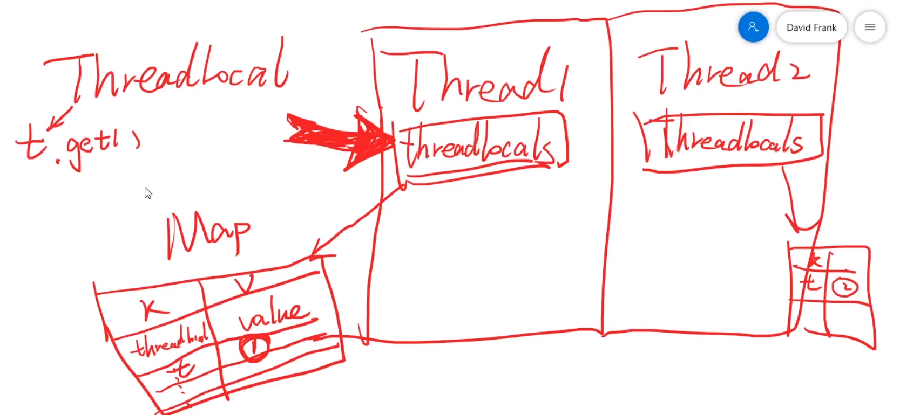

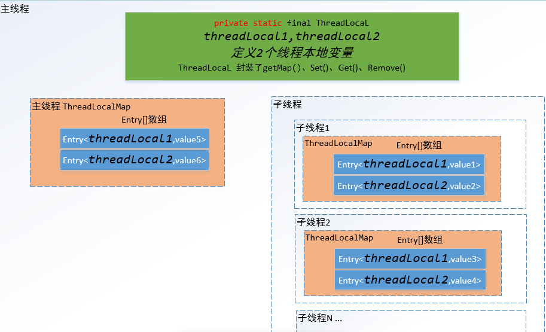

ThreadLocal和Synchronized都是为了解决多线程中相同变量的访问冲突问题，不同的点是

- Synchronized是通过线程等待，牺牲时间来解决访问冲突
- ThreadLocal是通过每个线程单独一份存储空间，牺牲空间来解决冲突，并且相比于Synchronized，ThreadLocal具有线程隔离的效果，只有在线程内才能获取到对应的值，线程外则不能访问到想要的值。

ThreadLocal为每个Thread都维护了一个类型为静态内部类ThreadLocalMap 的threadlocals ，threadlocals是Map类型，key为ThreadLocal，value是存储的值。

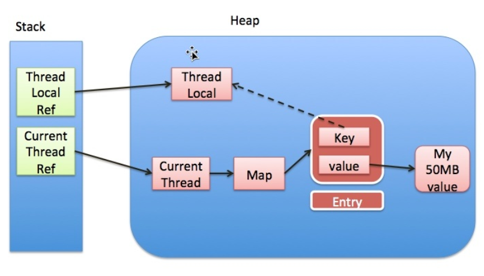

`ThreadLocal`的实现是这样的：每个`Thread` 维护一个 `ThreadLocalMap` 映射表，这个映射表的 `key`是 `ThreadLocal` 实例本身，`value` 是真正需要存储的 `Object`。

也就是说 `ThreadLocal` 本身并不存储值，它只是作为一个 `key` 来让线程从 `ThreadLocalMap` 获取 `value`。值得注意的是图中的虚线，表示 `ThreadLocalMap` 是使用 `ThreadLocal` 的弱引用作为 `Key`的，弱引用的对象在 GC 时会被回收。

**ThreadLocal为什么会内存泄漏**

`ThreadLocalMap`使用`ThreadLocal`的弱引用作为`key`，如果一个`ThreadLocal`没有外部强引用来引用它，那么系统 GC 的时候，这个`ThreadLocal`势必会被回收，这样一来，`ThreadLocalMap`中就会出现`key`为`null`的`Entry`，就没有办法访问这些`key`为`null`的`Entry`的`value`，如果当前线程再迟迟不结束的话，这些`key`为`null`的`Entry`的`value`就会一直存在一条强引用链：`Thread Ref -> Thread -> ThreaLocalMap -> Entry -> value`永远无法回收，造成内存泄漏。

**防护措施**：在`ThreadLocal`的`get()`,`set()`,`remove()`的时候都会清除线程`ThreadLocalMap`里所有`key`为`null`的`value`。

- **key 使用强引用**：引用的`ThreadLocal`的对象被回收了，但是`ThreadLocalMap`还持有`ThreadLocal`的强引用，如果没有手动删除，`ThreadLocal`不会被回收，导致`Entry`内存泄漏。
- **key 使用弱引用**：引用的`ThreadLocal`的对象被回收了，由于`ThreadLocalMap`持有`ThreadLocal`的弱引用，即使没有手动删除，`ThreadLocal`也会被回收。`value`在下一次`ThreadLocalMap`调用`set`,`get`，`remove`的时候会被清除。

比较两种情况，我们可以发现：由于`ThreadLocalMap`的生命周期跟`Thread`一样长，如果都没有手动删除对应`key`，都会导致内存泄漏，但是使用弱引用可以多一层保障：弱引用ThreadLocal不会内存泄漏，对应的value在下一次ThreadLocalMap调用set,get,remove的时候会被清除。

因此，`ThreadLocal`内存泄漏的根源是：由于`ThreadLocalMap`的生命周期跟`Thread`一样长，如果没有手动删除对应`key`就会导致内存泄漏，而不是因为弱引用。

#### 1.2  OSI七层模型，每一层的作用

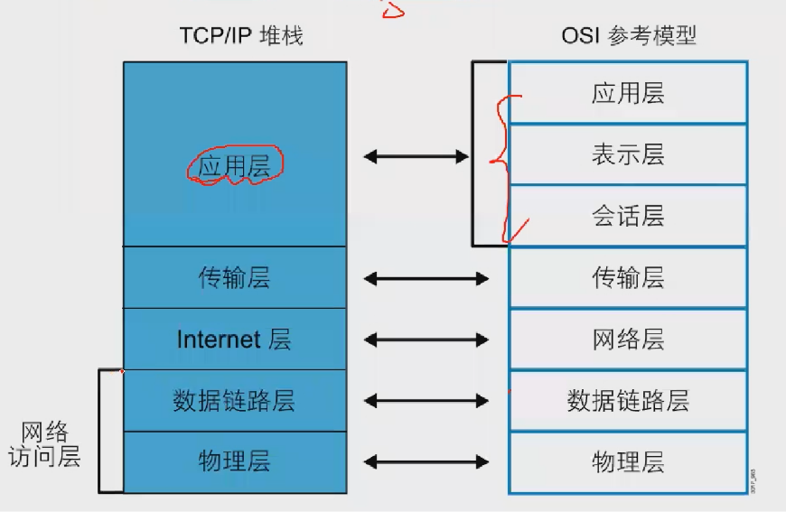

1、物理层：二进制传输。物理层处于OSI参考模型的最低层。物理层的主要功能是利用物理传输介质为数据链路层提供物理连接，以透明地传送比特流。

2、数据链路层：访问介质，如何格式化数据以便进行传输以及如何控制网络的访问，支持错误检测。

3、网络层：数据传输，路由和寻址。网络层主要任务是通过执行路由选择算法，为报文分组通过通信子网选择最适当的路径。

4、传输层：传输问题，提供可靠的端到端服务，确保数据传输的可靠性。

5、会话层：主机间通信，建立、管理和终止应用程序之间的会话。

6、表示层：数据表示。处理两个通信系统间信息交换的表示方式，它包括数据格式变换、数据加密与解密、数据压缩与恢复等功能。

7、应用层：网络进程访问应用层，为应用程序进程提供网络服务。

#### 1.3 Socket技术详解

在计算机通信领域，它是计算机之间进行通信的一种约定或一种方式。通过 socket 这种约定，一台计算机可以接收其他计算机的数据，也可以向其他计算机发送数据。

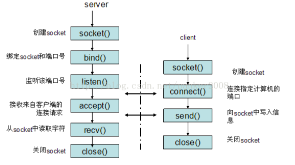

其过程是首先服务器方要先启动，并根据请求提供相应服务：

（1）打开一通信通道并告知本地主机，它在某一公认地址上的某端口（如FTP的端口可能为21）接收客户请求；

（2）等待客户请求到达该端口；

（3）接收到客户端的服务请求时，处理该请求并发送应答信号。接收到并发服务请求，要激活一新进程来处理这个客户请求（如UNIX系统中用fork、exec）。新进程处理此客户请求，并不需要对其它请求作出应答。服务完成后，关闭此新进程与客户的通信链路，并终止。

（4）返回第（2）步，等待另一客户请求。

（5）关闭服务器

客户端：

（1）打开一通信通道，并连接到服务器所在主机的特定端口；

（2）向服务器发服务请求报文，等待并接收应答；继续提出请求......

（3）请求结束后关闭通信通道并终止。

#### 1.4 进程调度的几种方式

**作业调度**是外存与内存之间的调度，发生频率很低，使进程从创建态到就绪态的过程，

**进程调度**是从内存到cpu的调度，发生频率很高，使进程从就绪态到运行态的过程。

  作业调度算法：1.先来先服务算法.2.短作业优先算法.3.高响应比优先算法. 

  进程调度算法：1.时间片轮转算法。2.优先级调度算法。3.多级反馈队列算法。

进程调度概念：操作系统必须为多个进程请求分配计算机资源。对处理器而言，可分配的资源是在处理器上的执行时间，分配途径是调度。调度功能必须设计成可以满足多个目标，包括公平、任何进程都不会饿死、有效地使用处理器时间和低开销。此外，调度功能可能需要为某些进程的启动或结束考虑不同的优先级和实时最后期限。
**一、先来先服务和短作业(进程)优先调度算法**

1．先来先服务调度算法(FCFS*: first come first service)

该算法既可用于作业调度，也可用于进程调度。每次调度都是从后备作业队列中选择一个或多个最先进入该队列的作业，将它们调入内存，为它们分配资源、创建进程，然后放入就绪队列。在进程调度中采用FCFS算法时，则每次调度是从就绪队列中选择一个最先进入该队列的进程，为之分配处理机，使之投入运行。该进程一直运行到完成或发生某事件而阻塞后才放弃处理机。

2．短作业(进程)优先调度算法

短作业优先(SJF)的调度算法是从后备队列中选择一个或若干个估计运行时间最短的作业，将它们调入内存运行。而短进程优先(SPF)调度算法则是从就绪队列中选出一个估计运行时间最短的进程，将处理机分配给它，使它立即执行并一直执行到完成，或发生某事件而被阻塞放弃处理机时再重新调度。

**二 高优先权优先调度算法：**

1．优先权调度算法的类型

为了照顾紧迫型作业，使之在进入系统后便获得优先处理，引入了最高优先权优先(FPF)调度算法。此算法常被用于批处理系统中，作为作业调度算法，也作为多种操作系统中的进程调度算法，还可用于实时系统中。当把该算法用于作业调度时，系统将从后备队列中选择若干个优先权最高的作业装入内存。当用于进程调度时，该算法是把处理机分配给就绪队列中优先权最高的进程，这时，又可进一步把该算法分成如下两种。

（1） 非抢占式优先权算法

系统一旦把处理机分配给就绪队列中优先权最高的进程后，该进程便一直执行下去，直至完成；或因发生某事件使该进程放弃处理机时，系统方可再将处理机重新分配给另一优先权最高的进程。

（2) 抢占式优先权调度算法

系统同样是把处理机分配给优先权最高的进程，使之执行。但在其执行期间，只要又出现了另一个其优先权更高的进程，进程调度程序就立即停止当前进程(原优先权最高的进程)的执行，重新将处理机分配给新到的优先权最高的进程。

2 高响应比优先调度算法

在批处理系统中，短作业优先算法是一种比较好的算法，其主要的不足之处是长作业的运行得不到保证。如果我们能为每个作业引入前面所述的动态优先权，并使作业的优先级随着等待时间的增加而以速率a 提高，则长作业在等待一定的时间后，必然有机会分配到处理机。该优先权的变化规律可描述为


**三、基于时间片的轮转调度算法**

在早期的时间片轮转法中，系统将所有的就绪进程按先来先服务的原则排成一个队列，每次调度时，把CPU 分配给队首进程，并令其执行一个时间片。时间片的大小从几ms 到几百ms。当执行的时间片用完时，由一个计时器发出时钟中断请求，调度程序便据此信号来停止该进程的执行，并将它送往就绪队列的末尾；然后，再把处理机分配给就绪队列中新的队首进程，同时也让它执行一个时间片。这样就可以保证就绪队列中的所有进程在一给定的时间内均能获得一时间片的处理机执行时间。换言之，系统能在给定的时间内响应所有用户的请求。
2．多级反馈队列调度算法

1、进程在进入待调度的队列等待时，首先进入优先级最高的Q1等待。　　

2、首先调度优先级高的队列中的进程。若高优先级中队列中已没有调度的进程，则调度次优先级队列中的进程。例如：Q1,Q2,Q3三个队列，只有在Q1中没有进程等待时才去调度Q2，同理，只有Q1,Q2都为空时才会去调度Q3。　　

3、对于同一个队列中的各个进程，按照时间片轮转法调度。比如Q1队列的时间片为N，那么Q1中的作业在经历了N个时间片后若还没有完成，则进入Q2队列等待，若Q2的时间片用完后作业还不能完成，一直进入下一级队列，直至完成。　　

4、在低优先级的队列中的进程在运行时，又有新到达的作业，那么在运行完这个时间片后，CPU马上分配给新到达的作业（抢占式）。　　

#### 1.5 布隆过滤器数据结构

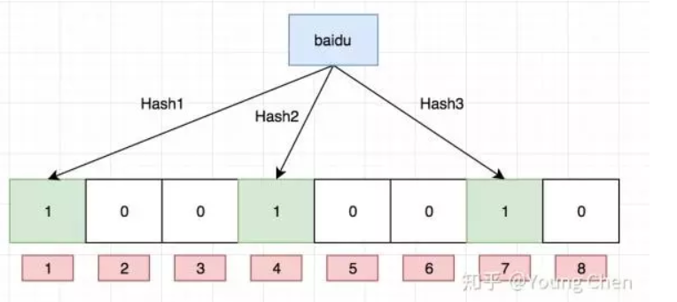

布隆过滤器:概率型数据结构,特点是高效地插入和查询，可以用来告诉你 “某样东西一定不存在或者可能存在”。相比于传统的 List、Set、Map 等数据结构，它更高效、占用空间更少，但是缺点是其返回的结果是概率性的，而不是确切的。

案例分析：

布隆过滤器是一个 bit 向量或者说 bit 数组。

1）、映射一个值到布隆过滤器中，需要使用多个不同的哈希函数生成多个哈希值，并对每个生成的哈希值指向的 bit 位置 1，例如针对值 “baidu” 和三个不同的哈希函数分别生成了哈希值 1、4、7；

2）存一个值 “tencent”，假设哈希函数返回 3、4、8 ；

3）查询 “dianping” 这个值是否存在，哈希函数返回了 1、5、8三个值，结果发现 5 这个 bit 位上的值为 0，说明没有任何一个值映射到这个 bit 位上，因此可以很确定地说 “dianping” 这个值不存在。

4）当我们需要查询 “baidu” 这个值是否存在的话，那么哈希函数必然会返回 1、4、7，然后我们检查发现这三个 bit 位上的值均为 1，可能存在 “baidu” 
原因：因为随着增加的值越来越多，被置为 1 的 bit 位也会越来越多，这样某个值 “taobao” 即使没有被存储过，但是万一哈希函数返回的三个 bit 位都被其他值置位了 1 ，那么程序还是会判断 “taobao” 这个值存在。

## 美团笔试

#### 2.1 RESTful调用和 RPC调用有什么区别？如果让你设计一个RPC服务治理框架你会设计那些模块？

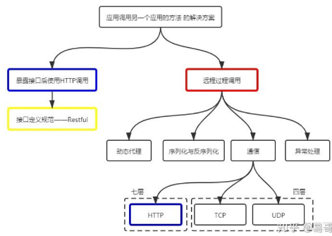

1、RESTful是一种软件架构风格，用于约束客户端和服务器交互，满足这些约束条件和原则的应用程序或设计就是 RESTful。比如HTTP协议使用同一个URL地址，通过GET，POST，PUT，DELETE等方式实现查询、提交、删除数据。

RPC是远程过程调用，是用于解决分布式系统服务间调用的一种方式。RPC采用客户端与服务端模式，双方通过约定的接口以类似本地方法调用的方式来进行交互，客户端根据约定传输调用函数+参数给服务端（一般是网络传输TCP/UDP），服务端处理完按照约定将返回值返回给客户端。

**重点为RESTful HTTP的约束风格，RPC调用模型。**

1、可分为两大部分RPC +服务治理
RPC部分 = IDL  +客户端/服务端实现层  +协议层 +数据传输层
服务治理 =服务管理（注册中心） +服务监控 +服务容灾 +服务鉴权


#### 2.2 请描述避免多线程竞争时有哪些手段？

1) 不可变对象；

2) 互斥锁；

3)  ThreadLocal 对象；

4) CAS；

#### 2.3 请简述HTTP的5个常用Method及其含义？HTTP与HTTPS的区别是什么，简述一下HTTPS的实现原理

get 从服务器端获取资源

put 更新资源

post 创建资源

delete 删除资源

connect 建立tunnel隧道

5类常用状态码

100 认可继续

200 成功

300 重定向

400 服务器无此资源

500 服务器无法正常响应

https是http加上ssl的应用层协议。在http的基础上增加了安全性和可靠性。

端口的不同：http默认是80端口， https默认是443端口

安全性：http是明文传输，https是密文传输。

认证：http没有认证，https在建立TCP连接前会进行ssl层的握手，在这个过程中需要认证。

成本上：https的证书需要成本，同时加密和解密时对CPU和内存开销增加。

https的原理：

https通信时，首先建立ssl层的连接，客户端将ssl版本号和加密组件发到服务端，服务端收到后对ssl版本号和加密组件进行匹配，同时将CA证书及密钥发送到客户端。客户端对证书进行验证，验证通过后使用非对称加密对数据通信时的密钥进行协商。协商后得到一致的获得一致的对称加密密钥。然后使用对称加密算法进行TCP连接，后续的过程跟http的过程一致。三次握手，数据交换，四次挥手，通信结束。

#### 2.4  JVM: G1和CMS的区别

Stop-The-World机制简称STW，是在执行垃圾收集算法时，Java应用程序的其他所有线程都被挂起（除了垃圾收集帮助器之外）。Java中一种全局暂停现象，全局停顿，所有Java代码停止，native代码可以执行，但不能与JVM交互；这些现象多半是由于gc引起。

**垃圾收集器**

年轻代的收集器：

serial：串行收集，复制算法，单线程，stop the world

Parallel Scavenge：并行收集，复制算法，多线程，stop the world

ParNew：并发收集，复制算法，多线程，stop the world

老年代的收集器：

Serial Old：串行收集，标记整理，单线程，stop the world。

Parallel Old：并行收集，标记整理，stop the wold。

CMS：多次标记，并发清理

**CMS**

多次标记：

- 1 初次标记，标出O区的GCROOT对象和被Y区引用的对象，耗时短StopTheWorld
- 2 并发标记，GCRootTracing，时间长，但不用StopTheWorld
- 3 重新标记，修正并发标记中的错误，时间中等，StopTheWold

并发清理：

- 采用`标记清除`算法，定点清理内存，而不影响其他位置内存，所以可以并发，不用StopTheWorld。

评价： 极大的降低StopTheWorld时间，是服务端常用的垃圾收集器，配合PawNew使用。不过标记清理是有内存碎片的，这是个比较明显的缺点。

**G1垃圾收集器**

G1首先在内存结构上采用了region化的方法，将堆内存划分成2000块左右的小块，每块大小1-32M（2的幂次），每块region都可以作为E、S、O任意一种，分配灵活，但是存在大对象问题。解决方法是：

- 小于一半region size的可以正常存入E区
- 一半到一个region size的直接存入O区一个region中，这个region又叫Humongous region，我们也可以把它叫做H区（他本质还是O区的）
- 比一个region size还要大的对象，需要存入连续的多个region中，这多个region都是H区。

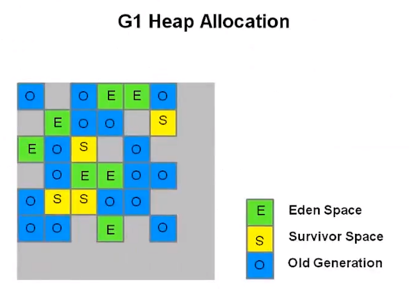

- RememberSets，又叫Rsets是每个region中都有的一份存储空间，用于存储本region的对象被其他region对象的引用记录。
- CollectionSets，又叫Csets是一次GC中需要被清理的regions集合，注意G1每次GC不是全部region都参与的，可能只清理少数几个，这几个就被叫做Csets。

G1对于老年代的GC比较特殊，本质上不是只针对老年代，也有部分年轻代，所以又叫MixGC。

- 初次标记，也是标记GCroot直接引的对象和所在Region，但是与CMS不同的是，这里不止标记O区。注意初次标记一般和YGC同时发生，利用YGC的STW时间，顺带把这事给干了。
- RootRegion扫描，扫描GCroot所在的region到Old区的引用。
- 并发标记，类似CMS，但是标记的是整个堆，而不是只有O区。这期间如果发现某个region所有对象都是'垃圾'则标记为X。
- 重新标记，类似CMS，但也是整个堆，并且上一步中的X区被删除。另外采用了初始标记阶段的SATB，重新标记的速度变快。
- 复制/清理，选择所有Y区reigons和'对象存活率较低'的O区regions组成Csets，进行复制清理。

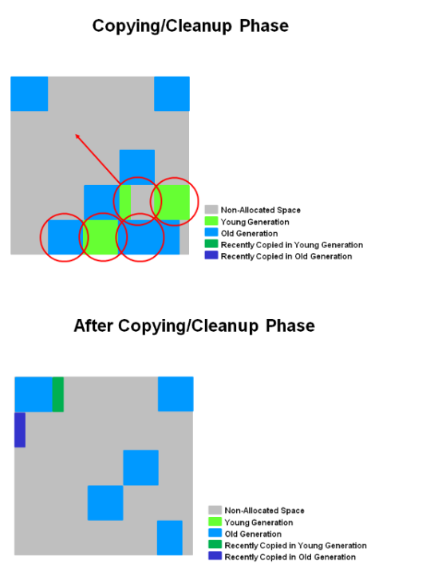

**RootRegionScan这个阶段是干嘛的？**

> 标记出RootRegion指向O区的region，标记这些region是为了降低并发标记的扫描范围，因为并发标记需要扫描GCROOT引用或间接的所有对象，而这些对象一定是在RootRegion出发指向的Region中的。MIXGC中Y区本来就要全扫，所以这里再按照O区过滤下，这样就缩小了扫描范围。该阶段的操作为遍历O区region查询Rset是否有来自RootRegion的，（RootRegion是初始标记得到的）。

**Rset作用有哪些？**

> 上题中的作用是一个，还有个作用是YGC时，O区不GC因而认为O区全为‘GCroot’，需扫描全部O区。有了Rset只需要查看所有Y区region的Rset就知道被哪些O区region跨带引用了，避免了扫描整个O区。

**G1提高效率的点有哪些？**

> 1 重新标记时X区域直接删除。
> 2 Rset降低了扫描的范围，上题中两点。
> 3 重新标记阶段使用SATB速度比CMS快。
> 4 清理过程为选取部分存活率低的Region进行清理，不是全部，提高了清理的效率。

**对比CMS，有哪些不同？**

> 1 region化的内存结构，采用复制清理的方式，避免了内存碎片。但是这种清理也造成了STW。
> 2 SATB速度更快。
> 3 初始标记，并发标记，重新标记，清理垃圾四个阶段很像，但是G1中有很多标记region的操作，并借助Rset进行了范围的缩小，提高了并发标记的速度。小结下就是初始标记和YGC的STW一起了，提高了效率；并发标记因为rset的设计，扫描范围缩小了，提高了效率；重新标记因为使用了SATB提高了效率；清理虽然造成了STW，但是复制使内存紧凑，避免了内存碎片。同时只清理垃圾较多的region，最大限度的降低了STW时间。

#### 2.5 TCP与UDP区别总结：

1、TCP面向连接（如打电话要先拨号建立连接）;UDP是无连接的，即发送数据之前不需要建立连接
2、TCP提供可靠的服务。也就是说，通过TCP连接传送的数据，无差错，不丢失，不重复，且按序到达;UDP尽最大努力交付，即不保证可靠交付
3、TCP面向字节流，实际上是TCP把数据看成一连串无结构的字节流;UDP是面向报文的UDP没有拥塞控制，因此网络出现拥塞不会使源主机的发送速率降低（对实时应用很有用，如IP电话，实时视频会议等）
4、每一条TCP连接只能是点到点的;UDP支持一对一，一对多，多对一和多对多的交互通信
5、TCP首部开销20字节;UDP的首部开销小，只有8个字节
6、TCP的逻辑通信信道是全双工的可靠信道，UDP则是不可靠信道

#### 2.6 AQS

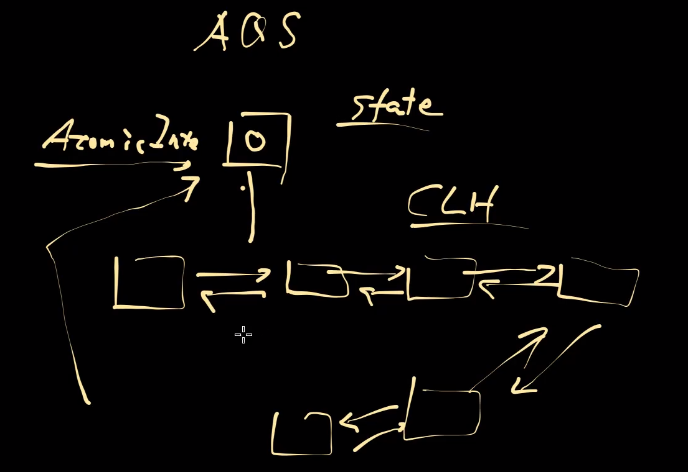

AQS(AbstractQuenedSynchronizer抽象的队列式同步器)核心数据结构：双向链表 + state(锁状态)。底层操作：CAS

AQS定义两种资源共享方式：Exclusive（独占，只有一个线程能执行，如ReentrantLock）和Share（共享，多个线程可同时执行，如Semaphore/CountDownLatch）

具体流程：通过CAS（乐观锁）去修改state的值，如果成功更新AQS的状态值执行程序，如果失败当前线程加入上面锁的双向链表中，通过自旋，判断当前队列节点是否可以获取锁。


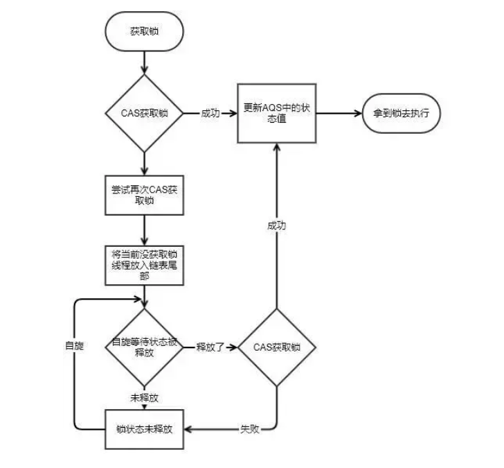

#### 2.7 公平锁和非公平锁的实现

锁的实现方式关键点：双向链表和状态state

公平和非公平锁的队列都基于锁内部维护的一个双向链表，表结点Node的值就是每一个请求当前锁的线程。公平锁则在于每次都是依次从队首取值。非公平锁在等待锁的过程中， 如果有任意新的线程妄图获取锁，都是有很大的几率直接获取到锁的。

#### 2.8 线程的状态以及状态变化过程

Java的线程一共6种状态。具体代码见

 **NEW**:新建状态，线程还没有调用start的时候

**RUNNABLE**：可运行状态 ，调用start之后，jvm启动了这个任务，但是可能被其他资源占用线程变成WAITING

**BLOCKED**：阻塞状态 ，线程被锁的时候，线程等待进去一个synchronized块方法或者可重入锁的时候

**WAITING**：等待状态 ，线程调用object.wait thread.join LockSupport.park 的时候变成 WAITING

**TIMED_WAITING**：时间等待状态 ，sleep 或者wait,join带时间参数等方法时

**TERMINATED**：终止状态 ，线程执行完成 或者被中断的时候变成TERMINATED

#### 2.9 TCP协议-保证传输可靠性

https://blog.csdn.net/liuchenxia8/article/details/80428157

TCP协议保证数据传输可靠性的方式主要有：

**校验和**：在数据传输的过程中，将发送的数据段都当做一个16位的整数。将这些整数加起来。并且前面的进位不能丢弃，补在后面，最后取反，得到校验和。 
**序列号**：确认应答与序列号
**超时重传**：发送方在发送完数据后等待一个时间，时间到达没有接收到ACK报文，那么对刚才发送的数据进行重新发送。
**连接管理**：连接管理就是三次握手与四次挥手的过程
**流量控制(滑动窗口)**：如果发送端的发送速度太快，导致接收端的结束缓冲区很快的填充满了。此时如果发送端仍旧发送数据，那么接下来发送的数据都会丢包。在TCP协议的报头信息当中，有一个16位字段的窗口大小。内容实际上是接收端接收数据缓冲区的剩余大小。接收端会在确认应答发送ACK报文时，将自己的即时窗口大小填入，并跟随ACK报文一起发送过去。而发送方根据ACK报文里的窗口大小的值的改变进而改变自己的发送速度。如果接收到窗口大小的值为0，那么发送方将停止发送数据。并定期的向接收端发送窗口探测数据段，让接收端把窗口大小告诉发送端。
**拥塞控制**:在发送端和接收端之间，可能会存在很多中间设备，包括路由器、网关等，这些设备也具有一定的承载数据的上限，也会引起网络拥塞，造成数据的丢失，造成接收端接受数据的失序。为了解决这个问题，引入了拥塞窗口，即在发送端设置一个窗口结构，根据网络的拥塞情况，动态调整该窗口大小，发送端只能发送大小小于滑动窗口和拥塞窗口的数据，在发送端设置的这个窗口就是拥塞窗口。

拥塞控制也就是在发送端设置一个窗口结构，窗口大小为cwnd，其根据网络的拥塞情况动态变化，也就是根据连接的超时重发情况动态变化。发送端只能发送小于或等于拥塞窗口和滑动窗口大小的数据。

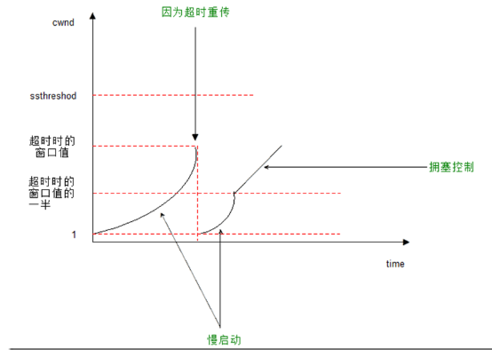


#### 3.1 Class.forName()和ClassLoader.loaderClass()有什么区别

```
Class.forName(className)方法，内部实际调用的方法是  Class.forName(className,true,classloader);

第2个boolean参数表示类是否需要初始化，  Class.forName(className)默认是需要初始化。一旦初始化，就会触发目标对象的 static块代码执行，static参数也也会被再次初始化。

    

ClassLoader.loadClass(className)方法，内部实际调用的方法是  ClassLoader.loadClass(className,false);

第2个 boolean参数，表示目标对象是否进行链接，false表示不进行链接，由上面介绍可以，不进行链接意味着不进行包括初始化等一些列步骤，那么静态块和静态对象就不会得到执行
```

 **数据库链接为什么使用Class.forName(className)**

```java
static {
    try {
        java.sql.DriverManager.registerDriver(new Driver());
    } catch (SQLException E) {
        throw new RuntimeException("Can't register driver!");
    }
}
```

#### 3.2 HTTP与TCP的关系，无连接、无状态详解

**HTTP与TCP的关系**

TCP协议对应于传输层，而HTTP协议对应于应用层，从本质上来说，二者没有可比性。HTTP协议是建立在TCP协议基础之上的，当浏览器需要从服务器获取网页数据的时候，会发出一次HTTP请求。HTTP会通过TCP建立起一个到服务器的连接通道，当本次请求需要的数据完毕后，HTTP会立即将TCP连接断开，这个过程是很短的。所以HTTP连接是一种短连接，是一种无状态的连接。

**无连接**

无连接的含义是限制每次连接只处理一个请求。服务器处理完客户的请求，并收到客户的应答后，即断开连接。采用这种方式可以节省传输时间。

早期这么做的原因是 HTTP 协议产生于互联网，因此服务器需要处理同时面向全世界数十万、上百万客户端的网页访问，但每个客户端（即浏览器）与服务器之间交换数据的间歇性较大（即传输具有突发性、瞬时性），并且网页浏览的联想性、发散性导致两次传送的数据关联性很低，大部分通道实际上会很空闲、无端占用资源。因此 HTTP 的设计者有意利用这种特点将协议设计为请求时建连接、请求完释放连接，以尽快将资源释放出来服务其他客户端。

随着时间的推移，网页变得越来越复杂，里面可能嵌入了很多图片，这时候每次访问图片都需要建立一次 TCP 连接就显得很低效。后来，Keep-Alive 被提出用来解决这效率低的问题。

**Keep-Alive** 功能使客户端到服务器端的连接持续有效，当出现对服务器的后继请求时，Keep-Alive 功能避免了重新建立连接。从HTTP/1.1起，默认都开启了Keep-Alive，保持连接特性，简单地说，当一个网页打开完成后，客户端和服务器之间用于传输HTTP数据的TCP连接不会关闭，如果客户端再次访问这个服务器上的网页，会继续使用这一条已经建立的连接Keep-Alive不会永久保持连接，它有一个保持时间，可以在不同的服务器软件（如Apache）中设定这个时间。

**无状态**

无状态是指协议对于事务处理没有记忆能力，服务器不知道客户端是什么状态。即我们给服务器发送 HTTP 请求之后，服务器根据请求，会给我们发送数据过来，但是，发送完，不会记录任何信息。

HTTP 是一个无状态协议，这意味着每个请求都是独立的，Keep-Alive 没能改变这个结果。缺少状态意味着如果后续处理需要前面的信息，则它必须重传，这样可能导致每次连接传送的数据量增大。另一方面，在服务器不需要先前信息时它的应答就较快。优点在于解放了服务器，每一次请求“点到为止”不会造成不必要连接占用，缺点在于每次请求会传输大量重复的内容信息。

客户端与服务器进行动态交互的 Web 应用程序出现之后，HTTP 无状态的特性严重阻碍了这些应用程序的实现，毕竟交互是需要承前启后的，简单的购物车程序也要知道用户到底在之前选择了什么商品。于是，两种用于保持 HTTP 连接状态的技术就应运而生了，**一个是 Cookie，而另一个则是 Session。**

**Cookies** 最典型的应用是判定注册用户是否已经登录网站，用户可能会得到提示，是否在下一次进入此网站时保留用户信息以便简化登录手续，这些都是 Cookies 的功用。另一个重要应用场合是“购物车”之类处理。用户可能会在一段时间内在同一家网站的不同页面中选择不同的商品，这些信息都会写入 Cookies，以便在最后付款时提取信息

 **Cookie 相对的一个解决方案是 Session，它是通过服务器来保持状态的。**

当客户端访问服务器时，服务器根据需求设置 Session，将会话信息保存在服务器上，同时将标示 Session 的 SessionId 传递给客户端浏览器，浏览器将这个 SessionId 保存在内存中，我们称之为无过期时间的 Cookie。浏览器关闭后，这个 Cookie 就会被清掉，它不会存在于用户的 Cookie 临时文件。以后浏览器每次请求都会额外加上这个参数值，服务器会根据这个 SessionId，就能取得客户端的数据信息。  

#### 3.3   进程间通信，怎么同步

**无名管道( pipe )**：管道是一种半双工的通信方式，数据只能单向流动，而且只能在具有亲缘关系的进程间使用。进程的亲缘关系通常是指父子进程关系。
**高级管道(popen)**：将另一个程序当做一个新的进程在当前程序进程中启动，则它算是当前程序的子进程，这种方式我们成为高级管道方式。
**有名管道 (named pipe)** ： 有名管道也是半双工的通信方式，但是它允许无亲缘关系进程间的通信。
**消息队列( message queue )** ： 消息队列是由消息的链表，存放在内核中并由消息队列标识符标识。消息队列克服了信号传递信息少、管道只能承载无格式字节流以及缓冲区大小受限等缺点。
**信号量( semophore )** ： 信号量是一个计数器，可以用来控制多个进程对共享资源的访问。它常作为一种锁机制，防止某进程正在访问共享资源时，其他进程也访问该资源。因此，主要作为进程间以及同一进程内不同线程之间的同步手段。
**信号 ( sinal )** ： 信号是一种比较复杂的通信方式，用于通知接收进程某个事件已经发生。
**共享内存( shared memory )** ：共享内存就是映射一段能被其他进程所访问的内存，这段共享内存由一个进程创建，但多个进程都可以访问。共享内存，顾名思义就是允许两个不相关的进程访问同一个逻辑内存，共享内存是两个正在运行的进程之间共享和传递数据的一种非常有效的方式。不同进程之间共享的内存通常为同一段物理内存。进程可以将同一段物理内存连接到他们自己的地址空间中，所有的进程都可以访问共享内存中的地址。

**套接字( socket )** ： 套解口也是一种进程间通信机制，与其他通信机制不同的是，它可用于不同机器间的进程通信。


#### 3.4 HTTPS过程，为什么后来不用非对称加密而改用对称加密

**非对称加密到对称加密**:因为非对称加密加密解密算法效率较低，不适合客户端和服务器端这样高频率的通信过程，在某些极端情况下，甚至能比非对称加密慢上1000倍。非对称加密的优势在于它可以很好帮助完成秘钥的交换，所以前期交换秘钥必须使用非对称加密算法。

#### 3.5 OOM和StackOverflow区别

 **StackOverflow**
每当java程序启动一个新的线程时，java虚拟机会为他分配一个栈，java栈以帧为单位保持线程运行状态；当线程调用一个方法时，jvm压入一个新的栈帧到这个线程的栈中，只要这个方法还没返回，这个栈帧就存在。
如果方法的嵌套调用层次太多(如递归调用),随着java栈中的帧的增多，最终导致这个线程的栈中的所有栈帧的大小的总和大于-Xss设置的值，而产生StackOverflowError溢出异常。

**OutOfMemory**
（1） 堆内存溢出
java堆用于存放对象的实例，当需要为对象的实例分配内存时，而堆的占用已经达到了设置的最大值(通过-Xmx)设置最大值，则抛出OutOfMemoryError异常。

（2） 栈内存溢出
java程序启动一个新线程时，没有足够的空间为该线程分配java栈，一个线程java栈的大小由-Xss设置决定；JVM则抛出OutOfMemoryError异常。

（3） 方法区内存溢出
方法区用于存放java类的相关信息，如类名、访问修饰符、常量池、字段描述、方法描述等。在类加载器加载class文件到内存中的时候，JVM会提取其中的类信息，并将这些类信息放到方法区中。
当需要存储这些类信息，而方法区的内存占用又已经达到最大值（通过-XX:MaxPermSize）；将会抛出OutOfMemoryError异常。
对于这种情况的测试，基本的思路是运行时产生大量的类去填满方法区，直到溢出。这里需要借助CGLib直接操作字节码运行时，生成了大量的动态类

#### 3.6 聚集索引与非聚集索引的总结

MySQL 索引类型有：唯一索引，主键（聚集）索引，非聚集索引，全文索引

聚集索引：数据行的物理顺序与列值（一般是主键的那一列）的逻辑顺序相同，一个表中只能拥有一个聚集索引。

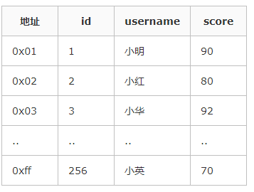

注：第一列的地址表示该行数据在磁盘中的物理地址，后面三列才是我们SQL里面用的表里的列，其中id是主键，建立了聚集索引。

数据行的物理顺序与列值的**顺序相同**，如果我们查询id比较靠后的数据，那么这行数据的地址在磁盘中的物理地址也会比较靠后。而且由于物理排列方式与聚集索引的顺序相同，所以也就只能建立一个聚集索引。

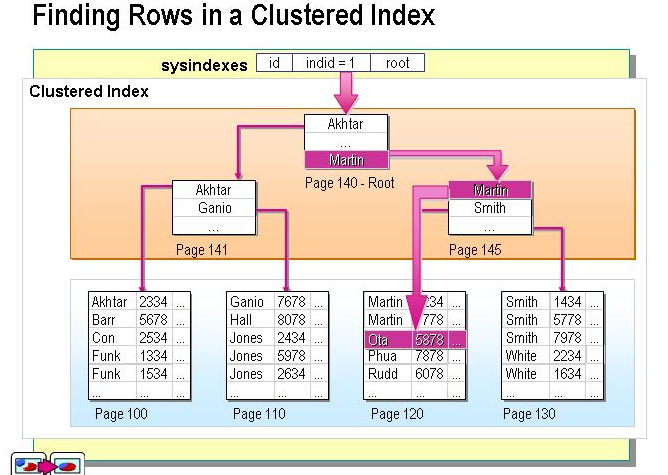

从上图可以看出聚集索引的好处了，索引的叶子节点就是对应的数据节点,可以直接获取到对应的全部列的数据，而非聚集索引在索引没有覆盖到对应的列的时候需要进行二次查询。因此在查询方面，聚集索引的速度往往会更占优势。

**非聚集索引：**除了聚集索引以外的索引都是非聚集索引，细分成普通索引，唯一索引，全文索引。（全文索引：通过关键字的匹配来进行查询过滤，那么就需要基于相似度的查询，而不是原来的精确数值比较。）

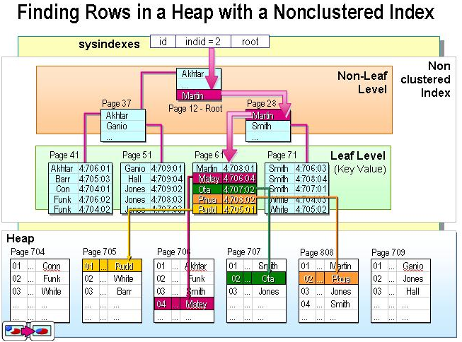

非聚集索引叶节点仍然是索引节点，只是有一个指针指向对应的数据块，此如果使用非聚集索引查询，而查询列中包含了其他该索引没有覆盖的列，那么他还要进行第二次的查询，查询节点上对应的数据行的数据。

#### 3.7 Redis为什么使用跳跃表

Redis里面使用skiplist是为了实现sorted set这种对外的数据结构。一般查找问题的解法分为两个大类：一个是基于各种平衡树，一个是基于哈希表。但skiplist却比较特殊

当我们想查找数据的时候，可以先沿着这个新链表进行查找。当碰到比待查数据大的节点时，再回到原来的链表中进行查找。比如，我们想查找23，查找的路径是沿着下图中标红的指针所指向的方向进行的：

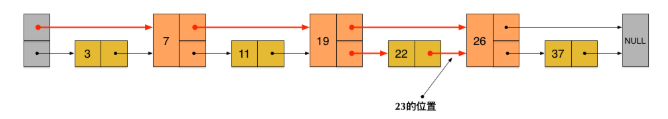

skiplist为了避免插入和删除问题，它不要求上下相邻两层链表之间的节点个数有严格的对应关系，而是为每个节点随机出一个层数(level)。比如，一个节点随机出的层数是3，那么就把它链入到第1层到第3层这三层链表中。

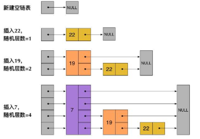

#### 3.8 B+树和B-树的区别，为什么选用B+树做索引

**B-树**：是一种多路搜索树（并不是二叉的），定义任意非叶子结点最多只有M个儿子，且M>2。根结点的儿子数为[2, M]，除根结点以外的非叶子结点的儿子数为[M/2, M]，

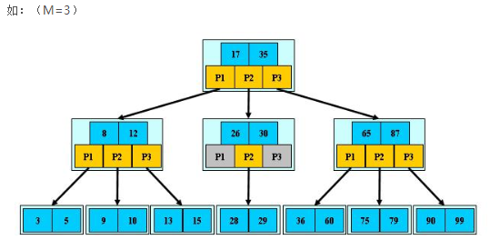

**B+树**：B+树是B-树的变体，也是一种多路搜索树。其定义基本与B-树相同，除了非叶子结点的子树指针与关键字个数相同，所有叶子结点增加一个链指针，所有关键字都在叶子结点出现

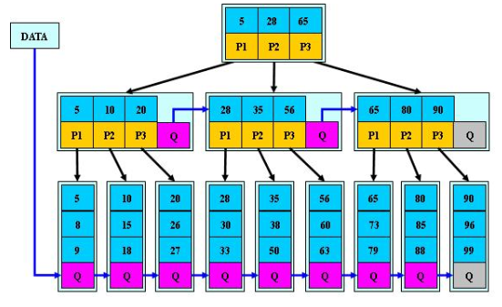

####  3.9  反射的原理

Java的反射是利用加载到jvm中的.class文件来进行操作的。.class文件中包含java类的所有信息，当你不知道某个类具体信息时，可以使用反射获取class，然后进行各种操作。

Java反射就是在运行状态中，对于任意一个类，都能够知道这个类的所有属性和方法；对于任意一个对象，都能够调用它的任意方法和属性；并且能改变它的属性。总结说：反射就是把**java类中的各种成分映射成一个个的Java对象**，并且可以进行操作

#### 3.10 为什么cpu有缓存

内存看起来速度要比硬盘快得多，但是相对CPU来说仍然是极慢的,在CPU和内存交换数据的时候，CPU内部的缓存才是关键的关键。通常CPU都是先从cache（高速缓存）拿数据，如果没有找到要的数据才会从慢的内存中找。

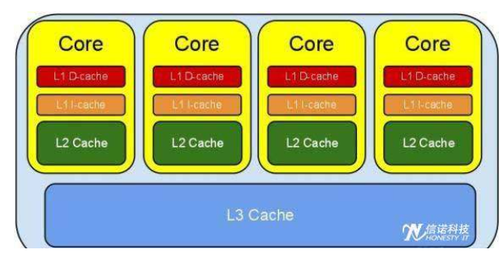

CPU的缓存也分成几个层级，用于优化数据的吞吐和暂存，提高执行效率。

**L1 Cache一级缓存**

一级缓存是CPU第一层级的高速缓存，主要承担的工作是缓存数据和缓存指令。L1告诉缓存的容量和结构对CPU性能影响很大，但是由于它的结构很复杂，考虑到成本等方面的因素，一般CPU的一级缓存也就能做到256KB左右的水平。

**L2 Cache二级缓存**

二级缓存是CPU的第二层级高速缓存，二级缓存的容量会直接影响CPU性能，原则是越大越好。而且它是跟着核心走的，比如8代酷睿的i7 8700，6个核心每个都拥有256KB的二级缓存，属于各核心独享，这样总数就达到了1.5MB。

**L3 Cache三级缓存**

三级缓存其实原本是服务器级别CPU才有的，后来逐步下放到家用级CPU上。三级缓存的作用是进一步降低内存延迟，同时提升海量数据量计算时的性能，对游戏有直接的影响哦！

和一、二级缓存不同的是，三级缓存是核心共享的，而且容量可以做的很大

#### 3.11 缓存一致性协议之MESI

处理器上有一套完整的协议，来保证Cache一致性。

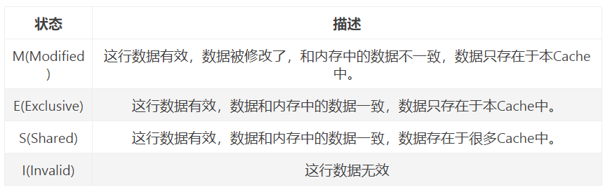

## 腾讯

#### 4.1  Redis性能高的原因

1、完全基于内存，绝大部分请求是纯粹的内存操作，非常快速。数据存在内存中，类似于HashMap，HashMap的优势就是查找和操作的时间复杂度都是O(1)；

2、数据结构简单，对数据操作也简单，Redis中的数据结构是专门进行设计的；

3、采用单线程，避免了不必要的上下文切换和竞争条件，也不存在多进程或者多线程导致的切换而消耗 CPU，不用去考虑各种锁的问题，不存在加锁释放锁操作，没有因为可能出现死锁而导致的性能消耗；注意：redis 单线程指的是网络请求模块使用了一个线程，即一个线程处理所有网络请求，其他模块仍用了多个线程。

4、使用多路I/O复用模型，非阻塞IO；

5、使用底层模型不同，它们之间底层实现方式以及与客户端之间通信的应用协议不一样，Redis直接自己构建了VM 机制 ，因为一般的系统调用系统函数的话，会浪费一定的时间去移动和请求；


#### 4.2  Redis 的RDB和AOF

 **RDB存在哪些优势呢？**
1). 一旦采用该方式，那么你的整个Redis数据库将只包含一个文件，这对于文件备份而言是非常完美的。比如，你可能打算每个小时归档一次最近24小时的数据，同时还要每天归档一次最近30天的数据。通过这样的备份策略，一旦系统出现灾难性故障，我们可以非常容易的进行恢复。
2). 对于灾难恢复而言，RDB是非常不错的选择。因为我们可以非常轻松的将一个单独的文件压缩后再转移到其它存储介质上。
3). 性能最大化。对于Redis的服务进程而言，在开始持久化时，它唯一需要做的只是fork出子进程，之后再由子进程完成这些持久化的工作，这样就可以极大的避免服务进程执行IO操作了。
4). 相比于AOF机制，如果数据集很大，RDB的启动效率会更高。**RDB又存在哪些劣势呢？**
4.1). 如果你想保证数据的高可用性，即最大限度的避免数据丢失，那么RDB将不是一个很好的选择。因为系统一旦在定时持久化之前出现宕机现象，此前没有来得及写入磁盘的数据都将丢失。
4.2). 由于RDB是通过fork子进程来协助完成数据持久化工作的，因此，如果当数据集较大时，可能会导致整个服务器停止服务几百毫秒，甚至是1秒钟。
**AOF的优势有哪些呢？**
1). 该机制可以带来更高的数据安全性，即数据持久性。Redis中提供了3中同步策略，即每秒同步、每修改同步和不同步。事实上，每秒同步也是异步完成的，其效率也是非常高的，所差的是一旦系统出现宕机现象，那么这一秒钟之内修改的数据将会丢失。而每修改同步，我们可以将其视为同步持久化，即每次发生的数据变化都会被立即记录到磁盘中。可以预见，这种方式在效率上是最低的。至于无同步，无需多言，我想大家都能正确的理解它。
2). 由于该机制对日志文件的写入操作采用的是append模式，因此在写入过程中即使出现宕机现象，也不会破坏日志文件中已经存在的内容。然而如果我们本次操作只是写入了一半数据就出现了系统崩溃问题，不用担心，在Redis下一次启动之前，我们可以通过redis-check-aof工具来帮助我们解决数据一致性的问题。
3). 如果日志过大，Redis可以自动启用rewrite机制。即Redis以append模式不断的将修改数据写入到老的磁盘文件中，同时Redis还会创建一个新的文件用于记录此期间有哪些修改命令被执行。因此在进行rewrite切换时可以更好的保证数据安全性。
4). AOF包含一个格式清晰、易于理解的日志文件用于记录所有的修改操作。事实上，我们也可以通过该文件完成数据的重建。
**AOF的劣势有哪些呢？**
1). 对于相同数量的数据集而言，AOF文件通常要大于RDB文件。RDB 在恢复大数据集时的速度比 AOF 的恢复速度要快。
2). 根据同步策略的不同，AOF在运行效率上往往会慢于RDB。总之，每秒同步策略的效率是比较高的，同步禁用策略的效率和RDB一样高效。二者选择的标准，就是看系统是愿意牺牲一些性能，换取更高的缓存一致性（aof），还是愿意写操作频繁的时候，不启用备份来换取更高的性能，待手动运行save的时候，再做备份（rdb）。rdb这个就更有些 eventually consistent的意思了。
3). 常用配置RDB持久化配置Redis会将数据集的快照dump到dump.rdb文件中。此外，我们也可以通过配置文件来修改Redis服务器dump快照的频率，在打开6379.conf文件之后，我们搜索save，可以看到下面的配置信息：save 900 1 #在900秒(15分钟)之后，如果至少有1个key发生变化，则dump内存快照。save 300 10 #在300秒(5分钟)之后，如果至少有10个key发生变化，则dump内存快照。save 60 10000 #在60秒(1分钟)之后，如果至少有10000个key发生变化，则dump内存快照。AOF持久化配置在Redis的配置文件中存在三种同步方式，它们分别是：appendfsync always #每次有数据修改发生时都会写入AOF文件。appendfsync everysec #每秒钟同步一次，该策略为AOF的缺省策略。

#### 4.3  IO多路复用

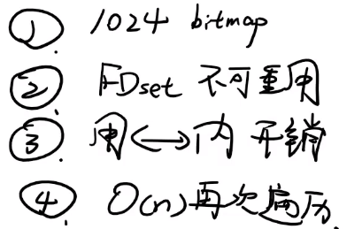

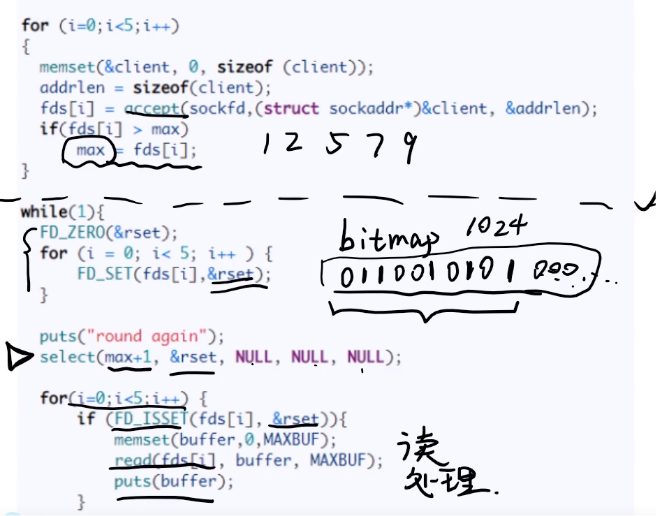

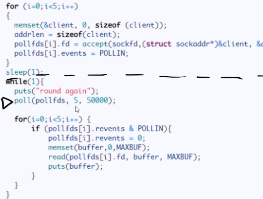

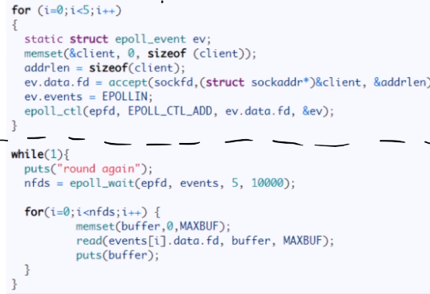

Linux: select、poll、epoll

**select** 被实现以后，很快就暴露出了很多问题。
select 会修改传入的参数数组，这个对于一个需要调用很多次的函数，是非常不友好的。
 select 如果任何一个sock(I/O stream)出现了数据，select 仅仅会返回，但是并不会告诉你是那个sock上有数据，于是你只能自己一个一个的找，10几个sock可能还好，要是几万的sock每次都找一遍，这个无谓的开销就颇有海天盛筵的豪气了。
select 只能监视1024个链接， 这个跟草榴没啥关系哦，linux 定义在头文件中的，参见FD_SETSIZE。select 不是线程安全的，如果你把一个sock加入到select, 然后突然另外一个线程发现，尼玛，这个sock不用，要收回。对不起，这个select 不支持的，如果你丧心病狂的竟然关掉这个sock, select的标准行为是不可预测的， 这个可是写在文档中的哦.
**poll** 修复了select的很多问题，比如 

- poll 去掉了1024个链接的限制，于是要多少链接呢， 主人你开心就好。
- poll 从设计上来说，不再修改传入数组，不过这个要看你的平台了，所以行走江湖，还是小心为妙。

**epoll** 可以说是I/O 多路复用最新的一个实现

- epoll 现在是线程安全的。 
- epoll 现在不仅告诉你sock组里面数据，还会告诉你具体哪个sock有数据，你不用自己去找了。


#### 4.4 MySQL根据JSON字段查询数据

MySQL5.7以上支持JSON的操作，以及增加了JSON存储类型

```mysql
SELECT * FROM core_process where Form_Value_ -> '$.attendancer' = '马立新'
```

#### 4.5  Mysql 使用通配符模糊查询

`%`百分号通配符: 表示任何字符出现任意次数

`_`下划线通配符:表示只能匹配单个字符,不能多也不能少,就是一个字符.

```mysql
SELECT * FROM products WHERE products.prod_name like 'yves%'
```

## 总结

#### A.1 Java 多线程与并发

 **线程和进程的区别**

进程是资源分配的最小单位，线程是CPU调度的最小单位。

进程负责为程序的运行提供必备的环境，线程是计算机中最小的计算单元线程负责执行进程中的程序。

1、进程中至少包含一个线程，并且可以包含多个线程。

2、同一进程之间线程数据共享比较容易，进程之间交互比较困难。

3、进程之间不会相互影响，一个线程挂掉将导致整个进程挂掉。

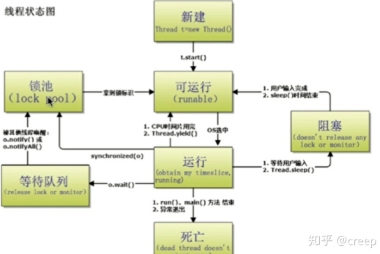

**start()与run()的区别**

- 调用start()方法会创建一个新的子线程并启动
- run()方法是Thread启动后的方法回调

**Thread和Runnable的关系**

- Runable接口并没有start方法，需要依赖Thread来启动
- Thread是实现了Runnable接口的类，使得run支持多线程
- 因类的单一继承原则，推荐多使用Runnable

**如何处理线程的返回值**

1. 主线程等待法
2. 使用Thread类的join()阻塞当前线程以等待子线程处理完毕
3. 通过Callable接口实现：通过FutureTask 或者线程池获取

**线程的状态**

Java中的线程主要有六个状态

```java
public enum State {
        NEW,
        RUNNABLE,
        BLOCKED,
        WAITING,
        TIMED_WAITING,
        TERMINATED;
    }

```

- 新建（New）：创建后尚未启动的线程的状态
- 运行（Runnable）：包含Running和Ready
- 无限期等待（Waiting）：不会被分配CPU执行事件，需要显示被唤醒
- 限期等待（Timed Waiting）：在一定时间后会由系统自动唤醒。Thread.sleep()和带timeout参数的Object.wait()方法
- 阻塞（Blocked）：等待获取排他锁
- 结束（Terminated）：已终止线程的状态，线程已经结束执行

**sleep和wait的区别**

- sleep是Thread类的方法，wait是Object类中定义的方法
- sleep()方法可以在任何地方使用
- wait()方法只能在synchronized方法或synchronized块中使用

本质区别：Thread.sleep只会让出CPU，不会导致锁行为的改变，Object.wait不仅让出CPU，还会释放已经占有的同步资源锁。

**notify()与notifyAll()的区别**

- 锁池EntryList：假设线程A已经拥有的某个对象（不是类）的锁，B、C线程就会被阻塞，进入一个地方去等待锁的释放，这个地方便是该对象的锁池。
- 等待池WaitSet：假设线程A调用了某个对象的wait()方法，线程A就会释放该对象的锁，同时线程A就进入到了该对象的等待池中，进入到等待池中的线程不会去竞争该对象的锁。
- notifyAll会让所有处于等待池中的线程全部进入锁池去竞争获取锁的机会
- notify只会随机选取一个处于等待池中的线程进入锁池去竞争获取锁的机会

**yield**

当调用Thread.yield()函数时，会给线程调度器一个当前线程愿意让出CPU使用的暗示，但是线程调度器可能会忽略这个暗示。取决于各个不同jvm的具体实现。HotSpot实现是将线程从running状态转为runnable状态，然后放入同优先级等待队列的末尾，等待前面所有相同优先级的线程调度完成后才可能再度获得执行机会。

**interrupt 中断线程**

- 如果线程处于被阻塞状态，那么线程将立即退出被阻塞状态，并抛出一个Interrupted Exception异常
- 如果线程处于正常活动状态，那么会将该线程的中断标志设置为true。被设置中断标志的线程将继续正常运行，不受影响。

**Callable和Runnable接口的区别**

区别1: 两者最大的区别，实现Callable接口的任务线程能返回执行结果，而实现Runnable接口的任务线程不能返回执行结果。

区别2:Callable接口实现类中run()方法允许将异常向上抛出，也可以直接在内部处理(try...catch); 而Runnable接口实现类中run()方法的异常必须在内部处理掉，不能向上抛出

**线程安全问题的主要诱因**

存在共享数据（也称临界资源）,存在多条线程共同操作这些共享数据

**对象锁与类锁**

获取对象锁的两种方法：

1. 同步代码块（synchronized(this),synchronized(类实例对象)），锁是小括号()中的实例对象
2. 同步非静态方法（synchronized method），锁是当前对象的实例对象

获取类锁的俩种用法：

1. 同步代码块（synchronized(类.class))，锁是小括号()中的类对象（Class对象）
2. 同步静态方法（synchronized static method）,锁是当前对象的类对象（Class对象）

类锁由于也是一种特殊的对象锁，由于一个类只有一把对象锁，所以同一个类的不同对象使用类锁将会是同步的；

**synchronized底层实现原理**

实现synchronized的基础

- Java对象头
- Monitor

**对象在内存中的布局**

- 对象头：默认存储对象的hashcode，分代年龄，锁类型，锁标识位等信息

  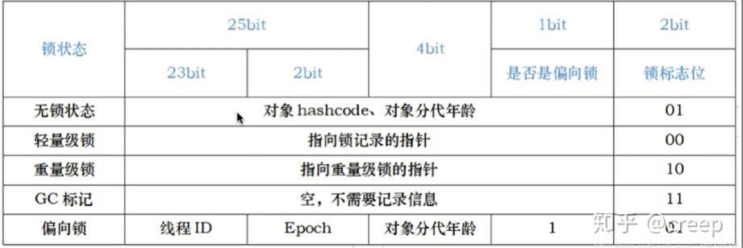

- 实例数据

- 对齐填充

**Monitor**

Monitor：每个Java对象天生自带了一把看不见的锁

Monitor锁的竞争、获取与释放：

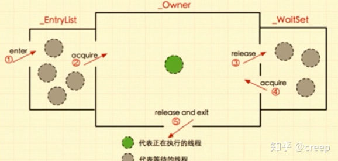

**锁的内存语义**

当线程释放锁时，Java内存模型会把该线程对应的本地内存种的共享变量刷新到主内存中；
而当线程获取锁时


**synchronized的四种状态**

- 无锁、**偏向锁**、**轻量级锁**、**重量级锁**

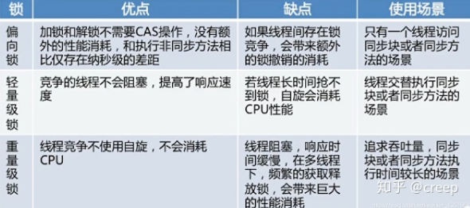

**ReentrantLock公平性的设置**

- ReentrantLock fairLock = new ReentrantLock(true);
- 参数为true时，倾向于将锁赋予等待时间最久的线程

公平锁与非公平锁：

- 公平锁： 获取锁的顺序按先后调用lock方法的顺序（慎用）
- 非公平锁：抢占的顺序不一定，看运气
- synchronized 是非公平锁

**synchronized和ReentrantLock的区别**

1. synchronized是关键字，ReentrantLock是类
2. ReentrantLock可以对获取锁的等待时间进行设置，避免死锁
3. ReentrantLock可以实现公平锁，synchronized 是非公平锁
4. 机制：sync操作Mark Word，lock调用Unsafe类地park()方法

**volatile变量为何立即可见**

> 当写一个volatile变量时，JMM会把该线程对应的工作内存中的共享变量值刷新到主内存中；
> 当读取一个volatile变量时，JMM会把该线程对应的工作内存置为无效

**volatile如何禁止重排序优化**

volatile通过插入内存屏障指令禁止在内存屏障前后的指令执行重排序优化。
**Fork/Join框架**

- 把大任务分割成若干个小任务并行执行，最终汇总每个小人物结果后得到大任务结果的框架


**ThreadPoolExecutor**

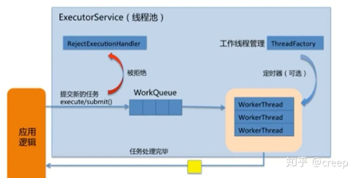

- 如果运行的线程少于corePoolSize,则创建新线程来处理任务，即使线程池中的其他线程是空闲的
- 如果线程池中的线程数量大于等于corePoolSize且小于maximumPoolSize，则只有当workQueue满时才创建新的线程去处理任务
- 如果设置的corePoolSize和maximumPoolSize相同，则创建的线程池的大小是固定的，这时如果有新任务提交，若workQueue未满，则将请求放入workQueue中，等待有空闲的线程去从workQueue中取任务并处理
- 如果运行的线程数量大于等于maximumPoolSize，这时如果workQueue已经满了，则通过handler所指定的策略来处理任务


**线程池的大小如何选定**

- CPU密集型：线程数 = 按照核数或者核数 + 1设定

- IO密集型：线程数 = CPU核数 * （1 + 平均等待时间/平均工作时间）

  

**ThreadLocal**

（1）每个Thread维护着一个ThreadLocalMap的引用

（2）ThreadLocalMap是ThreadLocal的内部类，用Entry来进行存储

（3）ThreadLocal创建的副本是存储在自己的threadLocals中的，也就是自己的ThreadLocalMap。

（4）ThreadLocalMap的键值为ThreadLocal对象，而且可以有多个threadLocal变量，因此保存在map中

（5）在进行get之前，必须先set，否则会报空指针异常，当然也可以初始化一个，但是必须重写initialValue()方法。

（6）ThreadLocal本身并不存储值，它只是作为一个key来让线程从ThreadLocalMap获取value。

#### A.2   Java多线程案例

**窗口A和B卖10 张票：**

```java
public class SaleWindow2 implements Runnable {

    private int id = 10;   //表示10张火车票   这是共享资源
	public synchronized  void saleOne(){
        if (id > 0) { 
            System.out.println(Thread.currentThread().getName()
                    + "卖了编号为" + id + "的火车票");
            id--;
            try {
                Thread.sleep(500);
            } catch (InterruptedException e) {
            }
        }
    }

    //卖10张火车票
    public void run() {
        for (int i = 0; i < 10; i++) {
           saleOne();
        }
    }
}
public static void main(String[] args) {
		SaleWindow2 sw=new SaleWindow2();

		Thread t1=new Thread(sw);
		Thread t2=new Thread(sw);

		t1.setName("窗口A");
		t2.setName("窗口B");

		t1.start();
		t2.start();
	}
```

**线程A和B交替执行**

```java
public class MyLock {
    public static Object o=new Object();
}
public class ThreadForNum1 extends Thread {
    public void run(){
        for(int j=0;j<10;j++){
            synchronized (MyLock.o) {
                System.out.println(1);
                MyLock.o.notify();
                try {
                    MyLock.o.wait();
                } catch (InterruptedException e) {
                    e.printStackTrace();
                }
            }
        }
    }
}

public class ThreadForNum2 extends Thread {
    public void run(){
        for(int j=0;j<10;j++){
            synchronized (MyLock.o) {
                System.out.println(2);
                MyLock.o.notify();
                try {
                    MyLock.o.wait();
                } catch (InterruptedException e) {
                    e.printStackTrace();
                }
            }
        }
    }
}

public class TestThreadForNum {
    public static void main(String[] args){
        new ThreadForNum1().start();
        new ThreadForNum2().start();
    }
}
```

**生产者消费者模型**

```java
public class Kuang {
	//这个集合就是水果筐 假设最多存10个水果
	public static ArrayList<String> kuang=new ArrayList<String>();
}
消费者
public class Child extends Thread {
    public void run() {
        while (true) {
            synchronized (Kuang.kuang) {
                //1.筐里没水果了就让小孩休息
                if (Kuang.kuang.size() == 0) {
                    try {
                        Kuang.kuang.wait();
                    } catch (InterruptedException e) {
                    }
                }
                //2.小孩吃水果
                Kuang.kuang.remove("apple");
                System.out.println("小孩吃了一个水果,目前筐里有" + Kuang.kuang.size() + "个水果");
                //3.唤醒农夫继续放水果
                Kuang.kuang.notify();
            }
            //4.模拟控制速度
            try {
                Thread.sleep(3000);
            } catch (InterruptedException e) {
                e.printStackTrace();
            }
        }
    }
}
生产者
public class Farmer extends Thread {
    public void run() {
        while (true) {
            synchronized (Kuang.kuang) {
                //1.筐放满了就让农夫休息
                if (Kuang.kuang.size() == 10) {
                    try {
                        Kuang.kuang.wait();
                    } catch (InterruptedException e) {
                    }
                }
                //2.往筐里放水果
                Kuang.kuang.add("apple");
                System.out.println("农夫放了一个水果,目前筐里有" + Kuang.kuang.size()
                        + "个水果");
                //3.唤醒小孩继续吃
                Kuang.kuang.notify();
            }
            //4.模拟控制速度
            try {
                Thread.sleep(50);
            } catch (InterruptedException e) {
            }
        }
    }
}
public class TestFarmerChild {
	public static void main(String[] args) {
		new Farmer().start();
		new Child().start();
	}
}
```

**线程使用案例**

```java
 1 package com.jt.thread.demo05;
 2 
 3 import java.util.concurrent.ExecutorService;
 4 import java.util.concurrent.Executors;
 5 
 6 class MyRunnable implements Runnable {
 7     @Override
 8     public void run() {
 9         for (int x = 0; x < 100; x++) {
10             System.out.println(Thread.currentThread().getName() + ":" + x);
11        }
12     }
13 }
14 
15 public class ExecutorServiceDemo {
16     public static void main(String[] args) {
17      // 创建一个线程池对象，控制要创建几个线程对象。
18      // public static ExecutorService newFixedThreadPool(int nThreads)
19      ExecutorService pool = Executors.newFixedThreadPool(2);
20 
21      // 可以执行Runnable对象或者Callable对象代表的线程
22      pool.submit(new MyRunnable());
23      pool.submit(new MyRunnable());
24 
25     //结束线程池
26     pool.shutdown();
27    }
28 } 
输出：
pool-1-thread-1:0
pool-1-thread-1:1
pool-1-thread-1:2
pool-1-thread-2:0
pool-1-thread-2:1
pool-1-thread-2:2
pool-1-thread-2:3
    ....
```


#### A.3  MYSQL 总结

**SQL语句执行流程**

1.当客户端连接到MySQL服务器时，服务器对其进行认证。

2.在正式查询之前，服务器会检查查询缓存，如果能找到对应的查询，则不必进行查询解析。

3.MySQL的解析器会根据查询语句，构造出一个解析树，主要用于根据语法规则来验证语句是否正确，比如SQL的关键字是否正确，关键字的顺序是否正确。

4.查询优化器将解析树转化为查询计划，一般情况下，一条查询可以有很多种执行方式，最终返回相同的结果，优化器就是根据成本找到这其中最优的执行计划

5.执行计划调用查询执行引擎，而查询引擎通过一系列API接口查询到数据

6.得到数据之后，在返回给客户端的同时，会将数据存在查询缓存中

**索引使用原则**

1.最左前缀原则。一个联合索引（a,b,c），查询条件有a，有b，那么他则走索引，否则不走索引。

2.使用唯一索引。具有多个重复值的列，其索引效果最差。

3.不要过度索引。每个额外的索引都要占用额外的磁盘空间，并降低写操作的性能。在修改表的内容时，索引必须进行更新，有时可能需要重构，因此，索引越多，所花的时间越长。

4、索引列不能参与计算，保持列“干净”。

5.一定要设置一个主键。前面聚簇索引说到如果不指定主键，InnoDB会自动为其指定主键

6.主键推荐用自增id，而不是uuid。如果是uuid，那么其肯定是随机的，其可能从中间插入，导致页的分裂，产生很多表碎片。

**为什么索引用B+树**

1、 B+树的磁盘读写代价更低：B+树的内部节点并没有指向关键字具体信息的指针，因此其内部节点相对B树更小，如果把所有同一内部节点的关键字存放在同一盘块中，那么盘块所能容纳的关键字数量也越多，一次性读入内存的需要查找的关键字也就越多，相对`IO读写次数就降低`了。
2、由于B+树的数据都存储在叶子结点中，分支结点均为索引，方便扫库，只需要扫一遍叶子结点，B+树更加适合在`区间查询`的情况

**为什么Mongodb 使用B树，Mysql使用B+树**
.**B+树和B-树**

B树和B-tree是同一种树，属于多叉树又名平衡多路查找树。（1）排序方式：所有节点关键字是按递增次序排列，并遵循左小右大原则；

（2）子节点数：非叶节点的子节点数>1，且<=M ，且M>=2，空树除外

（3）关键字数：枝节点的关键字数量大于等于ceil(m/2)-1个且小于等于M-1个（ceil(1.1)结果为2）

（4）所有叶子节点均在同一层、叶子节点除了包含了关键字和关键字记录的指针外也有指向其子节点的指针只不过其指针地址都为null对应下图最后一层节点的空格子;


B+树是B树的一个升级版，相对于B树来说B+树更充分的利用了节点的空间，树的层级更少所以查询数据更快；

（1）B+树的层级更少：B+跟B树不同B+树的非叶子节点不保存关键字记录的指针，只进行数据索引，这样使得B+树每个非叶子节点所能保存的关键字大大增加,B+树的层级更少：；

（2）B+树查询速度更稳定：B+树叶子节点保存了父节点的所有关键字记录的指针，所有数据地址必须要到叶子节点才能获取到。所以每次数据查询的次数都一样；

（3）B+树天然具备排序功能：B+树叶子节点的关键字从小到大有序排列，左边结尾数据都会保存右边节点开始数据的指针。

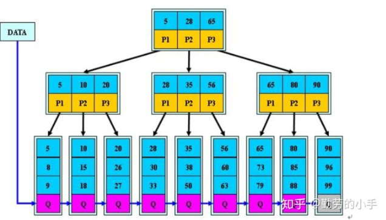

**redo日志刷盘时机**

log buffer空间不足。上面有指定缓冲区的内存大小，MySQL认为日志量已经占了 总容量的一半左右，就需要将这些日志刷新到磁盘上。 

事务提交时。我们使用redo日志的目的就是将他未刷新到磁盘的记录保存起来，防止 丢失，如果数据提交了，我们是可以不把数据提交到磁盘的，但为了保证持久性，必须 把修改这些页面的redo日志刷新到磁盘。 

后台线程不同的刷新 后台有一个线程，大概每秒都会将log buffer里面的redo日志刷新到硬盘上。

#### A.4  UDP 和 TCP 高频面试题

**UDP 和 TCP 的特点与区别**

用户数据报协议 UDP（User Datagram Protocol）

是无连接的，尽最大可能交付，没有拥塞控制，面向报文（对于应用程序传下来的报文不合并也不拆分，只是添加 UDP 首部），支持一对一、一对多、多对一和多对多的交互通信。

传输控制协议 TCP（Transmission Control Protocol）

是面向连接的，提供可靠交付，有流量控制，拥塞控制，提供全双工通信，面向字节流（把应用层传下来的报文看成字节流，把字节流组织成大小不等的数据块），每一条 TCP 连接只能是点对点的（一对一）。

**UDP 、TCP 首部格式**

UDP 首部字段只有 8 个字节，包括源端口、目的端口、长度、检验和。12 字节的伪首部是为了计算检验和临时添加的。

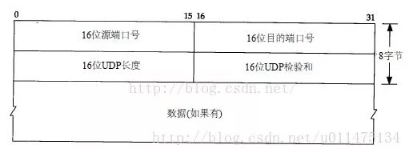

TCP 首部格式比 UDP 复杂。

序号：用于对字节流进行编号，例如序号为 301，表示第一个字节的编号为 301，如果携带的数据长度为 100 字节，那么下一个报文段的序号应为 401。

确认号：期望收到的下一个报文段的序号。例如 B 正确收到 A 发送来的一个报文段，序号为 501，携带的数据长度为 200 字节，因此 B 期望下一个报文段的序号为 701，B 发送给 A 的确认报文段中确认号就为 701。

数据偏移：指的是数据部分距离报文段起始处的偏移量，实际上指的是首部的长度。

控制位：八位从左到右分别是 CWR，ECE，URG，ACK，PSH，RST，SYN，FIN。

- CWR：CWR 标志与后面的 ECE 标志都用于 IP 首部的 ECN 字段，ECE 标志为 1 时，则通知对方已将拥塞窗口缩小；
- ECE：若其值为 1 则会通知对方，从对方到这边的网络有阻塞。在收到数据包的 IP 首部中 ECN 为 1 时将 TCP 首部中的 ECE 设为 1；
- URG：该位设为 1，表示包中有需要紧急处理的数据，对于需要紧急处理的数据，与后面的紧急指针有关；
- ACK：该位设为 1，确认应答的字段有效，TCP规定除了最初建立连接时的 SYN 包之外该位必须设为 1；
- PSH：该位设为 1，表示需要将收到的数据立刻传给上层应用协议，若设为 0，则先将数据进行缓存；
- RST：该位设为 1，表示 TCP 连接出现异常必须强制断开连接；
- SYN：用于建立连接，该位设为 1，表示希望建立连接，并在其序列号的字段进行序列号初值设定；
- FIN：该位设为 1，表示今后不再有数据发送，希望断开连接。当通信结束希望断开连接时，通信双方的主机之间就可以相互交换 FIN 位置为 1 的 TCP 段。

窗口：窗口值作为接收方让发送方设置其发送窗口的依据。之所以要有这个限制，是因为接收方的数据缓存空间是有限的。

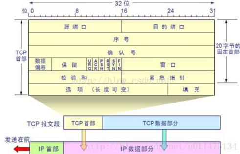

**TCP 的三次握手（为什么三次？）**

“3次握手”的作用就是双方都能明确自己和对方的收、发能力是正常的。

第一次握手：客户端发送网络包，服务端收到了。这样服务端就能得出结论：客户端的发送能力、服务端的接收能力是正常的。

第二次握手：服务端发包，客户端收到了。这样客户端就能得出结论：服务端的接收、发送能力，客户端的接收、发送能力是正常的。

第三次握手：客户端发包，服务端收到了。这样服务端就能得出结论：客户端的接收、发送能力，服务端的发送、接收能力是正常的。

注意：第一、二次握手后，服务端并不知道客户端的接收能力以及自己的发送能力是否正常。最少是需要三次握手过程的。两次达不到让双方都得出自己、对方的接收、发送能力都正常的结论。

**TIME_WAIT**

客户端接收到服务器端的 FIN 报文后进入此状态，此时并不是直接进入 CLOSED 状态，还需要等待一个时间计时器设置的时间 2MSL

- 确保最后一个确认报文能够到达。如果 B 没收到 A 发送来的确认报文，那么就会重新发送连接释放请求报文，A 等待一段时间就是为了处理这种情况的发生。

  

**TCP 短连接和长连接的区别**

短连接：Client 向 Server 发送消息，Server 回应 Client，然后一次读写就完成了，这时候双方任何一个都可以发起 close 操作，不过一般都是 Client 先发起 close 操作。短连接一般只会在 Client/Server 间传递一次读写操作。

短连接的优点：管理起来比较简单，建立存在的连接都是有用的连接，不需要额外的控制手段。

长连接：Client 与 Server 完成一次读写之后，它们之间的连接并不会主动关闭，后续的读写操作会继续使用这个连接。

在长连接的应用场景下，Client 端一般不会主动关闭它们之间的连接，Client 与 Server 之间的连接如果一直不关闭的话，随着客户端连接越来越多，Server 压力也越来越大，这时候 Server 端需要采取一些策略，如关闭一些长时间没有读写事件发生的连接，这样可以避免一些恶意连接导致 Server 端服务受损；

**TCP粘包、拆包及解决办法**

UDP 是基于报文发送的，UDP首部采用了 16bit 来指示 UDP 数据报文的长度，因此在应用层能很好的将不同的数据报文区分开，从而避免粘包和拆包的问题。

TCP 是基于字节流的，虽然应用层和 TCP 传输层之间的数据交互是大小不等的数据块，但是 TCP 并没有把这些数据块区分边界，仅仅是一连串没有结构的字节流；TCP 的首部没有表示数据长度的字段，基于上面两点，在使用 TCP 传输数据时，才有粘包或者拆包现象发生的可能。

发生 TCP 粘包、拆包

- 要发送的数据大于 TCP 发送缓冲区剩余空间大小，将会发生拆包。
- 待发送数据大于 MSS（最大报文长度），TCP 在传输前将进行拆包。
- 要发送的数据小于 TCP 发送缓冲区的大小，TCP 将多次写入缓冲区的数据一次发送出去，将会发生粘包。
- 接收数据端的应用层没有及时读取接收缓冲区中的数据，将发生粘包。

粘包、拆包解决办法

- 消息定长：发送端将每个数据包封装为固定长度（不够的可以通过补 0 填充），这样接收端每次接收缓冲区中读取固定长度的数据就自然而然的把每个数据包拆分开来。

- 设置消息边界**：**服务端从网络流中按消息边界分离出消息内容。在包尾增加回车换行符进行分割，例如 FTP 协议。

- 将消息分为消息头和消息体：消息头中包含表示消息总长度（或者消息体长度）的字段。

  

**TCP 滑动窗口**

窗口是缓存的一部分，用来暂时存放字节流。发送方和接收方各有一个窗口，接收方通过 TCP 报文段中的窗口字段告诉发送方自己的窗口大小，发送方根据这个值和其它信息设置自己的窗口大小。

发送窗口内的字节都允许被发送，接收窗口内的字节都允许被接收。如果发送窗口左部的字节已经发送并且收到了确认，那么就将发送窗口向右滑动一定距离，直到左部第一个字节不是已发送并且已确认的状态；接收窗口的滑动类似，接收窗口左部字节已经发送确认并交付主机，就向右滑动接收窗口。

接收窗口只会对窗口内最后一个按序到达的字节进行确认，例如接收窗口已经收到的字节为 {31, 34, 35}，其中 {31} 按序到达，而 {34, 35} 就不是，因此只对字节 31 进行确认。发送方得到一个字节的确认之后，就知道这个字节之前的所有字节都已经被接收。

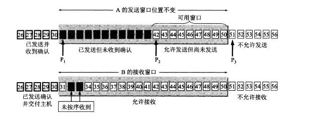

接收方发送的确认报文中的窗口字段可以用来控制发送方窗口大小，从而影响发送方的发送速率。将窗口字段设置为 0，则发送方不能发送数据。发送端主机会时不时的发送一个叫做窗口探测的数据段，此数据段仅包含一个字节来获取最新的窗口大小信息。

**TCP 拥塞控制**

如果网络出现拥塞，分组将会丢失，此时发送方会继续重传，从而导致网络拥塞程度更高。因此当出现拥塞时，应当控制发送方的速率。流量控制是为了让接收方能来得及接收，而拥塞控制是为了降低整个网络的拥塞程度。

发送方需要维护一个叫做拥塞窗口（cwnd）的状态变量，注意拥塞窗口与发送方窗口的区别：拥塞窗口只是一个状态变量，实际决定发送方能发送多少数据的是发送方窗口。

TCP 主要通过四个算法来进行拥塞控制：

慢开始、拥塞避免、快重传、快恢复

- 发送的最初执行慢开始，令 cwnd = 1，发送方只能发送 1 个报文段；当收到确认后，将 cwnd 加倍，因此之后发送方能够发送的报文段数量为：2、4、8 ...
- 注意到慢开始每个轮次都将 cwnd 加倍，这样会让 cwnd 增长速度非常快，从而使得发送方发送的速度增长速度过快，网络拥塞的可能性也就更高。设置一个慢开始门限 ssthresh，当 cwnd >= ssthresh 时，进入拥塞避免，每个轮次只将 cwnd 加 1。
- 如果出现了超时，则令 ssthresh = cwnd / 2，然后重新执行慢开始。
- 在接收方，要求每次接收到报文段都应该对最后一个已收到的有序报文段进行确认。例如已经接收到 M1 和 M2，此时收到 M4，应当发送对 M2 的确认。
- 在发送方，如果收到三个重复确认，那么可以知道下一个报文段丢失，此时执行快重传，立即重传下一个报文段。例如收到三个 M2，则 M3 丢失，立即重传 M3。
- 在这种情况下，只是丢失个别报文段，而不是网络拥塞。因此执行快恢复，令 ssthresh = cwnd / 2 ，cwnd = ssthresh，注意到此时直接进入拥塞避免。

慢开始和快恢复的快慢指的是 cwnd 的设定值，而不是 cwnd 的增长速率。慢开始 cwnd 设定为 1，而快恢复 cwnd 设定为 ssthresh。

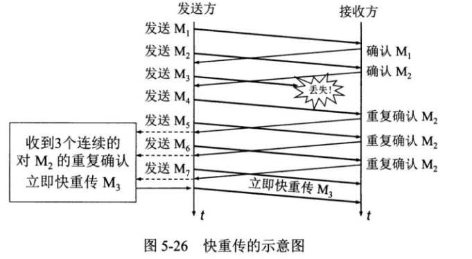

**HTTPS通信过程**
HTTPS协议 = HTTP协议 + SSL/TLS协议
在HTTPS数据传输的过程中，需要用SSL/TLS对数据进行加密和解密，需要用HTTP对加密后的数据进行传输。
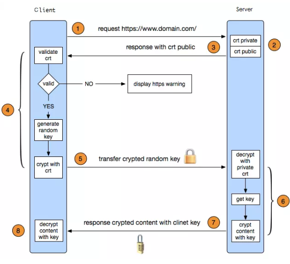
HTTPS为了兼顾安全与效率，同时使用了对称加密和非对称加密。数据是被对称加密传输的，对称加密过程需要客户端的一个密钥，为了确保能把该密钥安全传输到服务器端，采用非对称加密对该密钥进行加密传输，总的来说，对数据进行对称加密，对称加密所要使用的密钥通过非对称加密传输。
1.客户端向服务器发起HTTPS请求，连接到服务器的443端口.
2.服务器端有一个密钥对，即公钥和私钥，是用来进行非对称加密使用的，服务器端保存着私钥，不能将其泄露，公钥可以发送给任何人。
3.服务器将自己的公钥和证书发送给客户端。
4.客户端收到服务器端的证书之后，会对证书进行检查，验证其合法性，如果发现发现证书有问题，那么HTTPS传输就无法继续。严格的说，这里应该是验证服务器发送的数字证书的合法性。如果数字证书合格，那么客户端会生成一个随机值，这个随机值就是用于进行对称加密的密钥，我们将该密钥称之为client key，即客户端密钥，这样在概念上和服务器端的密钥容易进行区分。然后用服务器的公钥对客户端密钥进行非对称加密，这样客户端密钥就变成密文了，至此，HTTPS中的第一次HTTP请求结束。
5.客户端会发起HTTPS中的第二个HTTP请求，将加密之后的客户端密钥发送给服务器。
6.服务器接收到客户端发来的密文之后，会用自己的私钥对其进行非对称解密，解密之后的明文就是客户端密钥，然后用客户端密钥对数据进行对称加密，这样数据就变成了密文。
7.然后服务器将加密后的密文发送给客户端。
8.客户端收到服务器发送来的密文，用客户端密钥对其进行对称解密，得到服务器发送的数据。

#### A.5 分布式和消息中间件

***CAP*原则**

又称*CAP*定理，指的是在一个分布式系统中，一致性（Consistency）、可用性（Availability）、分区容错性（Partition tolerance）。

**分布式锁**

基于 Redis实现分布式锁：SETNX，在 Redis 中设置一个值表示加了锁，然后释放锁的时候就把这个 Key 删除。

基于 Redisson实现分布式锁：Redisson 中有一个 Watchdog 的概念，翻译过来就是看门狗，它会在你获取锁之后，每隔 10s 帮你把 Key 的超时时间设为 30s。逻辑保证了没有死锁发生 。

基于 Zookeeper 实现分布式锁：

- 使用 ZK 的临时节点和有序节点，每个线程获取锁就是在 ZK 创建一个临时有序的节点，比如在 /lock/ 目录下；
- 创建节点成功后，获取 /lock 目录下的所有临时节点，再判断当前线程创建的节点是否是所有的节点的序号最小的节点。
- 如果当前线程创建的节点是所有节点序号最小的节点，则认为获取锁成功。
- 如果当前线程创建的节点不是所有节点序号最小的节点，则对节点序号的前一个节点添加一个事件监听。

优缺点：

对于 Redis 的分布式锁而言：

- Redis 分布式锁，其实需要自己不断去尝试获取锁，比较消耗性能。
- Redis 的设计定位决定了它的数据并不是强一致性的，在某些极端情况下，可能会出现问题。锁的模型不够健壮
- Redis 的性能很高，可以支撑高并发的获取、释放锁操作。

对于 Zookeeper 的分布式锁而言：
- ZK 天生设计定位就是分布式协调，强一致性。锁的模型健壮、简单易用、适合做分布式锁。
- 如果获取不到锁，只需要添加一个监听器就可以了，不用一直轮询，性能消耗较小。
- 如果有较多的客户端频繁的申请加锁、释放锁，对于 ZK 集群的压力会比较大。

**Spring事务传播方式**

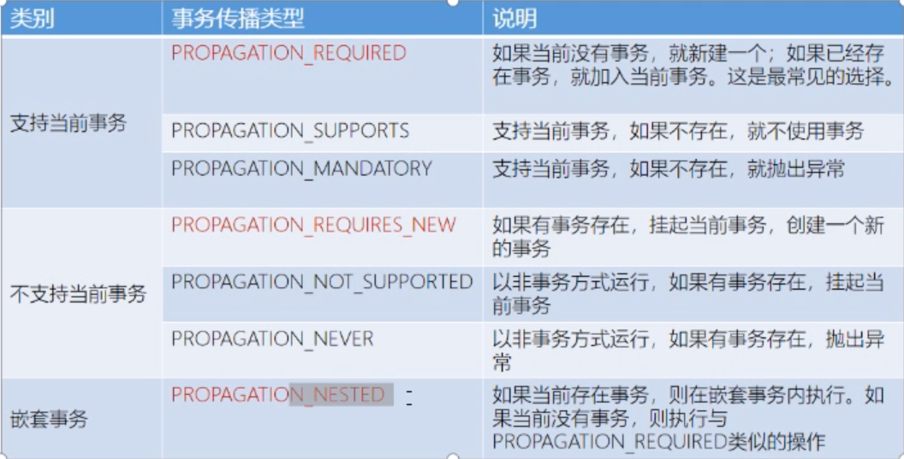

```java
//数据访问层
@Repository("accountDao")
public class AccountDaoImpl{
public void updateAccount(Account account) {
    jdbcTemplate.update("update account set money = ? where id = ? ",account.getMoney(),account.getId());
}
}
//业务逻辑层


@Service("accountService")
public class AccountServiceImpl{
     @Transactional(propagation=Propagation.REQUIRED)
     public void transfer(Account source, Account target, Float money) {
        source.setMoney(source.getMoney()-money);//转出账户减钱
        target.setMoney(target.getMoney()+money);//转入账户加钱
        //更新两个账户
        accountDao.updateAccount(source);
        accountDao.updateAccount(target);
    }

    @Transactional(propagation=Propagation.REQUIRED)
    public void transferException(Account source, Account target, Float money) {
        source.setMoney(source.getMoney()-money);//转出账户减钱
        target.setMoney(target.getMoney()+money);//转入账户加钱
        //更新两个账户
        accountDao.updateAccount(source);
        int i=1/0;
        accountDao.updateAccount(target);
    }
}

//测试
@Test
public void testDo(){
    serviceImpl.transfer("%张%","%李%",1000f);
    serviceImpl.transferException ("%张%","%李%",2000f);
    int I = 1/0;
}

现在测试的方法testDo上没有加事务，当它调用serviceImpl.transfer（）方法的时候,因为transfer使用REQUIRED修饰，所以transfer会新建一个事务，自己独立在该事务执行，成功转账1000，张三账户1000，李四4000。当调用serviceImpl.transferException时新建事务，在执行该方法时发生异常，事务回滚，所以转账不成功，张三账户1000，李四4000,此时这两个方法都是在各自的事务中独立执行。


@Test
@Transactional(propagation=Propagation.REQUIRED)
public voidtestDo(){
    serviceImpl.transfer("%张%","%李%",1000f);
    serviceImpl.transferException ("%张%","%李%",2000f);
}

当它调用serviceImpl.transfer（）方法的时候transfer方法和transferException方法加入到testDo方法的事务中，他们都在一个事务，当发生异常的时候事务回滚，转账1000和2000都不成功，张三账户2000，李四3000。
```

**Spring 事务配置**

```xml
    <!-- spring中基于XML的声明式事务控制配置步骤
        1、配置事务管理器
        2、配置事务的通知
                此时我们需要导入事务的约束 tx名称空间和约束，同时也需要aop的
                使用tx:advice标签配置事务通知
                    属性：
                        id：给事务通知起一个唯一标识
                        transaction-manager：给事务通知提供一个事务管理器引用
        3、配置AOP中的通用切入点表达式
        4、建立事务通知和切入点表达式的对应关系
        5、配置事务的属性
               是在事务的通知tx:advice标签的内部

     -->
    <!-- 配置事务管理器 -->
    <bean id="transactionManager" class="org.springframework.jdbc.datasource.DataSourceTransactionManager">
        <property name="dataSource" ref="dataSource"></property>
    </bean>

    <!-- 配置事务的通知-->
    <tx:advice id="txAdvice" transaction-manager="transactionManager">
        <!-- 配置事务的属性
                isolation：用于指定事务的隔离级别。默认值是DEFAULT，表示使用数据库的默认隔离级别。
                propagation：用于指定事务的传播行为。默认值是REQUIRED，表示一定会有事务，增删改的选择。查询方法可以选择SUPPORTS。
                read-only：用于指定事务是否只读。只有查询方法才能设置为true。默认值是false，表示读写。
                timeout：用于指定事务的超时时间，默认值是-1，表示永不超时。如果指定了数值，以秒为单位。
                rollback-for：用于指定一个异常，当产生该异常时，事务回滚，产生其他异常时，事务不回滚。没有默认值。表示任何异常都回滚。
                no-rollback-for：用于指定一个异常，当产生该异常时，事务不回滚，产生其他异常时事务回滚。没有默认值。表示任何异常都回滚。
        -->
        <tx:attributes>
            <tx:method name="*" propagation="REQUIRED" read-only="false"/>
            <tx:method name="find*" propagation="SUPPORTS" read-only="true"></tx:method>
        </tx:attributes>
    </tx:advice>

    <!-- 配置aop-->
    <aop:config>
        <!-- 配置切入点表达式-->
        <aop:pointcut id="pt1" expression="execution(* com.itheima.service.impl.*.*(..))"></aop:pointcut>
        <!--建立切入点表达式和事务通知的对应关系 -->
        <aop:advisor advice-ref="txAdvice" pointcut-ref="pt1"></aop:advisor>
    </aop:config>

    <!-- spring中基于注解 的声明式事务控制配置步骤
        1、配置事务管理器
        2、开启spring对注解事务的支持
        3、在需要事务支持的地方使用@Transactional注解
     -->

    <!-- 开启spring对注解事务的支持-->
    <tx:annotation-driven transaction-manager="transactionManager"></tx:annotation-driven>
```

**Springboot 使用redis做缓存**

```java
 * Redis 是一个开源（BSD许可）的，内存中的数据结构存储系统，它可以用作数据库、缓存和消息中间件。
 * 	1、安装redis：使用docker；
 * 	2、引入redis的starter
 * 	3、配置redis
 * 	4、测试缓存
 * 		原理：CacheManager===Cache 缓存组件来实际给缓存中存取数据
 *		1）、引入redis的starter，容器中保存的是 RedisCacheManager；
 *		2）、RedisCacheManager 帮我们创建 RedisCache 来作为缓存组件；RedisCache通过操作redis缓存数据的
 *		3）、默认保存数据 k-v 都是Object；利用序列化保存；如何保存为json
 *   			1、引入了redis的starter，cacheManager变为 RedisCacheManager；
 *   			2、默认创建的 RedisCacheManager 操作redis的时候使用的是 RedisTemplate<Object, Object>
 *   			3、RedisTemplate<Object, Object> 是 默认使用jdk的序列化机制
 *      4）、自定义CacheManager；

//主要注解
@CachePut：既调用方法，又更新缓存数据；同步更新缓存
@Cacheable：方法运行之前，先去查询Cache（缓存组件），按照cacheNames指定的名字获取.
@CacheEvict：缓存清除

//自己手动实现
@Bean
public RedisTemplate<Object, Employee> empRedisTemplate(
            RedisConnectionFactory redisConnectionFactory)
            throws UnknownHostException {
        RedisTemplate<Object, Employee> template = new RedisTemplate<Object, Employee>();
        template.setConnectionFactory(redisConnectionFactory);
        Jackson2JsonRedisSerializer<Employee> ser = new Jackson2JsonRedisSerializer<Employee>(Employee.class);
        template.setDefaultSerializer(ser);
        return template;
    }

@Autowired
StringRedisTemplate stringRedisTemplate;  //操作k-v都是字符串的
@Autowired
RedisTemplate<Object, Employee> empRedisTemplate;
Employee empById = employeeMapper.getEmpById(1);
empRedisTemplate.opsForValue().set("emp-01",empById);
```

**Springboot RabbitMq案例**

```java
	@Autowired
	RabbitTemplate rabbitTemplate;

	@Autowired
	AmqpAdmin amqpAdmin;

//		amqpAdmin.declareExchange(new DirectExchange("amqpadmin.exchange"));
//		System.out.println("创建完成");

//		amqpAdmin.declareQueue(new Queue("amqpadmin.queue",true));
		//创建绑定规则

//		amqpAdmin.declareBinding(new Binding("amqpadmin.queue", Binding.DestinationType.QUEUE,"amqpadmin.exchange","amqp.haha",null));
	/**
	 * 1、单播（点对点）
	 */
		Map<String,Object> map = new HashMap<>();
		map.put("msg","这是第一个消息");
		map.put("data", Arrays.asList("helloworld",123,true));
		//对象被默认序列化以后发送出去
rabbitTemplate.convertAndSend("exchange.direct","atguigu.news",new Book("西游记","吴承恩"));
	/**
	 * 广播
	 */				
rabbitTemplate.convertAndSend("exchange.fanout","",new Book("红楼梦","曹雪芹"));

//接受数据
		Object o = rabbitTemplate.receiveAndConvert("atguigu.news");
		System.out.println(o.getClass());
    @RabbitListener(queues = "atguigu.news")
    public void receive(Book book){
        System.out.println("收到消息："+book);
    }
```


#### B.1 java笔试

**java数组查找元素索引**

```java
int timeIndex = arrayList.indexOf("w");
```

**java 数组和列表的转换**

```java
//列表转数组
String[] strs=testList.toArray(new String[testList.size()]);
//数组转列表
List<String> result =Arrays.asList(strs);
```

**Arrays.sort方法重写**

```java
int[][] nums = new int[][]{{1,3},{1,2},{4,5},{3,7}};
	Arrays.sort(nums, new Comparator<int[]>() {
		public int compare(int[] a, int[] b){
			if(a[0]==b[0]){
				return a[1] - b[1];
			}else {
				return a[0] - b[0];
			}
		}
	});
	/*输出：
		[1, 2]
		[1, 3]
		[3, 7]
		[4, 5]
*/
```

**泛型**

```java
public class Pair<T> {
    private T first;
    private T last;
    public Pair(T first, T last) {
        this.first = first;
        this.last = last;
    }
    public T getFirst() {
        return first;
    }
    public T getLast() {
        return last;
    }
}
```

**字符串**

```java
"Hello".indexOf("l"); // 2
"Hello".lastIndexOf("l"); // 3
"Hello".substring(2); // "llo"
"Hello".substring(2, 4); "ll"

"  \tHello\r\n ".trim(); // "Hello"
"\u3000Hello\u3000".strip(); // "Hello"
//trim()移除字符串首尾空白字符(\t，\r，\n),strip()还包括\u3000

"  ".isEmpty(); // false，因为字符串长度不为0
"  \n".isBlank(); // true，因为只包含空白字符

s.replace('l', 'w'); // "hewwo"，所有字符'l'被替换为'w'

String[] ss = "A,B,C,D".split("\\,"); // {"A", "B", "C", "D"}
String[] arr = {"A", "B", "C"};
String s = String.join("***", arr); // "A***B***C"

String.valueOf(123); // "123" 类型转换
char[] cs = "Hello".toCharArray(); // String -> char[]

byte[] b3 = "Hello".getBytes(StandardCharsets.UTF_8); // 按UTF-8编码转换
String s2 = new String(b, StandardCharsets.UTF_8); // 按UTF-8转换
```

**java 集合**

```java
//java 数据取整
向上取整:Math.ceil() //只要有小数都+1
向下取整:Math.floor() //不取小数
四舍五入:Math.round() //四舍五入

List<Integer> list = List.of(1, 2, 5);//创建列表
Collections.sort(list);//列表排序

//Map
Map<String, Integer> map = new HashMap<>();
map.put("apple", 123);
map.get("apple")
for (String key : map.keySet()) {
            Integer value = map.get(key);
            System.out.println(key + " = " + value);}

//Set
Set<String> set = new HashSet<>();//无序
Set<String> set = new TreeSet<>();//有序
set.add("abc")//true
set.contains("xyz")//true

//queue
//throw Exception:add(E e);	E remove();E element()
//返回false或null:boolean offer(E e);E poll();E peek()
PriorityQueue<Integer> heap =
            new PriorityQueue<Integer>((n1, n2) -> n1 - n2);

//deque
//将元素添加到队尾或队首：
addLast()/offerLast()/addFirst()/offerFirst()；
//从队首／队尾获取元素并删除：
removeFirst()/pollFirst()/removeLast()/pollLast()；
//从队首／队尾获取元素但不删除：
getFirst()/peekFirst()/getLast()/peekLast()；

//stack
把元素压栈：push(E)；
把栈顶的元素“弹出”：pop(E)；
取栈顶元素但不弹出：peek(E)。
```

**Java 匿名函数**

```python
//传统写法
new Thread(new Runnable() {  
    public void run() {  
            System.out.println("hello");  
        }  
}).start(); 
//匿名函数
new Thread(() -> {System.out.println("hello");}).start();  //body部分，可以是一个表达式或者一个语句块。如果是一个表达式，表达式的值会被作为返回值返回；如果是语句块，需要用return语句指定返回值。
```

**java  reduce and map**

```java
List<Student> list = getStudents();
Student student = getStudent();
//使用Reduce 求 list 、student 的总成绩之和
Score scoreSum = list.stream()
    .map(Student::getScore)//相当于加了一个初始值
    .reduce(student.getScore(), (x, y) -> x.add(y));
System.out.println(scoreSum.getPoint());
//reduce        
final List<Integer> numbers = Arrays.asList(1, 2, 3, 4);
final Integer sum = numbers.stream()
    .reduce(0, (a, b) -> a + b);
//map
final List<Integer> numbers = Arrays.asList(1, 2, 3, 4);
final List<Integer> doubleNumbers = numbers.stream()
    .map(number -> number * 2)
    .collect(Collectors.toList());
```

**python 匿名函数**

```python 
def func(a,b,c):
    return a+b+c
print func(1,2,3)
# 返回值为6
 
# lambda匿名函数
f = lambda a,b,c:a+b+c
print f(1,2,3)

sorted(death,key=lambda age:age[1]) #按照第二个元素，索引为1排序

L = [1,2,3,4]
reduce(lambda x,y:x+y,L)#lambda和reduce联合使用
filter(lambda x:x % 2,L)#过滤2的倍数
map(lambda x,y:x+y, a,b)#求两个列表元素的和
```

