# JAVA知识

## 1 JVM知识

### １.１　JVM垃圾回收机制

GC 机制：安全性考虑、减少内存泄露和减少程序员工作量。

GC 主要进行回收的内存： JVM 中的方法区和堆

#### 1.1.1 垃圾对象的搜索方法

讲 Sun 公司只定义了垃圾回收机制规则而不局限于其实现算法，GC（Garbage Collector）在回收对象前首先必须发现那些无用的对象，常用的搜索方法：**１）引用计数器算法（废弃）；2）根搜索算法（使用）。**

１）**引用计数器算法**

引用计数器算法是给每个对象设置一个计数器，当有地方引用这个对象的时候，计数器 +1，当引用失效的时候，计数器-1，当计数器为 0 的时候，JVM 就认为对象不再被使用。

存在问题：不能解决循环引用问题（A 对象引用 B 对象，B 对象又引用 A 对象，但是A,B 对象已不被任何其他对象引用）。

2）**根搜索算法**

根搜索算法是通过“ GC Roots”对象作为起点，从这些节点开始往下搜索，搜索通过的路径成为引用链，当一个对象没有被 GC Roots 的引用链连接的时候，说明这个对象是不可用的。

GC Roots 对象包括：a) 虚拟机栈（栈帧中的本地变量表）中的引用的对象。 b) 方法区域中的类静态属性引用的对象。 c) 方法区域中常量引用的对象。 d) 本地方法栈中 JNI（Native 方法）的引用的对象。

#### 1.1.2 垃圾回收算法

通过上面的算法搜索到无用对象之后，就是回收过程，**回收算法包括：1）标记—清除算法；２）标记-复制算法；3）标记—整理算法；4）分代收集。**

1）**标记**—**清除算法**

在标记阶段，确定所有要回收的对象，并做标记。清除阶段紧随标记阶段，将标记阶段确定不可用的对象清除。评价：效率不高， 而且清除后回产生大量的不连续空间，这样当程序需要分配大内存对象时，可能无法找到足够的连续空间。

２）**标记-复制算法**（新生代）

复制算法是把内存分成大小相等的两块，每次使用其中一块，当垃圾回收的时候，把存活的对象复制到另一块上，然后把这块内存整个清理掉。评价：实现简单，运行效率高，但是由于每次只能使用其中的一半，造成内存的利用率不高

3）**标记**—**整理算法**（老年代）

标记**—**整理算法是把存活对象往内存的一端移动，然后直接回收边界以外的内存。评价：提高的内存利用率，适合存活时间较长的老年代。

4）**分代收集**

分代收集是根据对象的存活时间把内存分为新生代和老年代，根据各个代对象的存活特点，每个代采用不同的垃圾回收算法。

#### 1.1.3 方法区中的回收

**1.废弃的常量的回收**。没有对象引用该常量就可以回收。

**2.无用的类的回收**。A.该类所有的实例都已经被回收； B.加载该类的 ClassLoader 已经被回收； C.该类对应的 java.lang.Class 对象没有任何地方被引用。

#### 1.1.4  Minor GC 和 Full GC的区别

**Minor GC**：新生代 GC，指发生在新生代的垃圾收集动作，因为 Java 对象大多死亡频繁，所以 Minor GC 非常频繁，一般回收速度较快。采用标记-复制方法。

具体操作流程：1）当对象在堆创建时，将进入年轻代的Eden Space。
2）垃圾回收器进行垃圾回收时，扫描Eden Space和A Suvivor Space，如果对象仍然存活， 则复制到B Suvivor Space，如果B Suvivor Space已经满，则复制 Old Gen
3）扫描A Suvivor Space时，如果对象已经经过了几次的扫描仍然存活，JVM认为其为一个 Old对象，则将其移到Old Gen。
4）扫描完毕后，JVM将Eden Space和A Suvivor Space清空，然后交换A和B的角色（即下次 垃圾回收时会扫描Eden Space和B Suvivor Space。

**Full GC**：老年代 GC，也叫 Major GC，速度一般比 Minor GC 慢 10 倍以上。采用标记-整理方法。

#### 1.1.5 GC 机制下，为什么还会有内存泄露的情况

理论上 Java 因为有垃圾回收机制（GC）不会存在内存泄露问题。然而在实际开发中，可能会存在**无用但可达**的对象，这些对象不能被 GC 回收，因此也会导致内存泄露的发生。

例如：栈中pop 方法却存在内存泄露的问题，当我们用 pop 方法弹出栈中的对象时，该对象不会被当作垃圾回收，即使使用栈的程序不再引用这些对象，因为栈内部维护着对这些对象的过期引用。

### １.２JVM 的内存结构

#### １.２.1 JVM 的内存结构和内存分配

Java 虚拟机将其管辖的内存分三个逻辑部分：方法区、Java 栈和 Java 堆、本地方法栈（线程私有）、程序计数器（线程私有）。

**方法区**：它用于存储已被虚拟机加载的类信息、常量、静态变量、即时编译器编译后的代码等数据。不需要连续的内存，可以选择固定的大小，可以选择不实现垃圾收集。

**Java堆**：在虚拟机启动时创建，此内存区域的唯一目的就是存放对象实例和数组 （JIT编译器的发展，通过逃逸分析和标量替换技术，对象也能在栈上分配）。PS：可以划分出多个线程私有的分配缓冲区

**Java栈**：生命周期与线程相同，即每条线程都一个独立的栈。每个方法执行时都会创建一个栈帧，当有一条线程执行了多个方法时，就会有一个栈，栈中有多个栈帧。栈帧存储：局部变量表、操作栈、动态链接、方法出口。PS：存在异常：1.StackOverflowError：线程请求的栈深度大于虚拟机所允许的深度,栈深度受栈帧大小影响；2. OutOfMemoryError：虚拟机栈扩展到无法申请足够的内存时。

**程序计数器**：线程私有，一块较小的内存空间，可以看作是当前线程所执行字节码的行号指示器。分支、循环、跳转、异常处理、线程恢复等基础功能都需要依赖这个计数器完成。PS :如果线程正在执行的是一个 Java 方法，计数器记录的是正在执行的虚拟机字节码指令的地 址；如果正在执行的是 Native 方法，这个计数器的值为空。
**本地方法栈**：线程私有,为虚拟机使用到的 Native 方法服务

#### 1.2.2 字符串常量池存储位置

JDK1.7中，存储在永久代的部分数据就已经转移到了Java Heap或者是 Native Heap。但永久代仍存在于JDK1.7中，并没完全移除，譬如符号引用(Symbols)转移到了native heap；字面量(interned strings)转移到了java heap；类的静态变量(class statics)转移到了java heap。

jdk 6.0 字符串常量池在方法区，方法区的具体体现可以看做是堆中的永久区。
jdk 7.0 字符串常量池存放在堆空间中
jdk 8.0 java 虚拟机规范中又声明了元空间，字符串常量池存放在元空间中（元空间并不在虚拟机中，而是使用本地内存）

#### 1.2.3  Java堆和Java栈的区别

1）申请方式

Java栈:由系统自动分配。例如，声明在函数中一个局部变量 int b; 系统自动在栈中为 b 开辟空间。

 Java堆:需要程序员自己申请，并指明大小。Java 需要手动 new Object()的形式开辟

2）申请后的系统响应

Java栈:只要栈的剩余空间大于所申请空间，系统将为程序提供内存，否则将报异常提示栈溢出。

Java堆：首先应该知道操作系统有一个记录空闲内存地址的链表，当系统收到程序的申请时，会遍历该链表，寻找第一个空间大于所申请空间的堆结点，然后将该结点从空闲结点链表中删除，并将该结点的空间 分配给程序。另外，由于找到的堆结点的大小不一定正好等于申请的大小，系统会自动的将多余的那部分重新放入空闲链表中。

3）申请大小的限制

Java栈：向低地址扩展的数据结构（添加数据地址变小），一块连续的内存的区域，栈顶的地址和栈的最大容量是系统预先规定好的，

Java堆：向高地址扩展的数据结构（添加数据地址变大），是不连续的内存区域，于系统是用链表来存储的空闲内存地址的，而链表的遍历方向是由低地址向高地址。堆的大小受限于计算机系统中有效的虚拟内存。

#### 1.2.4 Java 中基本数据类型存放

基本类型又称自动变量：只在定义它们的时候才创建，在定义它们的函数返回时系统回收变量所占存储空间。对这些变量存储空间的分配和回收是由系统自动完成的。

编译器先处理 int a = 3；首先它会在栈中创建一个变量为 a 的引用，然后查找有没有字面值为 3 的地址，没找到，就开辟一个存放 3 这个字面值的地址，然后将 a 指向 3 的地址。接着处理 int b = 3；在创建完 b 的引用变量 后，由于在栈中已经有 3 这个字面值，便将 b 直接指向 3 的地址。这样，就出现了 a 与 b 同时均指向 3 的情况。 

特别注意的是，这种字面值的引用与类对象的引用不同。假定两个类对象的引用同时指向一个对象，如果一个对象引用变量修改了这个对象的内部状态，那么另一个对象引用变量也即刻反映出这个变化。相反，通过字面值的引用来修改其值，不会导致另一个指向此字面值的引用的值也跟着改变的情况。如上例，我们定义完 a 与 b 的值后，再令 a=4；那么，b 不会等于 4，还是等于 3。在编译器内部，遇到 a=4；时，它就会重新搜索栈中是否有 4 的字面值，如果没有，重新开辟地址存放 4 的值；如果已经有了，则直接将 a 指向这个地址。因此 a 值的改变不会影响到 b 的值。

#### 1.2.5 内存溢出的原因和解决方法

**引起内存溢出的原因**有很多种，常见的有以下几种：
1.内存中加载的数据量过于庞大，如一次从数据库取出过多数据； 
2.集合类中有对对象的引用，使用完后未清空，使得 JVM 不能回收； 
3.代码中存在死循环或循环产生过多重复的对象实体； 
4.启动参数内存值设定的过小； 内存溢出的解决方案：

**内存溢出的解决方案：**
第一步，修改 JVM 启动参数，直接增加内存。(-Xms，-Xmx 参数一定不要忘记加。)
第二步，检查错误日志，查看“OutOfMemory”错误前是否有其它异常或错误。 
第三步，对代码进行走查和分析，找出可能发生内存溢出的位置。

**重点排查以下几点**：
1.检查对数据库查询中，是否有一次获得全部数据的查询。
2.检查代码中是否有死循环或递归调用。
3.检查是否有大循环重复产生新对象实体。
4.检查 List、MAP 等集合对象是否有使用完后，未清除的问题。

### 1.3 Java 中引用类型都有哪些？

Java 中对象的引用分为四种级别，这四种级别由高到低依次为：强引用、软引用、弱引用和虚引用。

Java堆中对象有强可及对象、软可及对象、弱可及对象、虚可及对象和不可到达对象。如下代码：

```java
String abc=new String("abc"); //1 
SoftReference<String> softRef=new SoftReference<String>(abc); //2
WeakReference<String> weakRef = new WeakReference<String>(abc); //3 
abc=null; //4
softRef.clear();//5
```


**强引用**：一个对象拥有强引用，垃圾回收器绝不会回收它。当内存空间不足，Java 虚拟机抛出 OutOfMemoryError 错误。

**软引用**：一个对象只具有软引用，那么如果内存空间足够，垃圾回收器就不会回收它，如果内存空间不足了，就会回收这些对象的内存。主要用于内存敏感的高速缓存。

**弱引用**：（比软引用生命周期更短）一个对象只具有弱引用，那该类就是可有可无的对象，因为只要该对象被 gc 扫描到了随时都会把它销毁。

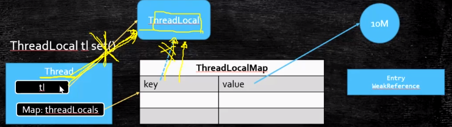


**虚引用**：虚引用主要用来跟踪（堆外内存）对象被垃圾回收的活动。虚引用必须和引用队列（ReferenceQueue）联合使用。当垃圾回收器准备回收一个对象时，如果发现它还有虚引用，就会在回收对象的内存之前，把这个虚引用加入到与之关联的引用队列中。程序可以通过判断引用队列中是否已经加入了虚引用，来了解被引用的对象是否将要被垃圾回收。

### 1.4 Java的类加载器

#### 1.4.1 Java 的类加载器

Java 的类加载器：**根类加载器**(Bootstrap)、**扩展类加载器**（Extension）和**应用类加载器**(App)和自定义加载器(必须继承 ClassLoader)。

BootStrapClassLoader ： 启 动 类 加 载 器 ， 该 ClassLoader 是 jvm 在 启 动 时 创 建 的 ， 用 于 加载 $JAVA_HOME$/jre/lib 下面的类库。

ExtClassLoader：扩展类加载器，ExtClassLoader 会加载 $JAVA_HOME/jre/lib/ext 下的类

AppClassLoader：应用程序类加载器，AppClassLoader 会加载 java 环境变量 CLASSPATH 所 指 定 的 路 径 下 的 类 库 ， 而 CLASSPATH 所 指 定 的 路 径 可 以 通 过System.getProperty("java.class.path")获取；当然，该变量也可以覆盖，可以使用参数-cp，例如：java -cp 路 径 （可以指定要执行的 class 目录）。

#### 1.4.2 类初始化时机

1）创建类的实例，也就是 new 一个对象

 2）访问某个类或接口的静态变量，或者对该静态变量赋值

 3）调用类的静态方法 

4）反射（Class.forName("com.lyj.load")） 

5）初始化一个类的子类（会首先初始化子类的父类） 

6）JVM启动时标明的启动类，即文件名和类名相同的那个类

**类的初始化步骤**： 

1）如果这个类还没有被加载和链接，那先进行加载和链接

 2）假如这个类存在直接父类，并且这个类还没有被初始化（注意：在一个类加载器中，类只能初始化一次），那就初始化直接的父类（不适用于接口） 

3)若类中存在初始化语句（如 static 变量和 static 块），那就依次执行这些初始化语句。（静态代码块，在虚拟机加载类的时候就会加载执行，而且只执行一次）

#### 1.4.3 ClassLoader 双亲委托机制

**ClassLoader的双亲委派机制**（由父类加载，父类加载失败委托子类加载）

1）当 AppClassLoader 加载一个 class 时，它首先不会自己去尝试加载这个类，而是把类加载请求委派给父类加载器 ExtClassLoader 去完成。

2）当 ExtClassLoader 加载一个 class 时，它首先也不会自己去尝试加载这个类，而是把类加载请求委派给 BootStrapClassLoader 去完成。

3）如果 BootStrapClassLoader 加载失败，会使用 ExtClassLoader 来尝试加载；

4）若 ExtClassLoader 也加载失败，则会使用 AppClassLoader 来加载，如果 AppClassLoader 也加载失败，则会报出异常 ClassNotFoundException。

**双亲委派托机制为什么安全**

ClassLoader 加载的 class 文件来源很多，比如编译器编译生成的 class、或者网络下载的字节码，如果没有使用双亲委派模型，让各个类加载器自己去加载，那么Java类型体系中最基础的行为得不到保障，应用程序会变得一片混乱。

比如自定义一个java.lang.Integer 类来覆盖 jdk 中默认的 Integer，使用双亲委派机制该Integer 类永远不会被调用。

#### 1.4.4  Java 类运行时机

**加载**、**连接**、**初始化**

其中装载阶段又三个基本动作组成：

1. 通过类型的完全限定名，产生一个代表该类型的二进制数据流
2. 解析这个二进制数据流为方法区内的内部数据结
3. 构创建一个表示该类型的java.lang.Class类的实例

另外如果一个类装载器在预先装载的时遇到缺失或错误的class文件，它需要等到程序首次主动使用该类时才报告错误。

​     连接阶段又分为三部分：

1. 验证，确认类型符合Java语言的语义，检查各个类之间的二进制兼容性(比如final的类不用拥有子类等)，另外还需要进行符号引用的验证。
2. 准备，Java虚拟机为类变量分配内存，设置默认初始值。
3. 解析(可选的) ，在类型的常量池中寻找类，接口，字段和方法的符号引用，把这些符号引用替换成直接引用的过程。


### 1.5 Class文件

Class文件是一组以8位字节为基础单位的二进制流，各个数据项目间没有任何分隔符。当遇到 8位字节以上空间的数据项时，则会按照高位在前的方式分隔成若干个8位字节进行存储。

每个Class文件的头4个字节称为**魔数**（Magic Number），它的唯一作用是用于确定这个文 件是否为一个能被虚拟机接受的Class文件。OxCAFEBABE。

接下来是Class文件的版本号：第5,6字节是次版本号（Minor Version），第7,8字节是主版本 号（Major Version）。


### 1.6 解释器和编译器

许多主流的商用虚拟机，都同时包含解释器和编译器。

当程序需要快速启动和执行时，解释器首先发挥作用，省去编译的时间，立即执行。

当程序运行后，随着时间的推移，编译器逐渐发挥作用，把越来越多的代码编译成本地代码，可以提高执行效率。

分层编译器：

第0层：程序解释执行，解释器不开启性能监控功能，可出发第1层编译。 

第1层：也成为C1编译，将字节码编译为本地代码，进行简单可靠的优化，如有必要加入 性能监控的逻辑。

 第2层：也成为C2编译，也是将字节码编译为本地代码，但是会启用一些编译耗时较长的优化，甚至会根据性能监控信息进行一些不可靠的激进优化。

用Client Compiler和Server Compiler将会同时工作。用Client Compiler获取更高的编译速度，用Server Compiler获取更好的编译质量。

#### 1.6.1 即时编译器

Java程序最初是通过解释器进行解释执行的，当虚拟机发现某个方法或代码块的运行特别频繁，就会把这些代码认定为“热点代码”。为了提高热点代码的执行效率，在运行时，虚拟机将会把这些代码编译成与本地平台相关的机器码，并进行各种层次的优化，完成这个任务的编译器成为**即时编译器**（Just In Time Compiler，JIT编译器）。

#### 1.6.2 热点代码探测方法

**基于采样的热点探测**，虚拟机周期性检查各个线程的栈顶，如果发现某个方法经常出现在栈顶，那这个方法就是“热点方法”。实现简单高效，但是很难精确确认一个方法的热度。 

**基于计数器的热点探测**，虚拟机会为每个方法建立计数器，统计方法的执行次数，如果执行次数超过一定的阈值，就认为它是热点方法。

两种计数器：方法调用计数器和回边计数器---判断循环代码。

方法调用计数器统计方法：统计的是一个相对的执行频率，即一段时间内方法被调用的次数。当超过一定的时间限度，如果方法的调用次数仍然不足以让它提交给即时编译器编译，那这个方法的调用计数器就会被减少一半，这个过程称为方法调用计数器的热度衰减，这个时间就被称为半衰周期。

#### 1.6.3 经典的优化技术

**公共子表达式消除**：如果一个表达式E已经被计算过了，并且从先前的计算到现在E中所有变量的值都没有发生变化，那么E 的这次出现就成了公共子表达式。没有必要重新计算，直接用结果代替E就可以了。
**数组边界检查消除**：因为Java会自动检查数组越界，每次数组元素的读写都带有一次隐含的条件判定操作，对于拥 有大量数组访问的程序代码，这无疑是一种性能负担。如果数组访问发生在循环之中，并且使用循环变量来进行数组访问，如果编译器只要通过数据流分析就可以判定循环变量的取值范围永远在数组区间内，那么整个循环中就可以把数组的上下界检查消除掉。

**方法内联**：遇到方法调用时，直接编译目标方法的方法体，并替换原方法调用。编译器在进行内联时，如果是非虚方法，那么直接内联。如果遇到虚方法，则会查询当前程序下是否有多个目标版本可供选择，如果查询结果只有一个版本，那么也可以内联，不过这种内 联属于激进优化，需要预留一个逃生门，称为守护内联。

**逃逸分析**：逃逸分析的基本行为就是分析对象动态作用域：当一个对象在方法里面被定义后，它可能被外部方法所引用，这种行为被称为方法逃逸。被外部线程访问到，被称为线程逃逸。

#### 1.6.4 逃逸分析优化

**栈上分配**：如果 一个对象不会逃逸出方法，可以让这个对象在栈上分配内存，对象所占用的内存空间就可以随着栈帧出栈而销毁。如果能使用栈上分配，那大量的对象会随着方法的结束而自动销毁，垃圾回收的压力会小很多。

**同步消除**：线程同步本身就是很耗时的过程。如果逃逸分析能确定一个变量不会逃逸出线程，那这个变量的读写肯定就不会有竞争，同步措施就可以消除掉。

**标量替换**：不创建这个对象，直接创建它的若干个被这个方法使用到的成员变量来替换。

1.标量和聚合量

标量即不可被进一步分解的量，而JAVA的基本数据类型就是标量（如：int，long等基本数据类型以及reference类型等），标量的对立就是可以被进一步分解的量，而这种量称之为聚合量。而在JAVA中对象就是可以被进一步分解的聚合量。

2.替换过程

通过逃逸分析确定该对象不会被外部访问，并且对象可以被进一步分解时，JVM不会创建该对象，而会将该对象成员变量分解若干个被这个方法使用的成员变量所代替。这些代替的成员变量在栈帧或寄存器上分配空间。

## 2 Java SE基础

### 2.1 Java面向对象

#### 2.1.1 面向对象的特性

面向对象有 4大特性，封装、继承、多态和抽象。

1）继承：继承是从已有类得到继承信息创建新类的过程

2）封装：通常认为封装是把数据和操作数据的方法绑定起来，对数据的访问只能通过已定义的接口。

3）多态性：多态性是指允许不同子类型的对象对同一消息作出不同的响应。方法重载（overload）实现的是编译时的多态性（也称为前绑定），而方法重写 （override）实现的是运行时的多态性

4）抽象：抽象是将一类对象的共同特征总结出来构造类的过程，包括数据抽象和行为抽象两方面。

#### 2.1.2  权限修饰符

问权限修饰符 public、private、protected, 以及不写时的区别


#### 2.1.3 深拷贝和浅拷贝

Person 中有两个成员变量，分别是 name 和 age， name 是 String 类型， age 是 int 类型。

age 是基本数据类型，那么对它的拷贝没有什么疑议，直接将一个 4 字节的整数值拷贝过来就行。但是 name是 String 类型的， 它只是一个引用， 指向一个真正的 String 对象，那么对它的拷贝有两种方式：

**浅拷贝**： 直接将原对象中 的 name 的引用值拷贝给新对象的 name 字段。 

**深拷贝**：根据原 Person 对象中的 name 指向的字符串对象创建一个新的相同的字符串对象，将这个新字符串对象的引用赋给新拷贝的 Person 对象的 name 字段。

**clone 方法执行的是浅拷贝**


### 2.2 JavaSE语法

#### 2.2.1 &和&&的区别

&运算符：(1)按位与；(2)逻辑与

&&运算符：短路与运算。如果&&左边的表达式的值是 false，右边的表达式会被直接短路掉，不会进行运算

#### 2.2.2  Java 的 eqauls 方法特性

equals 方法必须满足**自反性**（x.equals(x)必须返回 true）、**对称性**（x.equals(y)返回 true 时，y.equals(x)也必须返回 true）、**传递性**（x.equals(y)和 y.equals(z)都返回 true 时。

(1)如果两个对象相同（equals 方法返回 true），那么它们的 hashCode 值一定要相同；

(2)如果两个对象的 hashCode 相同，它们并不一定相同。

#### 2.2.3 Java值传递

方法参数的传递有两种方式：值传递和引用传递。

值传递表示方法接收的是调用者提供的值。

引用传递表示方法接收的是调用者提供的变量地址

Java程序设计语言总是采用按值传递的方式，也就是说，方法得到的是所有参数值的一个拷贝，特别是方法不能修改传递个它的任何参数变量的内容。**ps 个人觉得是浅拷贝**。

```java
  public staticvoid changeName(car c){
    c = new car();
    c.setName("奔驰");
    }
    car c = new car();
    c.setName("奥迪");
    changeName(c);
    System.out.println(c.getName());
将实例对象car传入changeName方法中，c作为拷贝对象进行传递，方法中对c实例再次进行实例化，并且赋予参数状态，方法中的c对象更改属性状态，并不会影响方法外的c实例属性，changeName方法结束后，方法中的c实例便会被废弃掉，所以最终会输出“奥迪”。
```

#### 2.2.4 重载（overload）和重写（override）的区别

重载和重写都是实现多态的方式，区别在于前者实现的是编译时的多态性，而后者实现的是运行时的多态性。

父类或接口定义的引用变量可以指向子类或具体实现类的实例对象，而程序调用的方法在**运行期才动态绑定**，就是**引用变量所指向的具体实例对象的方法**，也就是内存里正在运行的那个对象的方法。

方法重载的规则：

1）.方法名一致，参数列表中参数的顺序，类型，个数不同。

2）.重载与方法的返回值无关。

3）.能抛出不同的异常，可以有不同修饰符。

方法重写的规则：

1）.参数列表与返回类型必须完全与被重写方法的返回类型一致。

2）.构造方法、声明为 final 的方法、声明为 static 的方法不能被重写。

3）.访问权限不能比父类中被重写的方法的访问权限更低。

4）.重写的方法能够抛出任何非强制异常(UncheckedException)，重写的方法不能抛出新的强制性异常或者比被重写方法声明的更广泛的强制性异常。


PS **函数不能根据返回类型进行重载**。因为调用时不能指定类型信息，编译器不知道你要调用哪个函数。

```java
float max(int a, int b); 
int max(int a, int b); 
//当调用 max(1, 2);时无法确定调用的是哪个
```

抽象类(abstract class)和接口(interface)有什么异同

#### 2.2.5 抽象类和接口区别

抽象类： 1.抽象类中可以**定义构造器** 

2.可以有抽象方法和**具体方法** 

3.抽象类中可以定义**成员变量** 

4.有抽象方法的类必须被声明为抽象类，而抽象类未必要有抽象方法 

5.抽象类中可以**包含静态方法**

6.一个类只能**继承一个抽象类**

7.抽象类中的成员可以是 private、默认、protected、public 

接口：

1.接口中不能定义构造器 

2.方法全部都是抽象方法 

3.接口中的成员全都是 public 的

4.接口中定义的成员变量实际上都是常量 

5.接口中不能有静态方法

6.一个类可以实现多个接口

相同：不能够实例化

java  8新特性：1、定义一个或者更多个静态方法。用法和普通的static方法一样，实现接口的类或者子接口不会继承接口中的静态方法；2、在接口中，增加default方法， 是为了既有的成千上万的Java类库的类增加新的功能， 且不必对这些类重新进行设计。 比如， 只需在Collection接口中 增加default Stream stream(), 相应的Set和List接口以及它们的子类都包含此的方法， 不必为每个子类都重新copy这个方法。

#### 2.2.6   ==和 equals 的区别                                

equals 和== 最大的区别是一个是方法一个是运算符。

==：如果比较的对象是基本数据类型，则比较的是数值是否相等；如果比较的是引用数据类型，则比较的是对象
的地址值是否相等。 

equals()：用来比较方法两个对象的内容是否相等。 

注意：equals方法不能用于基本数据类型的变量，如果没有对 equals 方法进行重写，则比较的是引用类型的变量所指向的对象的地址。

#### 2.2.7  String 、StringBuilder 、StringBuffer 的区别

1）String 是只读字符串，也就意味着 String 引用的字符串内容是不能被改变的.

2）StringBuffer/StringBuilder 表示的字符串对象可以直接进行修改。

 3）StringBuilder 是 Java5 中引入的，它和 StringBuffer 的方法完全相同，区别在于它是在单线程环境下使用的，因为它的所有方法都没有被 synchronized 修饰，因此它的效率理论上也比 StringBuffer 要高。

### 2.3 Java的异常处理

#### 2.3.1 Java异常的分类

按照异常需要处理的时机分为**编译时异常**（也叫强制性异常）也叫 CheckedException 和**运行时异常**（也叫非强制性异常）也叫 RuntimeException。

**编译时异常**：ClassNotFoundException（指定类找不到）、SQLException 、IOexception 、 FileNotFoundException 、

**运行时异常**：NumberFormatException（字符串转换为数字异常）、IndexOutOfBoundsException（数组角标越界异常）、ClassCastException( 数据类型转换异常)。NullPointerException （空指针异常）、

Java 认为 Checked 异常都是可以被处理的异常，所以 Java 程序必须显式处理 Checked 异常。如果程序没有处理 Checked 异常，该程序在编译时就会发生错误无法编译。

 **Checked 异常处理方法**有两种： 

1 当前方法知道如何处理该异常，则用 **try...catch 块**来处理该异常。

2 当前方法不知道如何处理，则在定义该方法声明抛出异常。

**异常机制原则：**如果在 catch 中遇到了 return 或者异常等能使该函数终止的话那么有 finally 就必须先执行完 finally 代码块里面的代码然后再返回值

#### **2.3.2 error 和 exception 的区别**

Error 类和 Exception 类的父类都是 Throwable 类

Error 类一般是指与虚拟机相关的问题，如**系统崩溃**，**虚拟机错误**，**内存空间不足**，**方法调用栈溢出**等。对于这类错误仅靠程序本身无法恢复和和预防，建议让程序终止。

Exception 类表示程序可以处理的异常，可以捕获且可能恢复。遇到这类异常，应该尽可能处理异常，使程序恢复运行。

### 2.4 Java 中的日期和时间

#### 2.4.1 java.time.LocalDateTime

LocalDateTime 是一个不可变的日期-时间对象，它表示一组日期-时间，默认格式是yyyy-MM-dd-HH-mm- ss.zzz。

```java
//java8 获取年月日、小时分钟秒
LocalDateTime dt = LocalDateTime.now(); 
System.out.println(dt.getYear());
System.out.println(dt.getMonthValue()); // 1 - 12 
System.out.println(dt.getDayOfMonth()); 
System.out.println(dt.getHour());
System.out.println(dt.getMinute()); 
System.out.println(dt.getSecond());
//本月的第一天和最后一天
LocalDate today = LocalDate.now(); 
LocalDate firstday = LocalDate.of(today.getYear(),today.getMonth(),1); 
LocalDate lastDay =today.with(TemporalAdjusters.lastDayOfMonth());
//打印昨天的当前时刻
LocalDateTime today = LocalDateTime.now();
LocalDateTime yesterday = today.minusDays(1);
//格式化日期
DateTimeFormatter newFormatter = DateTimeFormatter.ofPattern("yyyy/MM/dd"); 
LocalDate date2 = LocalDate.now(); 
System.out.println(date2.format(newFormatter));

//Current Date 
LocalDateTime today = LocalDateTime.now(); 
System.out.println("Current DateTime="+today);
//Creating LocalDateTime by providing input arguments 
LocalDateTime specificDate = LocalDateTime.of(2014, Month.JANUARY, 1, 10, 10, 30);
System.out.println("Specific Date="+specificDate);
//Current date in "Asia/Kolkata", you can get it from ZoneId javadoc 
LocalDateTime todayKolkata = LocalDateTime.now(ZoneId.of("Asia/Kolkata")); System.out.println("Current Date in IST="+todayKolkata);

输出：Current DateTime=2014-04-28T16:00:49.455 
    Specific Date=2014-01-01T10:10:30 
    Current Date in IST=2014-04-29T04:30:49.493 10000th

```

#### 2.4.2  java.time.LocalDate

LocalDate 是一个不可变的类，它表示默认格式(yyyy-MM-dd)的日期。该类为 now()方法提供了重载方法，我们可以传入ZoneId 来获得指定时区的日期。

```java
LocalDate today = LocalDate.now(); 
System.out.println("Current Date="+today);

//根据给定参数创建LocalData
LocalDate firstDay_2014 = LocalDate.of(2014, Month.JANUARY, 1);
System.out.println("Specific Date="+firstDay_2014);
//指定时区日期
LocalDate todayKolkata = LocalDate.now(ZoneId.of("Asia/Kolkata")); System.out.println("Current Date in IST="+todayKolkata);

输出：Current Date=2014-04-28
Specific Date=2014-01-01 Current
Current Date in IST=2014-04-29
```

#### 2.4.3 java.time.LocalTime

LocalTime 是一个不可变的类，它的实例代表一个符合人类可读格式的时间，默认格式是 hh:mm:ss.zzz。

```java
//Current Time 
LocalTime time = LocalTime.now(); 
System.out.println("Current Time="+time);

//Creating LocalTime by providing input arguments 
LocalTime specificTime = LocalTime.of(12,20,25,40); 
System.out.println("Specific Time of Day="+specificTime);

//Current date in "Asia/Kolkata"
LocalTime timeKolkata = LocalTime.now(ZoneId.of("Asia/Kolkata")); System.out.println("Current Time in IST="+timeKolkata);
输出：
Current Time=15:51:45.240 Specific Time of Day=12:20:25.000000040 Current Time in IST=04:21:45.276
```

#### 2.4.4 java.time.Instant Instant

Instant 类是用在机器可读的时间格式上的，它以 Unix 时间戳的形式存储日期时间。

```java
//Current timestamp
Instant timestamp = Instant.now(); 
System.out.println("Current Timestamp = "+timestamp);
//Instant from timestamp 
Instant specificTime = Instant.ofEpochMilli(timestamp.toEpochMilli()); System.out.println("Specific Time = "+specificTime);
//Duration example 
Duration thirtyDay = Duration.ofDays(30); 
System.out.println(thirtyDay);

输出： Current Timestamp = 2014-04-28T23:20:08.489Z 
Specific Time = 2014-04-28T23:20:08.489Z 
PT720H
```


#### 2.4.5 Java 8 日期/时间特性

**不变性**：新的日期/时间 API 中，所有的类都是不可变的，这对多线程环境有好处

**关注点分离**：为日期（Date）、时间 （Time）、日期时间（DateTime）、时间戳（unix timestamp）以及时区定义了不同的类

**实用操作**：所有新的日期/时间 API 类都实现了一系列方法用以完成通用的任务，如：加、减、格式化。

### 2.5 java IO

#### 2.5.1 Java 中有几种类型的流

按照流的方向：输入流（inputStream）和输出流（outputStream）

按照处理数据的单位： **字节流和字符流**。字节流继承于 InputStream 和 OutputStream，字符流继承于InputStreamReader 和 OutputStreamWriter。

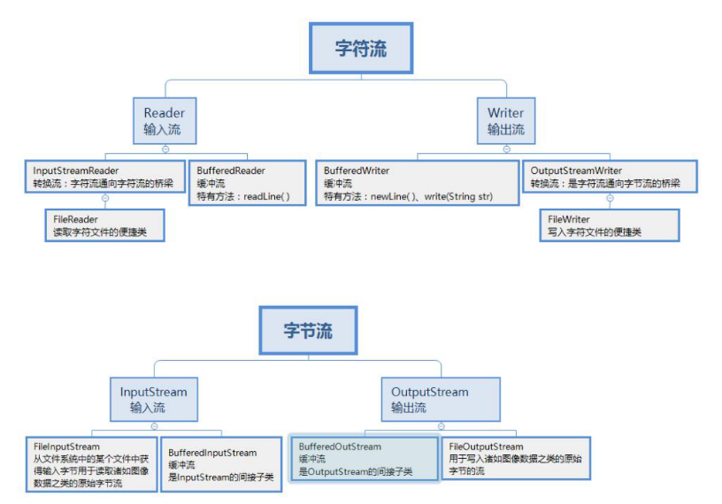

#### 2.5.2 字节流和字符流的区别

**字节流**读取的时候，读到一个字节就返回一个字节； 可以处理所有类型数。

**字符流**使用了字节流读到一个或多个字节时。先去查指定的编码表，将查到的字符返回。只能处理纯文本数据

#### 2.5.3 BIO 编程

BIO有的称之为basic(基本)IO,有的称之为 block(阻塞)IO， 主要应用于文件IO 和网络 IO， 这里不再说文件 IO, 大家对此都非常熟悉，本次课程主要讲解网络 IO。

在 JDK1.4 之前，我们建立网络连接的时候只能采用 BIO，需要先在服务端启动一个 ServerSocket，然后在客户端启动 Socket 来对服务端进行通信，默认情况下服务端需要对每 个请求建立一个线程等待请求，而客户端发送请求后，先咨询服务端是否有线程响应，如果 没有则会一直等待或者遭到拒绝，如果有的话，客户端线程会等待请求结束后才继续执行， 这就是阻塞式 IO。

#### 2.5.4 NIO 编程

java.nio 全称 javanon-blockingIO，是指 JDK 提供的新 API。从 JDK1.4 开始，Java 提供了 一系列改进的输入/输出的新特性，被统称为 NIO(即 NewIO)。

NIO 和 BIO 有着相同的目的和作用，但是它们的实现方式完全不同，BIO 以流的方式处 理数据,而 NIO 以块的方式处理数据,块 I/O 的效率比流 I/O 高很多。另外， NIO 是非阻塞式的， 这一点跟 BIO 也很不相同，使用它可以提供非阻塞式的高伸缩性网络。

NIO 主要有三大核心部分：Channel(通道)，Buffer(缓冲区),Selector(选择器)。传统的 BIO 基于字节流和字符流进行操作，而 NIO 基于 Channel(通道)和 Buffer(缓冲区)进行操作，数据 总是从通道读取到缓冲区中，或者从缓冲区写入到通道中。Selector(选择区)用于监听多个通 道的事件（比如：连接请求，数据到达等），因此使用单个线程就可以监听多个客户端通道

### 2.6 Java集合

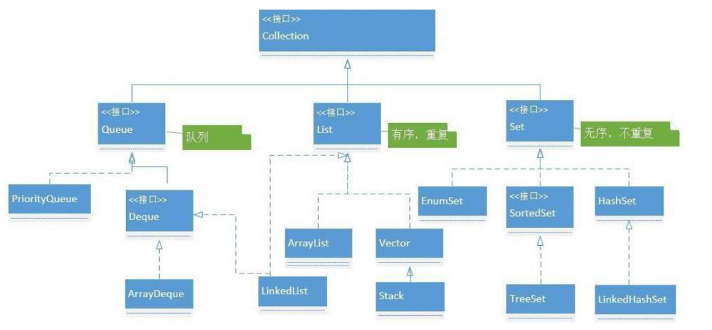


#### 2.6.1 List 的三个实现类的特点

List 接口有三个实现类:

**LinkedList**：基于循环双向链表实现，链表内存是散乱的，每一个元素存储本身内存地址的同时还存储下一个元素的地址。链表增删快，查找慢；

**ArrayList**：基于数组实现，非线程安全的，效率高，便于索引，但不 便于插入删除；

**Vector**：基于数组实现，线程安全的，效率低

#### 2.6.2  List 和 Map、Set 的区别

List 和 Set 是存储单列数据的集合，Map 是存储键和值这样的双列数据的集合；

List 中存储的数据是有顺序，并且允许重复；

Map 中存储的数据是没有顺序的，其键是不能重复的，它的值是可以有重复的.

Set 中存储的数据是无序的，且不允许有重复，但元素在集合中的位置由元素的 hashcode 决定，位置是固定的.

PS：Set 接口有两个实现类（**HashSet**：底层是由 HashMap 实现，不允许集合中有重复的值，使用该方式时需要重写 equals()和 hashCode()方法；**LinkedHashSet**：继承与 HashSet，同时又基于 LinkedHashMap 来进行实现，底层使用的是LinkedHashMp）

#### 2.6.3  Map的三个实现类

**HashMap**：基于 hash 表的 Map 接口实现，非线程安全，高效，支持 null 值和 null键；

**HashTable**：线程安全，低效，不支持 null 值和 null 键；

**LinkedHashMap**：是 HashMap 的一个子类，保存了记录的插入顺序；SortMap 接口：TreeMap，能够把它**保存的记录根据键排序**，默认是键值的升序排序。

#### 2.6.4 数组和链表

**数组**是将元素在内存中连续存储的；它的**优点**：因为数据是连续存储的，内存地址连续，所以在查找数据的时候效率比较高；它的**缺点**：在存储之前，我们需要申请一块连续的内存空间，并且在编译的时候就必须确定好它的空间的大小。在运行的时候空间的大小是无法随着你的需要进行增加和减少而改变的，当数据两比较大的时候，有可能会出现 越界的情况，数据比较小的时候，又有可能会浪费掉内存空间。在改变数据个数时，增加、插入、删除数据效率比较低。

**链表**是动态申请内存空间，不需要像数组需要提前申请好内存的大小，链表只需在用的时候申请就可以，根据需要来动态申请或者删除内存空间，对于数据增加和删除以及插入比数组灵活。还有就是链表中数据在内存中可以在任意的位置。

**数组应用场景**：数据比较少；经常做的运算是按序号访问数据元素；数组更容易实现，任何高级语言都支持；构建的线性表较稳定。 

**链表应用场景**：对线性表的长度或者规模难以估计；频繁做插入删除操作；构建动态性比较强的线性表。


#### 2.6.5 HashMap线程不安全

**1、put的时候导致的多线程数据不一致。**

比如有两个线程A和B，首先A希望插入一个key-value对到HashMap中，首先计算记录所要落到的桶的索引坐标，然后获取到该桶里面的链表头结点，此时线程A的时间片用完了，而此时线程B被调度得以执行，和线程A一样执行，只不过线程B成功将记录插到了桶里面，假设线程A插入的记录计算出来的桶索引和线程B要插入的记录计算出来的桶索引是一样的，那么当线程B成功插入之后，线程A再次被调度运行时，它依然持有过期的链表头但是它对此一无所知，以至于它认为它应该这样做，如此一来就覆盖了线程B插入的记录，这样线程B插入的记录就凭空消失了，造成了数据不一致的行为。
**2、在并发插入数据的时候，有可能出现带环链表，让下次读操作出现死循环。**（cpu100%），具体分析如下：

我们假设有两个线程同时需要执行resize操作，我们原来的桶数量为2，记录数为3，需要resize桶到4，原来的记录分别为：[3,A],[7,B],[5,C]，在原来的map里面，我们发现这三个entry都落到了第二个桶里面。
假设线程thread1执行到了transfer方法的Entry next = e.next这一句，然后时间片用完了，此时的e = [3,A], next = [7,B]。线程thread2被调度执行并且顺利完成了resize操作，需要注意的是，此时的[7,B]的next为[3,A]。此时线程thread1重新被调度运行，此时的thread1持有的引用是已经被thread2 resize之后的结果。线程thread1首先将[3,A]迁移到新的数组上，然后再处理[7,B]，而[7,B]被链接到了[3,A]的后面，处理完[7,B]之后，就需要处理[7,B]的next了啊，而通过thread2的resize之后，[7,B]的next变为了[3,A]，此时，[3,A]和[7,B]形成了环形链表，在get的时候，如果get的key的桶索引和[3,A]和[7,B]一样，那么就会陷入死循环。

#### 2.6.6  Java的ConcurrentHashMap 和HashMap

参考链接：https://blog.csdn.net/u013256816/article/details/84113163

**1、Java7 HashMap**：HashMap里面是一个*数组*，然后数组中每个元素是一个*单向链表*。上图中，每个绿色的实体是嵌套类 Entry 的实例，Entry 包含四个属性：key, value, hash 值和用于单向链表的 next。capacity：当前数组容量，始终保持 2^n，可以扩容，扩容后数组大小为当前的 2 倍。loadFactor：负载因子，默认为 0.75。threshold：扩容的阈值，等于 capacity * loadFactor。

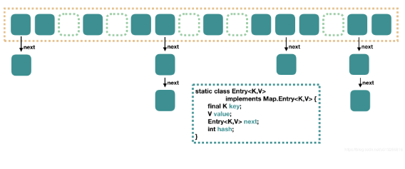


put 过程分析：

```java
public V put(K key, V value) {
    // 当插入第一个元素的时候，需要先初始化数组大小
    if (table == EMPTY_TABLE) {
        inflateTable(threshold);
    }
    // 如果 key 为 null，感兴趣的可以往里看，最终会将这个 entry 放到 table[0] 中
    if (key == null)
        return putForNullKey(value);
    // 1. 求 key 的 hash 值
    int hash = hash(key);
    // 2. 找到对应的数组下标
    int i = indexFor(hash, table.length);
    // 3. 遍历一下对应下标处的链表，看是否有重复的 key 已经存在，
    //    如果有，直接覆盖，put 方法返回旧值就结束了
    for (Entry<K,V> e = table[i]; e != null; e = e.next) {
        Object k;
        if (e.hash == hash && ((k = e.key) == key || key.equals(k))) {
            oldValue = e.value;
            e.value = value;
            e.recordAccess(this);
            return oldValue;
        }
    }

    modCount++;
    // 4. 不存在重复的 key，将此 entry 添加到链表中，细节后面说
    addEntry(hash, key, value, i);
    return null;
}
//数组初始化:在第一个元素插入 HashMap 的时候做一次数组的初始化，就是先确定初始的数组大小，并计算数组扩容的阈值
//计算具体数组位置:使用 key 的 hash 值对数组长度进行取模就可以了
//添加节点到链表中:找到数组下标后，会先进行 key 判重，如果没有重复，就准备将新值放入到链表的表头.主要逻辑就是先判断是否需要扩容，需要的话先扩容，然后再将这个新的数据插入到扩容后的数组的相应位置处的链表的表头。
//数组扩容:在插入新值的时候，如果当前的 size 已经达到了阈值，并且要插入的数组位置上已经有元素，那么就会触发扩容，扩容后，数组大小为原来的 2 倍。一个新的大数组替换原来的小数组，并将原来数组中的值迁移到新的数组中。由于是双倍扩容，迁移过程中，会将原来 table[i] 中的链表的所有节点，分拆到新的数组的 newTable[i] 和 newTable[i + oldLength] 位置上。如原来数组长度是 16，那么扩容后，原来 table[0] 处的链表中的所有元素会被分配到新数组中 newTable[0] 和 newTable[16] 这两个位置。
```

get 过程分析：

相对于 put 过程，get 过程是非常简单的:

1. 根据 key 计算 hash 值。
2. 找到相应的数组下标：hash & (length - 1)。
3. 遍历该数组位置处的链表，直到找到相等(==或equals)的 key

**2、Java7 ConcurrentHashMap:**ConcurrentHashMap 是一个 Segment 数组，Segment 通过继承 ReentrantLock 来进行加锁，所以每次需要加锁的操作锁住的是一个 segment，这样只要保证每个 Segment 是线程安全的，也就实现了全局的线程安全。


concurrencyLevel：并行级别、并发数、Segment 数。默认是 16，也就是说 ConcurrentHashMap 有 16 个 Segments，所以理论上，这个时候，最多可以同时支持 16 个线程并发写，只要它们的操作分别分布在不同的 Segment 上。这个值可以在初始化的时候设置为其他值，但是一旦初始化以后，它是不可以扩容的。

initialCapacity：初始容量，这个值指的是整个 ConcurrentHashMap 的初始容量，实际操作的时候需要平均分给每个 Segment。

loadFactor：负载因子，之前我们说了，Segment 数组不可以扩容，所以这个负载因子是给每个 Segment 内部使用的。

初始化：初始化完成，我们得到了一个 Segment 数组。我们就当是用 new ConcurrentHashMap() 无参构造函数进行初始化的，那么初始化完成后：

- Segment 数组长度为 16，不可以扩容
- Segment[i] 的默认大小为 2，负载因子是 0.75，得出初始阈值为 1.5，也就是以后插入第一个元素不会触发扩容，插入第二个会进行第一次扩容
- 这里初始化了 segment[0]，其他位置还是 null，至于为什么要初始化 segment[0]，后面的代码会介绍
- 当前 segmentShift 的值为 32 - 4 = 28，segmentMask 为 16 - 1 = 15，姑且把它们简单翻译为移位数和掩码，这两个值马上就会用到

**put 过程分析**

```java
public V put(K key, V value) {
    Segment<K,V> s;
    if (value == null)
        throw new NullPointerException();
    // 1. 计算 key 的 hash 值
    int hash = hash(key);
    // 2. 根据 hash 值找到 Segment 数组中的位置 j
    //    hash 是 32 位，无符号右移 segmentShift(28) 位，剩下高 4 位，
    //    然后和 segmentMask(15) 做一次与操作，也就是说 j 是 hash 值的高 4 位，也就是槽的数组下标
    int j = (hash >>> segmentShift) & segmentMask;
    // 刚刚说了，初始化的时候初始化了 segment[0]，但是其他位置还是 null，
    // ensureSegment(j) 对 segment[j] 进行初始化
    if ((s = (Segment<K,V>)UNSAFE.getObject          // nonvolatile; recheck
         (segments, (j << SSHIFT) + SBASE)) == null) //  in ensureSegment
        s = ensureSegment(j);
    // 3. 插入新值到 槽 s 中
    return s.put(key, hash, value, false);
// 第一层很简单，根据 hash 值很快就能找到相应的 Segment，之后就是 Segment 内部的 put 操作了。Segment 内部是由数组+链表组成的。   
// 在往该 segment 写入前，需要先获取该 segment 的独占锁
```

扩容: rehash

segment 数组不能扩容，扩容是 segment 数组某个位置内部的数组 HashEntry[] 进行扩容，扩容后，容量为原来的 2 倍。首先，我们要回顾一下触发扩容的地方，put 的时候，如果判断该值的插入会导致该 segment 的元素个数超过阈值，那么先进行扩容，再插值。

**3、Java8 HashMap**:Java8 对 HashMap 进行了一些修改，最大的不同就是利用了红黑树，所以其由**数组+链表+红黑树**组成。根据 Java7 HashMap 的介绍，我们知道，查找的时候，根据 hash 值我们能够快速定位到数组的具体下标，但是之后的话，需要顺着链表一个个比较下去才能找到我们需要的，时间复杂度取决于链表的长度，为 O(n)。为了降低这部分的开销，在 Java8 中，当链表中的元素达到了 8 个时，会将链表转换为红黑树，在这些位置进行查找的时候可以降低时间复杂度为 O(logN)。

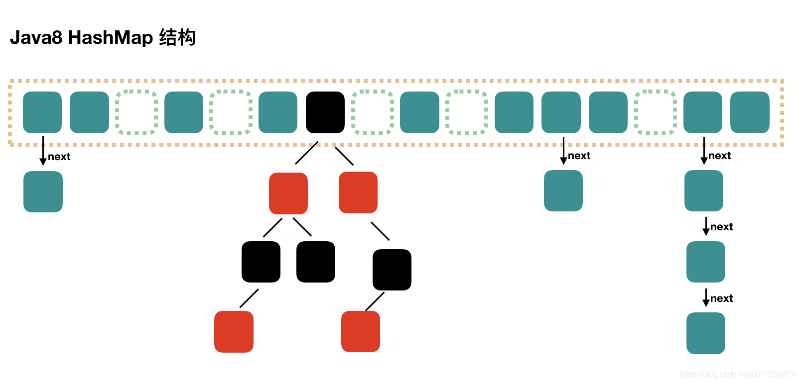


**Java8 ConcurrentHashMap**:Node数组替代了Segment数组来存储数据。Node数组中不再使用显示锁，而是Unsafe的乐观锁机制。Segment予以保留，仅用来处理对象流的读写。抛弃了原有的Segment 分段锁，而采用了 CAS + synchronized 来保证并发安全性

```
当前的table进行无条件自循环直到put成功,分为6个步骤
1、判断Node[]数组是否初始化，没有则进行初始化操作
2、通过hash定位数组的索引坐标，是否有Node节点，如果没有则使用CAS进行添加（链表的头节点），添加失败则进入下次循环。
3、检查到内部正在扩容，就帮助它一块扩容。
4、如果f！=null，则使用synchronized锁住f元素（链表/红黑树的头元素）。如果是Node（链表结构）则执行链表的添加操作；如果是TreeNode（树型结构）则执行树添加操作。
5、判断链表长度已经达到临界值8（默认值），当节点超过这个值就需要把链表转换为树结构。
6、如果添加成功就调用addCount（）方法统计size，并且检查是否需要扩容

///若当前已经有一个线程正在初始化即sizeCtl值变为-1，这个时候其他线程在If判断为true从而调用Thread.yield()让出CPU时间片。正在进行初始化的线程会调用U.compareAndSwapInt方法将sizeCtl改为-1即正在初始化的状态。
```


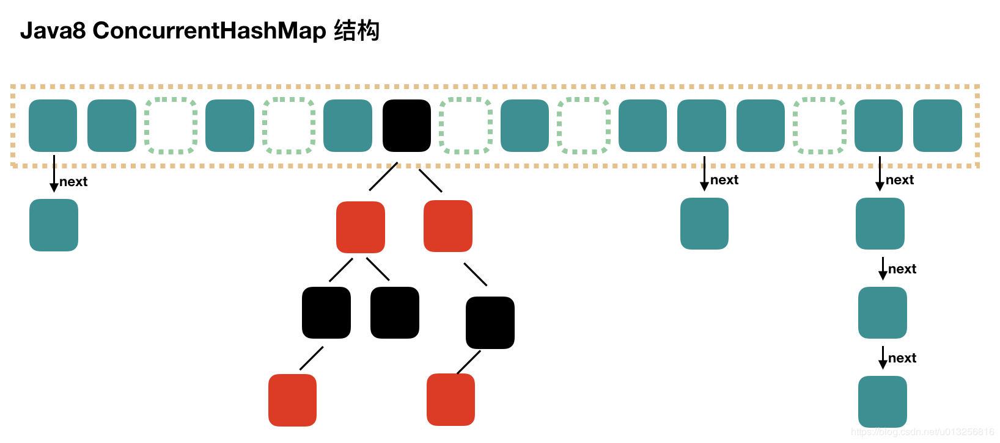

**JDK1.7和JDK1.8中的区别**

1、**不采用segment而采用node，锁住node来实现减小锁粒度**。
2、设计了MOVED状态 当resize的中过程中 线程2还在put数据，线程2会帮助resize。
3、使用CAS操作来确保node的一些操作的原子性，这种方式代替了锁。
4、sizeCtl的不同值来代表不同含义，起到了控制的作用。


#### 2.6.7 红黑树

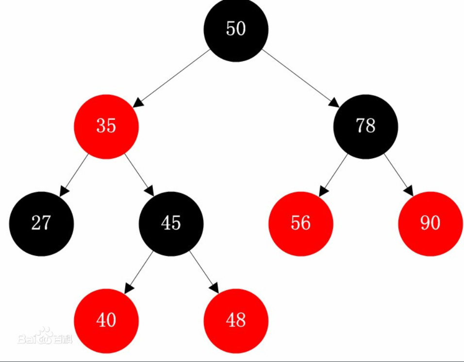

性质1. 节点是红色或黑色。

性质2. 根节点是黑色。

性质3.所有叶子都是黑色。（叶子是NUIL节点） 

性质4. 每个红色节点的两个子节点都是黑色。（从每个叶子到根的所有路径上不能有两个连续的红色节点）

性质5.. 从任一节点到其每个叶子的所有路径都包含相同数目的黑色节点。

### 2.7 Java中的反射

#### 2.7.1 Java 中反射的理解

Java 中 的 反 射 首 先 是 能 够 获 取 到 Java 中 要 反 射 类 的 字 节 码 ， 获 取 字 节 码 有 三 种 方 法 ， 1.Class.forName(className)

2.类名.class 

3.this.getClass()。

然后将字节码中的方法，变量，构造函数等映射成 相应的 Method、Filed、Constructor 等类，这些类提供了丰富的方法可以被我们所使用。

#### 2.7.2 动静态代理的区别，什么场景使用

1、静态代理通常只代理一个类，动态代理是代理一个接口下的多个实现类。 

2、静态代理事先知道要代理的是什么，而动态代理不知道要代理什么东西，只有在运行时才知道。 动态代理是实现 JDK 里的 InvocationHandler 接口的 invoke 方法，但注意的是代理的是接口，也就是你的业务类必须要实现接口，通过 **Proxy** 里的 newProxyInstance 得到代理对象。 还有一种动态代理 **CGLIB**，代理的是类，不需要业务类继承接口，通过派生的子类来实现代理。通过在运行时，动态修改字节码达到修改类的目的。

```java
public static Object newProxyInstance(ClassLoader loader, Class<?>[] interfaces,  InvocationHandler h)  throws IllegalArgumentException

Enhancer enhancer = new Enhancer();
//设置目标类的字节码文件
enhancer.setSuperclass(Dog.class);
//设置回调函数
enhancer.setCallback(new MyMethodInterceptor());
//这里的creat方法就是正式创建代理类
Dog proxyDog = (Dog)enhancer.create();
```

### 2.8  Java8的新特性以及使用

#### 2.8.1 Java8 中的 lambda 表达式

若一个方法接收 Runnable、Comparable 或者 Callable 接口，都有单个抽象方法，可以传入 lambda 表达式。类似 的，如果一个方法接受声明于 java.util.function 包内的接口，例如 Predicate、Function、Consumer 或 Supplier， 那么可以向其传 lambda 表达式。

```java
//例1 用 lambda 表达式实现 Runnable
new Thread( () -> System.out.println("In Java8, Lambda expression rocks !!") ).start();
//例2 对列表进行迭代
features.forEach(n -> System.out.println(n));
//使用lambda 表达式的 Map 和 Reduce 示例 
costBeforeTax.stream().map((cost) -> cost + .12*cost).forEach(System.out::println);
double bill = costBeforeTax.stream().map((cost) -> cost + .12*cost).reduce((sum, cost) -> sum +
cost).get();
```

lambda 表达式&匿名内部类不同

1. 关键字 this (1) 匿名内部类中的 this 代表匿名类 (2) Lambda 表达式中的 this 代表 lambda 表达式的类 
2. 编译方式不同 (1) 匿名内部类中会编译成一个.class 文件，文件命名方式为：主类+$+(1,2,3.......) (2) Java 编译器将 lambda 表达式编译成类的私有方法。

 **lambda 表达式的限制**

lambda 表达式有个限制，那就是只能引用 final 或 final 局部变量，这就是说不能在 lambda 内部修改定义在域外的变量。

## 3 Java 高级

### 3.1 Java并发问题

#### 3.1.1 Synchronized 用过吗，其原理是什么？

Synchronized 是由 JVM 实现的一种实现互斥同步的一种方式，如果你查看被 Synchronized 修饰过的程序块编译后的字节码，会发现，被Synchronized 修饰过的程序块，在编译前后被编译器生成了 monitorenter 和 monitorexit 两个字节码指令。

在虚拟机执行到 monitorenter 指令时，首先要尝试获取对象的锁：如果这个对象没有锁定，或者当前线程已经拥有了这个对象的锁，把锁的计数器 +1；当执行 monitorexit 指令时将锁计数器 -1；当计数器为 0 时，锁就被释放了。

#### 3.1.2“锁”到底是什么？如何确定对象的锁？

“锁”的本质其实是 monitorenter 和 monitorexit 字节码指令的一个 Reference 类型的参数，即要锁定和解锁的对象。我们知道，使用Synchronized 可以修饰不同的对象，因此，对应的对象锁可以这么确定。

1. 如果 Synchronized 明确指定了锁对象，比如 Synchronized（变量名）、Synchronized(this) 等，说明加解锁对象为该对象。

2. 如果没有明确指定：

若 Synchronized 修饰的方法为非静态方法，表示此方法对应的对象为锁对象；

若 Synchronized 修饰的方法为静态方法，则表示此方法对应的类对象为锁对象。

注意，当一个对象被锁住时，对象里面所有用 Synchronized 修饰的方法都将产生堵塞，而对象里非 Synchronized 修饰的方法可正常被调用，不受锁影响。

#### 3.1.3 Synchronized 是可重入锁？

可重入性是锁的一个基本要求，是为了解决自己锁死自己的情况。

比如下面的伪代码，一个类中的同步方法调用另一个同步方法，假如 Synchronized 不支持重入，进入 method2 方法时当前线程获得锁，method2 方法里面执行 method1 时当前线程又要去尝试获取锁，这时如果不支持重入，它就要等释放，把自己阻塞，导致自己锁死自己。

**重入锁实现可重入性原理或机制**：每一个锁关联一个线程持有者和计数器，当计数器为 0 时表示该锁没有被任何线程持有，那么任何线程都可能获得该锁而调用相应的方法；当某一线程请求成功后，JVM会记下锁的持有线程，并且将计数器置为 1；此时其它线程请求该锁，则必须等待；而该持有锁的线程如果再次请求这个锁，就可以再次拿到这个锁，同时计数器会递增；当线程退出同步代码块时，计数器会递减，如果计数器为 0，则释放该锁

#### 3.1. 4 JVM 对 Java 的原生锁做了哪些优化？

在 Java 6 之前，Monitor 的实现完全依赖底层操作系统的互斥锁来实现。

由于 Java 层面的线程与操作系统的原生线程有映射关系，如果要将一个线程进行阻塞或唤起都需要操作系统的协助，这就需要从用户态切换到内核态来执行，这种切换代价十分昂贵，很耗处理器时间，现代 JDK 中做了大量的优化。

现代 JDK 中还提供了三种不同的 Monitor 实现，也就是三种不同的锁：

·    偏向锁（Biased Locking）

·    轻量级锁

·    重量级锁

这三种锁使得 JDK 得以优化 Synchronized 的运行，当 JVM 检测到不同的竞争状况时，会自动切换到适合的锁实现，这就是锁的升级、降级。

·    当没有竞争出现时，默认会使用偏向锁。

JVM 会利用 CAS 操作，在对象头上的 Mark Word 部分设置线程 ID，以表示这个对象偏向于当前线程，所以并不涉及真正的互斥锁，因为在很多应用场景中，大部分对象生命周期中最多会被一个线程锁定，使用偏斜锁可以降低无竞争开销。

·    如果有另一线程试图锁定某个被偏斜过的对象，JVM 就撤销偏斜锁，切换到轻量级锁实现。

·    轻量级锁依赖 CAS 操作 Mark Word 来试图获取锁，如果重试成功，就使用普通的轻量级锁；否则，进一步升级为重量级锁。

**jdk1.6 synchronized 优化执行过程：** 

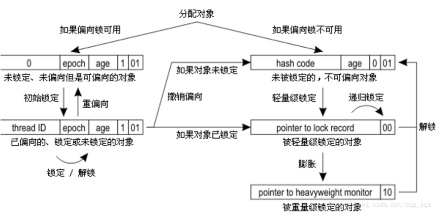


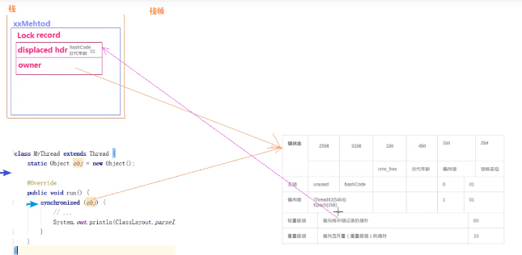

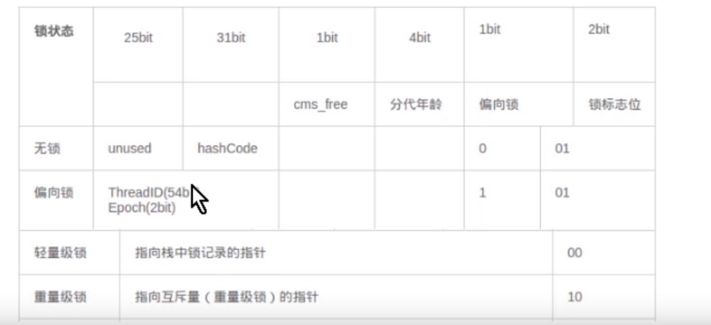

1. 检测Mark Word里面是不是当前线程的ID，如果是，表示当前线程处于偏向锁 
2. 如果不是，则使用CAS将当前**线程的ID**替换Mard Word，如果成功则表示当前线程获得偏向锁，置偏向标志位1 
3. 如果失败，则说明发生竞争，撤销偏向锁，进而升级为轻量级锁。 
4. 当前线程使用CAS将对象头的Mark Word替换为**锁记录指针**，如果成功，当前线程获得锁 
5. 如果失败，表示其他线程竞争锁，当前线程便尝试使用自旋来获取锁。 
6. 如果自旋成功则依然处于轻量级状态。 
7. 如果自旋失败，则升级为重量级锁。

#### 3.1.5 为什么说 Synchronized 是非公平锁？

非公平主要表现在获取锁的行为上，并非是按照申请锁的时间前后给等待线程分配锁的，每当锁被释放后，任何一个线程都有机会竞争到锁，这样做的目的是为了提高执行性能，缺点是可能会产生线程饥饿现象。

#### 3.1.6 为什么说 Synchronized 是一个悲观锁？乐观锁的实现原理又是什么？

Synchronized 显然是一个悲观锁，因为它的并发策略是悲观的：不管是否会产生竞争，任何的数据操作都必须要加锁、用户态核心态转换、维护锁计数器和检查是否有被阻塞的线程需要被唤醒等操作。

随着硬件指令集的发展，我们可以使用基于冲突检测的乐观并发策略。先进行操作，如果没有其他线程征用数据，那操作就成功了；

如果共享数据有征用，产生了冲突，那就再进行其他的补偿措施。这种乐观的并发策略的许多实现不需要线程挂起，所以被称为**非阻塞同步**。

乐观锁的核心算法是 CAS（Compareand Swap，比较并交换），它涉及到三个操作数：内存值、预期值、新值。当且仅当预期值和内存值相等时才将内存值修改为新值。

乐观锁一定就是好的吗？

乐观锁避免了悲观锁独占对象的现象，同时也提高了并发性能，但它也有缺点：

1. 乐观锁只能保证一个共享变量的原子操作。如果多一个或几个变量，乐观锁将变得力不从心，但互斥锁能轻易解决，不管对象数量多少及对象颗粒度大小。

2. 长时间自旋可能导致开销大。假如 CAS 长时间不成功而一直自旋，会给 CPU 带来很大的开销。

3. ABA 问题。CAS 的核心思想是通过比对内存值与预期值是否一样而判断内存值是否被改过，但这个判断逻辑不严谨，假如内存值原来是 A，后来被一条线程改为 B，最后又被改成了 A，则 CAS 认为此内存值并没有发生改变，但实际上是有被其他线程改过的，这种情况对依赖过程值的情景的运算结果影响很大。**解决的思路是引入版本号，每次变量更新都把版本号加一**。

#### 3.1.7  Synchronized 和 ReentrantLock 的异同。

ReentrantLock 是 Lock 的实现类，是一个互斥的同步锁。

**从功能角度**，ReentrantLock 比 Synchronized 的同步操作更精细（因为可以像普通对象一样使用），甚至实现 Synchronized 没有的高级功能，如：

·等待中断：当持有锁的线程长期不释放锁的时候，正在等待的线程可以选择放弃等待，对处理执行时间非常长的同步块很有用。

·超时的获取锁尝试：在指定的时间范围内获取锁，如果时间到了仍然无法获取则返回。

·判断是否有线程在排队等待获取锁。

·可以响应中断请求：与 Synchronized 不同，当获取到锁的线程被中断时，能够响应中断，中断异常将会被抛出，同时锁会被释放。

·可以实现公平锁。

**从锁释放角度**，Synchronized 在 JVM 层面上实现的，不但可以通过一些监控工具监控 Synchronized 的锁定，而且在代码执行出现异常时，JVM 会自动释放锁定；但是使用 Lock 则不行，Lock 是通过代码实现的，要保证锁定一定会被释放，就必须将 unLock() 放到 finally{} 中。

**从性能角度**，Synchronized 早期实现比较低效，对比 ReentrantLock，大多数场景性能都相差较大

#### 3.1.8 ReentrantLock 是如何实现可重入性的？

ReentrantLock 内部自定义了同步器 Sync（Sync 既实现了 AQS（Abstract Queued Synchronizer），又实现了 AOS，而 AOS 提供了一种互斥锁持有的方式），其实就是加锁的时候通过 CAS 算法，将线程对象放到一个双向链表中，每次获取锁的时候，看下当前维护的那个线程ID 和当前请求的线程 ID 是否一样，一样就可重入了。

#### 3.1.9java.util.concurrent （JUC）及其子包，集中了 Java 并发的各种基础工具类，具体主要包括几个方面：

通常所说的并发包（JUC）也就是 java.util.concurrent 及其子包，集中了 Java 并发的各种基础工具类，具体主要包括几个方面

·    提供了 CountDownLatch、CyclicBarrier、Semaphore 等，比 Synchronized 更加高级，可以实现更加丰富多线程操作的同步结构。

·    提供了 ConcurrentHashMap、有序的 ConcunrrentSkipListMap，或者通过类似快照机制实现线程安全的动态数组 CopyOnWriteArrayList 等，各种线程安全的容器。

·    提供了 ArrayBlockingQueue、SynchorousQueue 或针对特定场景的 PriorityBlockingQueue 等，各种并发队列实现。

·    强大的 Executor 框架，可以创建各种不同类型的线程池，调度任务运行等。

#### 3.1.10 请谈谈 ReadWriteLock 和 StampedLock

虽然 ReentrantLock 和 Synchronized 简单实用，但是行为上有一定局限性，要么不占，要么独占。实际应用场景中，有时候不需要大量竞争的写操作，而是以并发读取为主，为了进一步优化并发操作的粒度，Java 提供了读写锁。

读写锁基于的原理是多个读操作不需要互斥，如果读锁试图锁定时，写锁是被某个线程持有，读锁将无法获得，而只好等待对方操作结束，这样就可以自动保证不会读取到有争议的数据。

ReadWriteLock 代表了一对锁，下面是一个基于读写锁实现的数据结构，当数据量较大，并发读多、并发写少的时候，能够比纯同步版本凸显出优势：


读写锁看起来比 Synchronized 的粒度似乎细一些，但在实际应用中，其表现也并不尽如人意，主要还是因为相对比较大的开销。

所以，JDK在后期引入了 **StampedLock**，在提供类似读写锁的同时，还支持优化读模式。优化读基于假设大多数情况下读操作并不会和写操作冲突，其逻辑是先试着读，然后通过 validate 方法确认是否进入了写模式，如果没有进入，就成功避免了开销；如果进入，则尝试获取读锁。


#### 3.1.11 如何让 Java 的线程彼此同步？你了解过哪些同步器？

JUC 中的同步器三个主要的成员：CountDownLatch、CyclicBarrier 和 Semaphore，通过它们可以方便地实现很多线程之间协作的功能。

·    CountDownLatch 是不可以重置的，所以无法重用，CyclicBarrier 没有这种限制，可以重用。

CountDownLatch 目的是让一个线程等待其他 N 个线程达到某个条件后，自己再去做某个事。而 CyclicBarrier 的目的是让 N 多线程互相等待直到所有的都达到某个状态，然后这 N 个线程再继续执行各自后续。

**CountDownLatch**的用法顾名思义有一个计数器的概念，其应用场景是，如果B组线程要等A组线程全部执行完后再执行，那A组中每个线程都会调用其countDown方法计数，即A组中每跑一个线程计数加一。而B组中每个线程都会调用其await()方法。只有当计数达到预设值后，因调用await()方法而处于等待状态的线程全部执行。

**CyclicBarrier**和CountDownLatch有点像，不过他不是计数。CyclicBarrier在初始化的时候可以定义一个参与线程的数量，即parties同伴数量，有点抽象，接下来线程中会先调用一个await()方法使线程处于等待状态。只有当有预设值parties个线程调用了await()方法后，那这parties个线程才能继续执行，简单点说就是凑齐了一拨人一起走。

**信号量Semaphore**用得比较多，核心作用是控制并发执行的线程数量。定义信号量的时候会初始化一个预设值n，即最多有n个线程同时执行，如果将n设为1，就达到了互斥锁的效果。信号量是通过acquire()和release()来控制线程的。最多允许n个线程同时执行即有n个通行证，线程会先acquire()即去获得许可证，只有成功获得许可证才能继续执行，否则处于等待状态，最后通过release()把许可证释放掉以供其他线程获取，通过这种方式去控制线程最大并发量。

#### 3.1.12 Java 中各个线程是怎么彼此看到对方的变量的

Java 中定义了主内存与工作内存的概念：所有的变量都存储在主内存，每条线程还有自己的工作内存，保存了被该线程使用到的变量的主内存副本拷贝。

线程对变量的所有操作（读取、赋值）都必须在工作内存中进行，不能直接读写主内存的变量。不同的线程之间也无法直接访问对方工作内存的变量，线程间变量值的传递需要通过主内存。

#### 3.1.13  ThreadLocal  与Synchronized 区别

ThreadLocal 这是 Java 提供的一种保存线程私有信息的机制,为每一个线程维护变量的副本，把共享数据的可见范围限制在同一个线程之内，其实现原理是，ThreadLocal的静态内部类ThreadLocalMap为每个Thread都维护了一个数组table，ThreadLocal确定了一个数组下标，而这个下标就是value存储的对应位置。

注意：ThreadLocal 的实现是基于一个所谓的 ThreadLocalMap，在ThreadLocalMap 中，它的key 是一个弱引用。常弱引用都会和引用队列配合清理机制使用，但是 ThreadLocal 是个例外，它并没有这么做。弃项目的回收依赖于显式地触发，否则就要等待线程结束。

ThreadLocal 和 Synchonized 都用于解决多线程并发访问，防止任务在共享资源上产生冲突。但是 ThreadLocal 与 Synchronized 有本质的区别。

Synchronized 用于实现同步机制，是利用锁的机制使变量或代码块在某一时该只能被一个线程访问，是一种 “以时间换空间” 的方式。

 ThreadLocal 为每一个线程都提供了变量的副本，使得每个线程在某一时间访问到的并不是同一个对象，根除了对变量的共享，是一种 “以空间换时间” 的方式。

### 3.2 多线程面试题

#### 3.2 1.多线程的创建方式

（1）、继承 Thread 类：但 Thread 本质上也是实现了 Runnable 接口的一个实例，它代表一个线程的实例，并
且，启动线程的唯一方法就是通过 Thread 类的 start()实例方法。。start()方法是一个 native 方法，它将启动一个新线 程，并执行 run()方法。

（2）、实现 Runnable 接口的方式实现多线程，并且实例化 Thread，传入自己的 Thread 实例，调用 run( )方法。

（3）、通过线程池完成

#### 3.2.2 在 java中 wait和 sleep方法的不同

最大的不同是在等待时 wait 会释放锁，而 sleep 一直持有锁。wait 通常被用于线程间交互，sleep 通常被用于暂
停执行。

#### 3.2.3 synchronized和 volatile关键字的作用

被volatile修饰之后，那么就具备了两层语义：

1）保证了不同线程对这个变量进行操作时的可见性，即一个线程修改了某个变量的值，这新值对其他线程来说是
立即可见的。

2）禁止进行指令重排序。

1.volatile 仅能使用在变量级别；synchronized 则可以使用在变量、方法、和类级别的

2.volatile 仅能实现变量的修改可见性，并不能保证原子性；synchronized 则可以保证变量的修改可见性和原子性

3.volatile 不会造成线程的阻塞；synchronized 可能会造成线程的阻塞。

4.volatile 标记的变量不会被编译器优化； synchronized 标记的变量可以被编译器优化

PS 基于 volatile 变量的运算在并发下不一定是安全的。volatile 变量在各个线程的工作内存，不存在一致性问题（各个线程的工作内存中 volatile 变量，每次使用前都要刷新到主内存）。但是 Java 里面的运算并非原子操作，导致 volatile 变量的运算在并发下一样是不安全的。

#### 3.2.4  分析线程并发访问代码

在 java 的内存模型中每一个线程运行时都有一个线程栈，线程栈保存了线程运行时候变量值信息。当线程访问某一个对象时候值的时候，首先通过对象的引用找到对应在堆内存的变量的值，然后把堆内存变量的具体值 load 到线程本地内存中，建立一个变量副本，之后线程就不再和对象在堆内存变量值有任何关系，而是直接修改副本变量的值，在 修改完之后的某一个时刻（线程退出之前），自动把线程变量副本的值回写到对象在堆中变量。这样在堆中的对象的值就产生变化了。

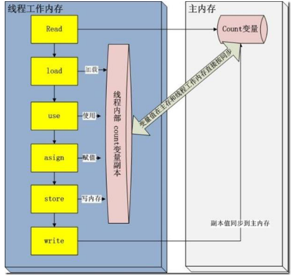

#### 3.2.5 常用的线程池有哪些？

newSingleThreadExecutor：创建一个单线程的线程池，此线程池保证所有任务的执行顺序按照任务的提交顺序
执行。 

newFixedThreadPool：创建固定大小的线程池，每次提交一个任务就创建一个线程，直到线程达到线程池的最大大小。

newCachedThreadPool：创建一个可缓存的线程池，此线程池不会对线程池大小做限制，线程池大小完全依赖于
操作系统（或者说 JVM）能够创建的最大线程大小。 

newScheduledThreadPool：创建一个大小无限的线程池，此线程池支持定时以及周期性执行任务的需求。 

#### 3.2.6 请叙述一下您对线程池的理解

第一：降低资源消耗。通过重复利用已创建的线程降低线程创建和销毁造成的消耗。 

第二：提高响应速度。当任务到达时，任务可以不需要等到线程创建就能立即执行。 

第三：提高线程的可管理性。线程是稀缺资源，如果无限制的创建，不仅会消耗系统资源，还会降低系统的稳定性，使用线程池可以进行统一的分配，调优和监控。

线程池执行步骤：

1、线程池刚创建时，里面没有一个线程。任务队列是作为参数传进来的。不过，就算队列里面有任务，线程池也
不会马上执行它们。

2、当调用 execute() 方法添加一个任务时，线程池会做如下判断： 

a. 如果正在运行的线程数量小于 corePoolSize，那么马上创建线程运行这个任务；

b. 如果正在运行的线程数量大于或等于 corePoolSize，那么将这个任务放入队列。
c. 如果这时候队列满了，而且正在运行的线程数量小于maximumPoolSize，那么还是要创建线程运行这个任务

d. 如果队列满了，而且正在运行的线程数量大于或等于 maximumPoolSize，那么线程池会抛出异常，告诉调用者“我不能再接受任务了”。

3、当一个线程完成任务时，它会从队列中取下一个任务来执行。

4、当一个线程无事可做，超过一定的时间（keepAliveTime）时，线程池会判断，如果当前运行的线程数大于corePoolSize，那么这个线程就被停掉。所以线程池的所有任务完成后，它最终会收缩到 corePoolSize 的大小。

#### 3.2.7 .三个线程 a、b、c并发运行，b,c需要 a线程的数据怎么实现

考虑到多线程的不确定性，因此我们不能确保 ThreadA 就一定先于 ThreadB 和 ThreadC 前执行，就算 ThreadA先执行了，我们也无法保证 ThreadA 什么时候才能将变量 num 给初始化完成。因此我们必须让 ThreadB 和 ThreadC 去等待 ThreadA 完成任何后发出的消息。 

现在需要解决两个难题，一是让 ThreadB 和 ThreadC 等待 ThreadA 先执行完，二是 ThreadA 执行完之后给ThreadB 和 ThreadC 发送消息。

**semaphore** 工作原理
        以一个停车场是运作为例。为了简单起见，假设停车场只有三个车位，一开始三个车位都是空的。这时如果同时来了五辆车，看门人允许其中三辆不受阻碍的进入，然后放下车拦，剩下的车则必须在入口等待，此后来的车也都不得不在入口处等待。这时，有一辆车离开停车场，看门人得知后，打开车拦，放入一辆，如果又离开两辆，则又可以放入两辆，如此往复。这个停车系统中，每辆车就好比一个线程，看门人就好比一个信号量，看门人限制了可以活动的线程。假如里面依然是三个车位，但是看门人改变了规则，要求每次只能停两辆车，那么一开始进入两辆车，后面得等到有车离开才能有车进入，但是得保证最多停两辆车。对于Semaphore类而言，就如同一个看门人，限制了可活动的线程数。

#### 3.2.8 什么情况下导致线程死锁，遇到线程死锁该怎么解决？

死锁的定义：所谓死锁是指多个线程因竞争资源而造成的一种僵局（互相等待），若无外力作用，这些进 程都将无法向前推进。

**死锁产生的必要条件：**

**互斥条件**：线程要求对所分配的资源（如打印机）进行排他性控制，即在一段时间内某 资源仅为一个线程
所占有。此时若有其他线程请求该资源，则请求线程只能等待。 

**不剥夺条件**：线程所获得的资源在未使用完毕之前，不能被其他线程强行夺走，即只能由获得该资源的线程
自己来释放（只能是主动释放)。

**请求和保持条件**：线程已经保持了至少一个资源，但又提出了新的资源请求，而该资源已被其他线程占有，此时请求进程被阻塞，但对自己已获得的资源保持不放。 

**循环等待条件**：存在一种线程资源的循环等待链，链中每一个线程已获得的资源同时被链中下一个线程所请 求。即存在一个处于等待状态的线程集合{Pl, P2, ..., pn}，其中 Pi 等待的资源被 P(i+1)占有（i=0, 1, ..., n-1)， Pn 等待的资源被 P0 占有，如图 2-15 所示。

如何避免死锁

1）加锁顺序（线程按照一定的顺序加锁）

2）加锁时限（线程尝试获取锁的时候加上一定的时限，超过时限则放弃对该锁的请求，并释放自己占有的锁）

#### 3.2.9 Java中多线程间的通信怎么实现

**1.共享变量** 。线程间通信可以通过发送信号，发送信号的一个简单方式是在共享对象的变量里设置信号值。线程 A 在一个同步块里设置 boolean 型成员变量 hasDataToProcess 为 true，线程 B 也在同步块里读取 hasDataToProcess 这个成员变量。这个简单的例子使用了一个持有信号的对象，

**2.wait/notify 机制。**以资源为例，生产者生产一个资源，通知消费者就消费掉一个资源，生产者继续生产资源，消费者消费资源，以此循环。

wait()：使一个线程处于等待（阻塞）状态，并且释放所持有的对象的锁；
sleep()：使一个正在运行的线程处于睡眠状态，是一个静态方法，调用此方法要处理 InterruptedException 异常；
notify()：唤醒一个处于等待状态的线程，当然在调用此方法的时候，并不能确切的唤醒某一个等待状态的线程而是由 JVM 确定唤醒哪个线程，而且与优先级无关； 
notityAll()：唤醒所有处于等待状态的线程，该方法并不是将对象的锁给所有线程，而是让它们竞争，只有获得锁的线程才能进入就绪状态

#### 3.2.10 线程和进程的区别

进程：（CPU分配资源的基本单位）操作系统进行资源分配和调度的一个独立单位。 

线程：（CPU执行的基本单位）是进程的一个实体，是 cpu 调度和分派的基本单位，是比进程更小的可以独立运行的基本单位。

特点：线程的划分尺度小于进程，这使多线程程序拥有高并发性，进程在运行时各自内存单元相互独立，线程之间内存共享，这使多线程编程可以拥有更好的性能和用户体验 

注意：多线程编程对于其它程序是不友好的，占据大量 cpu 资源。

#### 3.2.12 启动一个线程是调用 run()方法还是 start()方法？

启动一个线程是调用 start()方法，使线程所代表的虚拟处理机处于可运行状态，这意味着它可以由 JVM 调度并执行，这并不意味着线程就会立即运行。 run()方法是线程启动后要进行回调（callback）的方法。

### 3.3 Java 线程池相关问题

#### 3.3.1 Java 中的线程池是如何实现的？

在 Java 中，所谓的线程池中的“线程”，其实是被抽象为了一个静态内部类 Worker，它基于 AQS（Abstract Quened Synchronizer ，抽象的队列式同步器） 实现，存放在线程池的 HashSe\<Worker> workers 成员变量中；

而需要执行的任务则存放在成员变量 workQueue（BlockingQueue\<Runnable> workQueue）中。这样，整个线程池实现的基本思想就是：**从 workQueue 中不断取出需要执行的任务，放在 Workers 中进行处理。**

#### 3.3.2 创建线程池的核心构造参数？

Java 中的线程池的创建其实非常灵活，我们可以通过配置不同的参数，创建出行为不同的线程池，这几个参数包括：

· corePoolSize：线程池的核心线程数。

· maximumPoolSize：线程池允许的最大线程数。

· keepAliveTime：超过核心线程数时闲置线程的存活时间。

· workQueue：任务执行前保存任务的队列，保存由 execute 方法提交的 Runnable 任务

#### 3.3.3那么 Java中默认实现好的线程池又有哪些呢？请比较它们的异同。

**1. SingleThreadExecutor** **线程池**

这个线程池只有一个核心线程在工作，也就是相当于单线程串行执行所有任务。如果这个唯一的线程因为异常结束，那么会有一个新的线程来替代它。此线程池保证所有任务的执行顺序按照任务的提交顺序执行。

·    corePoolSize：1，只有一个核心线程在工作。

·    maximumPoolSize：1。

·    keepAliveTime：0L。

·    workQueue：new LinkedBlockingQueue<Runnable>()，其缓冲队列是无界的。

**2. FixedThreadPool** **线程池**

FixedThreadPool 是固定大小的线程池，只有核心线程。每次提交一个任务就创建一个线程，直到线程达到线程池的最大大小。线程池的大小一旦达到最大值就会保持不变，如果某个线程因为执行异常而结束，那么线程池会补充一个新线程。

FixedThreadPool 多数针对一些很稳定很固定的正规并发线程，多用于服务器。

·    corePoolSize：nThreads

·    maximumPoolSize：nThreads

·    keepAliveTime：0L

·    workQueue：new LinkedBlockingQueue<Runnable>()，其缓冲队列是无界的。

**3. CachedThreadPool** **线程池**

CachedThreadPool 是无界线程池，如果线程池的大小超过了处理任务所需要的线程，那么就会回收部分空闲（60 秒不执行任务）线程，当任务数增加时，此线程池又可以智能的添加新线程来处理任务。

线程池大小完全依赖于操作系统（或者说 JVM）能够创建的最大线程大小。SynchronousQueue 是一个是缓冲区为 1 的阻塞队列。

缓存型池子通常用于执行一些生存期很短的异步型任务，因此在一些面向连接的 daemon 型 SERVER 中用得不多。但对于生存期短的异步任务，它是 Executor 的首选。

·    corePoolSize：0

·    maximumPoolSize：Integer.MAX_VALUE

·    keepAliveTime：60L

·    workQueue：new SynchronousQueue<Runnable>()，一个是缓冲区为 1 的阻塞队列。

**4. ScheduledThreadPool** **线程池**

ScheduledThreadPool：核心线程池固定，大小无限的线程池。此线程池支持定时以及周期性执行任务的需求。创建一个周期性执行任务的线程池。如果闲置，非核心线程池会在 DEFAULT_KEEPALIVEMILLIS 时间内回收。

·    corePoolSize：corePoolSize

·    maximumPoolSize：Integer.MAX_VALUE

·    keepAliveTime：DEFAULT_KEEPALIVE_MILLIS

·    workQueue：new DelayedWorkQueue()

#### 3.3.4 如何在 Java 线程池中提交线程

线程池最常用的提交任务的方法有两种：

1. execute()：ExecutorService.execute 方法接收一个 Runable 实例，它用来执行一个任务：

```java
ExecutorService.execute(Runnable runable)
```

2. submit()：ExecutorService.submit() 方法返回的是 Future 对象。可以用 isDone() 来查询 Future 是否已经完成，当任务完成时，它具有一个结果，可以调用 get() 来获取结果。也可以不用 isDone() 进行检查就直接调用get()，在这种情况下，get() 将阻塞，直至结果准备就绪。


### 3.4 内核态和用户态  

#### 3.4.1 内核态与用户态的区别

- 内核态与用户态是操作系统的两种运行级别，

- 当程序运行在3级特权级上时，就可以称之为运行在**用户态**。因为这是最低特权级，是普通的用户进程运行的特权级，大部分用户直接面对的程序都是运行在用户态；

- 当程序运行在0级特权级上时，就可以称之为运行在**内核态**。

  

- 这两种状态的主要差别是

  > - 处于用户态执行时，进程所能访问的内存空间和对象受到限制，其所处于占有的处理器是可被抢占的
  > - 处于内核态执行时，则能访问所有的内存空间和对象，且所占有的处理器是不允许被抢占的。

#### 3.4.2 用户态到内核态的切换

- 系统调用

这是用户态进程主动要求切换到内核态的一种方式，用户态进程通过系统调用申请使用操作系统提供的服务程序完成工作。

- 异常

当CPU在执行运行在用户态下的程序时，发生了某些事先不可知的异常，这时会触发由当前运行进程切换到处理此异常的内核相关程序中，也就转到了内核态

- 外围设备的中断

当外围设备完成用户请求的操作后，会向CPU发出相应的中断信号，这时CPU会暂停执行下一条即将要执行的指令转而去执行与中断信号对应的处理程序，