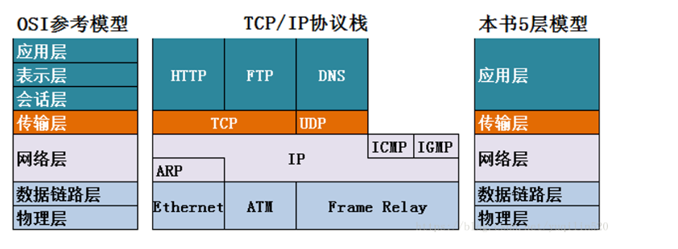
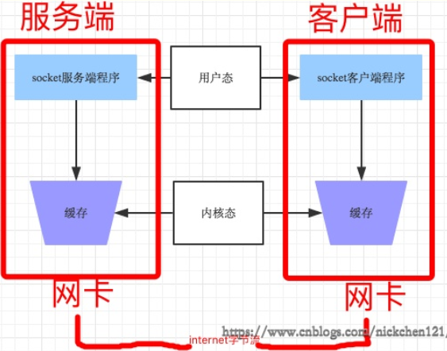
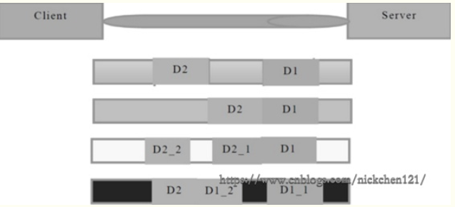
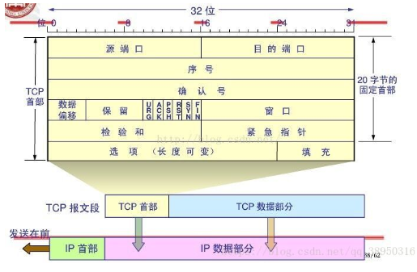
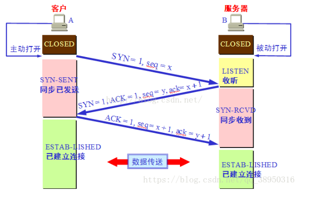
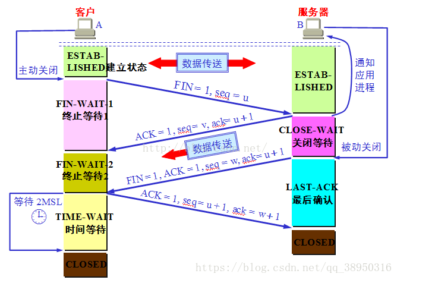
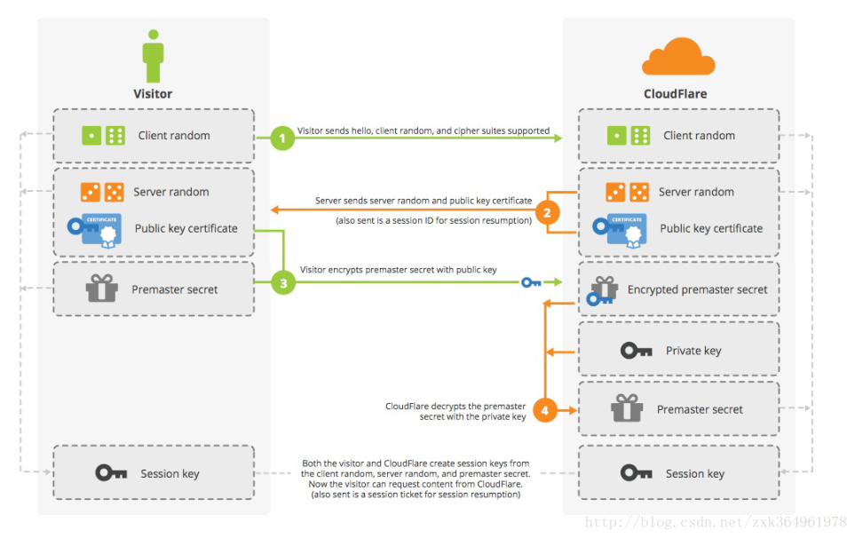
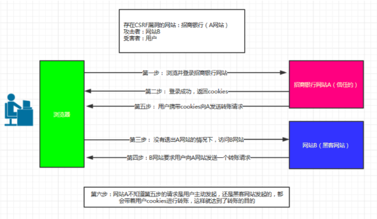
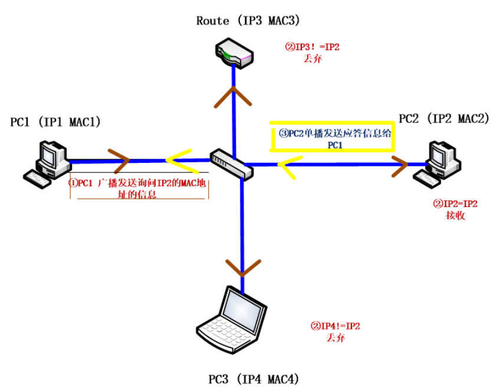
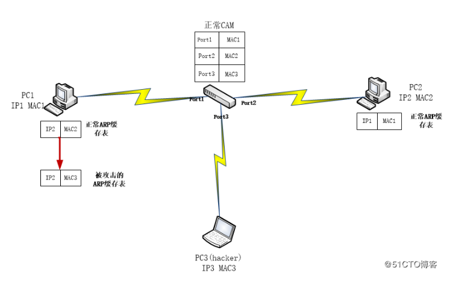

## 一、计算机网络

### 1.1  粘包

注意：只有TCP有粘包现象，UDP永远不会粘包

发送端可以是一K一K地发送数据，而接收端的应用程序可以2K 2K地提走数据，当然也有可能一次提走3K或6K数据，或者一次只提走几个字节的数据，也就是说，应用程序所看到的数据是一个整体。一条消息有多少字节对应用程序是不可见的，因此**TCP协议是面向流的协议**，这也是容易出现粘包问题的原因。而**UDP是面向消息的协议**，每个UDP段都是一条消息，应用程序必须以消息为单位提取数据，不能一次提取任意字节的数据，这一点和TCP是很不同的。
需要明白的是当对方send一条信息的时候，无论底层怎样分段分片，TCP协议层会把构成整条消息的数据段排序完成后才呈现在内核缓冲区。

**粘包问题原因：**主要还是因为接收方不知道消息之间的界限，不知道一次性提取多少字节的数据所造成的。

TCP是面向连接的，面向流的，提供高可靠性服务。发送端为了将多个发往接收端的包，更有效的发到对方，使用了优化方法（Nagle算法），将多次间隔较小且数据量小的数据，合并成一个大的数据块，然后进行封包。**即面向流的通信是无消息保护边界的。**ps:**nagle算法规定**，TCP协议会将数据量较小、时间间隔短的数据合并为一条发送给客户端

UDP是无连接的，面向消息的，提供高效率服务。不会使用块的合并优化算法,接收端的skbuff(套接字缓冲区）采用了链式结构来记录每一个到达的UDP包，在每个UDP包中就有了消息头（消息来源地址，端口等信息）。 **即面向消息的通信是有消息保护边界的。**

#### 1.1.1 TCP发送数据的四种情况

假设客户端分别发送了两个数据包D1和D2给服务端，由于服务端一次读取到的字节数是不确定的，故可能存在以下4种情况。

1. 服务端分两次读取到了两个独立的数据包，分别是D1和D2，没有粘包和拆包；
2. 服务端一次接收到了两个数据包，D1和D2粘合在一起，被1称为TCP粘包；
3. 服务端分两次读取到了两个数据包，第一次读取到了完整的D1包和D2包的部分内容，第二次读取到了D2包的剩余内容，这被称为TCP拆包；
4. 服务端分两次读取到了两个数据包，第一次读取到了D1包的部分内容D1_1，第二次读取到了D1包的剩余内容D1_2和D2包的整包。
#### 1.1.2 TCP粘包/拆包原因
1.**发送端**需要等缓冲区满才发送出去，造成粘包（发送数据时间间隔很短，数据了很小，Nagle算法会合到一起，在一个确认到来时一起发送，可能会出现产生粘包）
2.**接收方**不及时接收缓冲区的包，造成多个包接收（客户端发送了一段数据，服务端只收了一小部分，服务端下次再收的时候还是从缓冲区拿上次遗留的数据，产生粘包）

> 1、要发送的数据大于 TCP 发送缓冲区剩余空间大小，将会发生拆包。 
>
> 2、待发送数据大于 MSS（最大报文长度），TCP 在传输前将进行拆包。 
> 
> 3、要发送的数据小于 TCP 发送缓冲区的大小，TCP 将多次写入缓冲区的数据一次发送出 去，将会发生粘包。 
> 
>  4、接收数据端的应用层没有及时读取接收缓冲区中的数据，将发生粘包。
>  

#### 1.1.3 解决粘包问题

**问题分析：**接收端不知道发送端将要传送的字节流的长度，所以解决粘包的方法就是围绕，如何让发送端在发送数据前，把自己将要发送的字节流总大小让接收端知晓。

**问题解决**：解决粘包问题的核心就是为字节流加上自定义固定长度报头，报头中包含字节流长度，然后一次send到对端，对端在接收时，先从缓存中取出定长的报头，然后再取真实数据。

> 1、发送端给每个数据包添加包首部，首部中应该至少包含数据包的长度，这样接收端在 接收到数据后，通过读取包首部的长度字段，便知道每一个数据包的实际长度了。
>
>  2、发送端将每个数据包封装为固定长度（不够的可以通过补 0 填充），这样接收端每次 从接收缓冲区中读取固定长度的数据就自然而然的把每个数据包拆分开来。 
>
> 3、可以在数据包之间设置边界，如添加特殊符号，这样，接收端通过这个边界就可以将 不同的数据包拆分开

#### 1.1.4 TCP是可靠传输，udp是不可靠传输

**TCP**在数据传输时，发送端先把数据发送到自己的缓存中，然后协议控制将缓存中的数据发往对端，对端返回一个ack=1，发送端则清理缓存中的数据，对端返回ack=0，则重新发送数据，所以TCP是可靠的。

**UDP**发送数据，对端是不会返回确认信息的，因此不可靠。

### 1.2 TCP三次握手和四次挥手

    序列号seq：占4个字节，用来标记数据段的顺序，TCP把连接中发送的所有数据字节都编上一个序号，第一个字节的编号由本地随机产生；给字节编上序号后，就给每一个报文段指派一个序号；序列号seq就是这个报文段中的第一个字节的数据编号。
    
    确认号ack：占4个字节，期待收到对方下一个报文段的第一个数据字节的序号；序列号表示报文段携带数据的第一个字节的编号；而确认号指的是期望接收到下一个字节的编号；因此当前报文段最后一个字节的编号+1即为确认号。
    
    确认ACK：占1位，仅当ACK=1时，确认号字段才有效。ACK=0时，确认号无效
    同步SYN：连接建立时用于同步序号。当SYN=1，ACK=0时表示：这是一个连接请求报文段。若同意连接，则在响应报文段中使得SYN=1，ACK=1。因此，SYN=1表示这是一个连接请求，或连接接受报文。SYN这个标志位只有在TCP建产连接时才会被置1，握手完成后SYN标志位被置0。
    终止FIN：用来释放一个连接。FIN=1表示：此报文段的发送方的数据已经发送完毕，并要求释放运输连接
    
    PS：ACK、SYN和FIN这些大写的单词表示标志位，其值要么是1，要么是0；ack、seq小写的单词表示序号。
#### 1.2.1 TCP 的三次握手

第一次握手：建立连接时，客户端发送syn包（syn=x）到服务器，并进入SYN_SENT状态，等待服务器确认；SYN：同步序列编号（Synchronize Sequence Numbers）。

第二次握手：服务器收到syn包，必须确认客户的SYN（ack=x+1），同时自己也发送一个SYN包（syn=y），即SYN+ACK包，此时服务器进入SYN_RECV状态；

第三次握手：客户端收到服务器的SYN+ACK包，向服务器发送确认包ACK(ack=y+1），此包发送完毕，客户端和服务器进入ESTABLISHED（TCP连接成功）状态，完成三次握手。

#### 1.2.2 TCP 的四次挥手

1）客户端进程发出连接释放报文，并且停止发送数据。释放数据报文首部，FIN=1，其序列号为seq=u（等于前面已经传送过来的数据的最后一个字节的序号加1），此时，客户端进入FIN-WAIT-1（终止等待1）状态。 TCP规定，FIN报文段即使不携带数据，也要消耗一个序号。

2）服务器收到连接释放报文，发出确认报文，ACK=1，ack=u+1，并且带上自己的序列号seq=v。此时，服务端就进入了CLOSE-WAIT（关闭等待）状态。TCP服务器通知高层的应用进程，客户端向服务器的方向就释放了，这时候处于半关闭状态，即客户端已经没有数据要发送了，但是服务器若发送数据，客户端依然要接受。这个状态还要持续一段时间，也就是整个CLOSE-WAIT状态持续的时间。
3）客户端收到服务器的确认请求后，此时，客户端就进入FIN-WAIT-2（终止等待2）状态，等待服务器发送连接释放报文（在这之前还需要接受服务器发送的最后的数据）。

4）服务器将最后的数据发送完毕后，就向客户端发送连接释放报文，FIN=1，ack=u+1，由于在半关闭状态，服务器很可能又发送了一些数据，假定此时的序列号为seq=w，此时，服务器就进入了LAST-ACK（最后确认）状态，等待客户端的确认。
5）客户端收到服务器的连接释放报文后，必须发出确认，ACK=1，ack=w+1，而自己的序列号是seq=u+1，此时，客户端就进入了TIME-WAIT（时间等待）状态。注意此时TCP连接还没有释放，必须经过2∗∗MSL（最长报文段寿命）的时间后，当客户端撤销相应的TCB后，才进入CLOSED状态。
6）服务器只要收到了客户端发出的确认，立即进入CLOSED状态。同样，撤销TCB后，就结束了这次的TCP连接。可以看到，服务器结束TCP连接的时间要比客户端早一些。

#### 1.2.3 为什么连接的时候是三次握手，关闭的时候却是四次握手？

答：因为当Server端收到Client端的SYN连接请求报文后，可以直接发送SYN+ACK报文。其中ACK报文是用来应答的，SYN报文是用来同步的。但是关闭连接时，当Server端收到FIN报文时，很可能并不会立即关闭SOCKET，所以只能先回复一个ACK报文，告诉Client端，"你发的FIN报文我收到了"。只有等到我Server端所有的报文都发送完了，我才能发送FIN报文，因此不能一起发送。故需要四步握手。

#### 1.2.4 为什么TIME_WAIT状态需要经过2MSL(最大报文段生存时间)才能返回到CLOSE状态？

答：虽然按道理，四个报文都发送完毕，我们可以直接进入CLOSE状态了，但是我们必须假想网络是不可靠的，有可能最后一个ACK丢失。所以TIME_WAIT状态就是用来重发可能丢失的ACK报文。在Client发送出最后的ACK回复，但该ACK可能丢失。Server如果没有收到ACK，将不断重复发送FIN片段。所以Client不能立即关闭，它必须确认Server接收到了该ACK。Client会在发送出ACK之后进入到TIME_WAIT状态。Client会设置一个计时器，等待2MSL的时间。如果在该时间内再次收到FIN，那么Client会重发ACK并再次等待2MSL。所谓的2MSL是两倍的MSL(Maximum Segment Lifetime)。MSL指一个片段在网络中最大的存活时间，2MSL就是一个发送和一个回复所需的最大时间。如果直到2MSL，Client都没有再次收到FIN，那么Client推断ACK已经被成功接收，则结束TCP连接。

#### 1.2.5 为什么不能用两次握手进行连接？

答：3次握手完成两个重要的功能，既要双方做好发送数据的准备工作(双方都知道彼此已准备好)，也要允许双方就初始序列号进行协商，这个序列号在握手过程中被发送和确认。

现在把三次握手改成仅需要两次握手，死锁是可能发生的。作为例子，考虑计算机S和C之间的通信，假定C给S发送一个连接请求分组，S收到了这个分组，并发送了确认应答分组。按照两次握手的协定，S认为连接已经成功地建立了，可以开始发送数据分组。可是，C在S的应答分组在传输中被丢失的情况下，将不知道S 是否已准备好，不知道S建立什么样的序列号，C甚至怀疑S是否收到自己的连接请求分组。在这种情况下，C认为连接还未建立成功，将忽略S发来的任何数据分组，只等待连接确认应答分组。而S在发出的分组超时后，重复发送同样的分组。这样就形成了死锁。

#### 1.2.6 如果已经建立了连接，但是客户端突然出现故障了怎么办？

TCP还设有一个**保活计时器**，显然，客户端如果出现故障，服务器不能一直等下去，白白浪费资源。服务器每收到一次客户端的请求后都会重新复位这个计时器，时间通常是设置为2小时，若两小时还没有收到客户端的任何数据，服务器就会发送一个**探测报文段**，以后每隔75秒钟发送一次。若一连发送10个探测报文仍然没反应，服务器就认为客户端出了故障，接着就关闭连接。

### 1.3 HTTP协议

#### 1.3.1 常见的HTTP状态码

- 200("OK")：一切正常。
- 301("Moved Permanently"：永久移除)请求的 URL 已移走。Response 中应该包含一个 Location URL, 说明资源现在所处的位置。
- 302 found 重定向
- 304(未修改):自从上次请求后，请求的网页未修改过。服务器返回此响应时，不会返回网页内容
- 400 Bad Request //客户端请求有语法错误，不能被服务器所理解
-  401 Unauthorized //请求未经授权，这个状态代码必须和 WWW-Authenticate 报头域一起使用 
- 403 Forbidden //服务器收到请求，但是拒绝提供服务
- 404("Not Found") :当客户端所请求的URI不对应于任何资源时，发送此响应代码。
- 409("Conflict"：冲突):当客户端试图执行一个”会导致一个或多个资源处于不一致状态“的操作时，发送此响应代码。
- 410("Gone"):410用于服务器端知道客户端所请求的资源曾经存在，但现在已经不存在了的情况。
- 500 Internal Server Error //服务器发生不可预期的错误
- 502：作为网关或者代理工作的服务器尝试执行请求时，从上游服务器接收到无效的响应。
- 503 Server Unavailable //服务器当前不能处理客户端的请求，一段时间后可能恢复正常。
- 504：作为网关或者代理工作的服务器尝试执行请求时，未能及时从上游服务器收到响应。

**1XX：通知**：1XX系列响应代码仅在与HTTP服务器沟通时使用。

**2XX: 成功**：2XX系列响应代码表明操作成功了  

**3XX 重定向**：3XX系列响应代码表明：客户端需要做些额外工作才能得到所需要的资源。它们通常用于GET请求。他们通常告诉客户端需要向另一个URI发送GET请求，才能得到所需的表示。那个URI就包含在Location响应报头里。

**4XX：客户端错误**：这些响应代码表明客户端出现错误。不是认证信息有问题，就是表示格式或HTTP库本身有问题。客户端需要自行改正。

**5XX 服务端错误**：这些响应代码表明服务器端出现错误。一般来说，这些代码意味着服务器处于不能执行客户端请求的状态，此时客户端应稍后重试。有时，服务器能够估计客户端应在多久之后重试。并把该信息放在Retry-After响应报头里。

#### 1.3.2 SSL加密

1、客户端请求建立SSL链接，并向服务端发送一个随机数–Client random和客户端支持的加密方法，比如RSA公钥加密，此时是明文传输。
2、服务端回复一种客户端支持的加密方法、一个随机数–Server random、授信的服务器证书和非对称加密的公钥。
3、客户端收到服务端的回复后利用服务端的公钥，加上新的随机数–Premaster secret 通过服务端下发的公钥及加密方法进行加密，发送给服务器。
4、服务端收到客户端的回复，利用已知的加解密方式进行解密，同时利用Client random、Server random和Premaster secret通过一定的算法生成HTTP链接数据传输的对称加密key – session key。

#### 1.3.3 Http和Https的区别

1) https协议要申请证书到ca，需要一定经济成本；
2） http是明文传输，https是加密的安全传输；
3） 连接的端口不一样，http是80，https是443；
4）http连接很简单，没有状态；https是ssl加密的传输，身份认证的网络协议，相对http传输比较安全。

#### 1.3.4 浏览器从接收到一个URL，到最后展示出页面，经历了哪些过程

1.DNS解析 2.TCP连接 3.发送HTTP请求 4.服务器处理请求并返回HTTP报文 5.浏览器解析渲染页面

#### 1.3.5 HTTP1.0与HTTP1.1 的区别

**1)HTTP 1.1支持长连接,HTTP 1.0规定浏览器与服务器只保持短暂的连接**。HTTP 1.0中浏览器的每次请求都需要与服务器建立一个TCP连接，服务器完成请求处理后立即断开TCP连接，服务器不跟踪每个客户也不记录过去的请求。HTTP 1.1的持续连接，也需要增加新的请求头来帮助实现，在一个TCP连接上可以传送多个HTTP请求和响应，减少了建立和关闭连接的消耗和延迟。

**2）.HTTP 1.1增加host字段。**

在HTTP1.0中认为每台服务器都绑定一个唯一的IP地址，因此，请求消息中的URL并没有传递主机名（hostname）。但随着虚拟主机技术的发展，在一台物理服务器上可以存在多个虚拟主机（Multi-homed Web Servers），并且它们共享一个IP地址。

**3）HTTP/1.1加入了一个新的状态码100（Continue）**。

客户端事先发送一个只带头域的请求，如果服务器因为权限拒绝了请求，就回送响应码401（Unauthorized）；如果服务器接收此请求就回送响应码100，客户端就可以继续发送带实体的完整请求了。

**4）错误提示，**HTTP/1.0 中只定义了 16 个状态响应码，对错误或警告的提示不够具体。在 HTTP/1.1 中新增了 24 个状态响应码，如 409（Conflict）表示请求的资源与资源的当前状态发生冲突；410（Gone）表示服务器上的某个资源被永久性的删除。

#### 1.3.6  GET 和 POST 的区别
1. GET 请求的数据会附在 URL 之后（就是把数据放置在 HTTP 协议头中），以?分割 URL 和传输数据，参数之间以&相连，如：login.action?name=zhagnsan&password=123456。POST 把提交的数据则放置在HTML HEADER内提交
2. GET 方式提交的数据最多只能是 1024 字节，理论上 POST 没有限制，可传较大量的数据。（“GET 方式提交的数据最多只能是 1024 字节"，因为 GET 是通过 URL 提交数据，那么 GET 可提交的数据量就跟URL 的长度有直接关系了。而实际上，URL 不存在参数上限的问题，HTTP 协议规范没有对 URL 长度进行限制。这个 限制是特定的浏览器及服务器对它的限制。IE对URL长度的限制是2083字节(2K+35)。）
3. POST 的安全性要比 GET 的安全性高。比如：通过 GET 提交数据，用 户名和密码将明文出现在 URL 上，因为(1)登录页面有可能被浏览器缓存，(2)其他人查看浏览器的历史纪录，那么别 人就可以拿到你的账号和密码了，除此之外，使用 GET 提交数据还可能会造成 Cross-site request forgery 攻击。

#### 1.3.7 Cross-site request forgery攻击

CSRF（Cross-site request forgery）跨站请求伪造，也被称为“One Click Attack”或者Session Riding。**攻击者盗用了你的身份，以你的名义发送恶意请求，对服务器来说这个请求是完全合法的**，但是却完成了攻击者所期望的一个操作，比如以你的名义发送邮件、发消息，盗取你的账号，添加系统管理员，甚至于购买商品、虚拟货币转账等。

1.登录受信任网站A，并在本地生成Cookie。

2.在不登出A的情况下，访问危险网站B。

目前防御 CSRF 攻击主要有三种策略：**验证 HTTP Referer 字段；在请求地址中添加 token 并验证；在 HTTP 头中自定义属性并验证**

#### **1.3.8 http 中重定向和请求转发的区别**

转发是服务器行为，重定向是客户端行为。
重定向特点：两次请求，浏览器地址发生变化，可以访问自己 web 之外的资源，传输的数据会丢失。 
请求转发特点：一次强求，浏览器地址不变，访问的是自己本身的 web 资源，传输的数据不会丢失。

#### 1.3.9 Cookie 、Session与Token的区别

Cookie 是 web 服务器发送给浏览器的一块信息，浏览器会在本地一个文件中给每个 web 服务器存储 cookie。以后浏览器再给特定的 web 服务器发送请求时，同时会发送所有为该服务器存储的 cookie。

Session 是存储在 web 服务器端的一块信息。session 对象存储特定用户会话所需的属性及配置信息。当用户在应用程序的 Web 页之间跳转时，存储在 Session 对象中的变量将不会丢失，而是在整个用户会话中一直存在下去。

Token的定义：Token是服务端生成的一串字符串，以作客户端进行请求的一个令牌，当第一次登录后，服务器生成一个Token便将此Token返回给客户端，以后客户端只需带上这个Token前来请求数据即可，无需再次带上用户名和密码。最简单的token组成:uid(用户唯一的身份标识)、time(当前时间的时间戳)、sign(签名，由token的前几位+盐以哈希算法压缩成一定长的十六进制字符串，可以防止恶意第三方拼接token请求服务器)。

使用Token的目的：Token的目的是为了减轻服务器的压力，减少频繁的查询数据库，使服务器更加健壮。

**区别：**

1、无论客户端做怎样的设置，session 都能够正常工作。当客户端禁用 cookie 时将无法使用 cookie。

2、在存储的数据量方面：session 能够存储任意的 java 对象，cookie 只能存储 String 类型的对象。

#### 1.3.10 session 共享怎么做的

一个用户在登录成功以后会把用户信息存储在 session 当中，这时 session 所在服务器为 server1，那么用户在 session 失效之前如果再次使用 app，那么可能会被路由到 server2，这时问题来了，server 没有该用户的 session，所以需要用户重新登录，这时的用户体验会非常不好，所以我们想如何实现多台 server 之间共享 session， 让用户状态得以保存。

1、服务器实现的 session 复制或 session 共享，这类型的共享 session 是和服务器紧密相关的，比如 webSphere或 JBOSS 在搭建集群时候可以配置实现 session 复制或 session 共享，但是这种方式有一个致命的缺点，就是不好扩展和移植，比如我们更换服务器，那么就要修改服务器配置。

2、利用成熟的技术做session复制，比如12306使用的gemfire，比如常见的内存数据库如redis或memorycache，这类方案虽然比较普适，但是严重依赖于第三方，这样当第三方服务器出现问题的时候，那么将是应用的灾难。

3、将 session 维护在客户端，很容易想到就是利用 cookie，但是客户端存在风险，数据不安全，而且可以存放的数据量比较小，所以将 session 维护在客户端还要对 session 中的信息加密。

#### 1.3.11  RESTful架构

一种软件架构⻛风格，设计风格而不是标准，只是提供了一组设计原则和约束条件。它主要⽤于客户端和服务器器交互类的软件。基于这个风格设计的软件可以更简洁，更有层次，更易于 实现缓存等机制。 

1. 每⼀一个URI代表⼀一种资源；
2. 户端和服务器器之间，传递这种资源的某种表现层（Representation）；
3. 客户端通过四个HTTP动词，对服务器端资源进行操作，实现"表现层状态转化"。

### 1.4 网络层和应用层

#### 1.4.1  DNS的寻址过程

（1）检查**浏览器缓存、检查本地hosts文件**是否有这个网址的映射，如果有，就调用这个IP地址映射，解析完成。

（2）如果没有，则查找**本地DNS解析器缓存**是否有这个网址的映射，如果有，返回映射，解析完成。

（3）如果没有，则查找填写或分配的首选DNS服务器，称为**本地DNS服务器**。服务器接收到查询时：如果要查询的域名包含在本地配置区域资源中，返回解析结果，查询结束，此解析具有权威性。如果要查询的域名不由本地DNS服务器区域解析，但服务器缓存了此网址的映射关系，返回解析结果，查询结束，此解析不具有权威性。(如果你的电脑是直连运营商网络，一般默认设置情况下DNS为DHCP分配到的运营商的服务器地址。如果你的电脑和运营商之间还加了无线或者有线路由，那极有可能路由器本身还内置了一个DNS转发器，这玩意的作用是将发往他所有的DNS请求转发到上层DNS。)

（4）如果本地DNS服务器也失效：

如果**未采用转发模式（迭代）**，本地DNS就把请求发至13台根DNS，根DNS服务器收到请求后，会判断这个域名（如.com）是谁来授权管理，并返回一个负责该顶级域名服务器的IP，本地DNS服务器收到顶级域名服务器IP信息后，继续向该顶级域名服务器IP发送请求，该服务器如果无法解析，则会找到负责这个域名的下一级DNS服务器（如http://baidu.com）的IP给本地DNS服务器，循环往复直至查询到映射，将解析结果返回本地DNS服务器，再由本地DNS服务器返回解析结果，查询完成。

如果**采用转发模式（递归）**，则此DNS服务器就会把请求转发至上一级DNS服务器，如果上一级DNS服务器不能解析，则继续向上请求。最终将解析结果依次返回本地DNS服务器，本地DNS服务器再返回给客户机，查询完成。

从**客户端到本地DNS服务器是属于递归查询**，而**DNS服务器之间就是的交互查询就是迭代查询**。

#### 1.4.2 ARP协议和ARP攻击

**ARP协议：地址解析协议。**目的是实现IP地址到MAC地址的转换。因为在OSI七层模型中，对数据从上到下进行封装发送出去，然后对数据从下到上解包接收，但是**上层（网络层）关心的IP地址，下层关心的是MAC地址**，这个时候就需要映射IP和MAC。

①依次从上至下对数据进行封装，包括对ICMP Date+加IP包头的封装，但是到了封装MAC地址的时候。

②PC1首先查询自己的ARP缓存表，发现没有IP2和他的MAC地址的映射，这个时候MAC数据帧封装失败。

③PC1要发送询问信息，询问PC2的MAC地址，询问信息包括PC1的IP和MAC地址、PC2的IP地址，这个询问信息的目的MAC地址填ff-ff-ff-ff-ff-ff。

④PC2收到这个询问信息后，将这里面的IP1和MAC1（PC1的IP和MAC）添加到本地的ARP缓存表中，然后PC2发送应答信息，对数据进行IP和MAC的封装，发送给PC1。

**注意：**PC1并不知道PC2的MAC地址，同样需要发送ARP请求。在这个交换机上的设备需要判断此询问信息，如果各自的IP和要询问的IP不一致，则丢弃，如图PC3、Route均丢弃该询问信息，而对于PC2判断该询问信息发现满足一致的要求，则接受

**ARP攻击**

第一步：当PC1对PC2正常通信的时候（先别管攻击者PC3），PC2、PC1会先后建立对方的IP和MAC地址的映射（即建立ARP缓存表），**同时对于交换机而言，它也具有记忆功能**，会基于源MAC地址建立一个CAM缓存表（记录MAC对应接口的信息），理解为当PC1发送消息至交换机的Port1时，交换机会把源MAC（也就是MAC1）记录下来，添加一条MAC1和Port1的映射，之后交换机可以根据MAC帧的目的MAC进行端口转发，

正常的PC3会把广播包丢弃，同样的PC3可以抓住这一环节的漏洞，把不属于自己的广播包接收，同时回应一个虚假的回应包，告诉PC1我就是PC2。（IP2-MAC3），这样PC1会收到两个回应包（一个正确的IP2-MAC2，一个虚假的IP2-MAC3），但是PC1并不知道到底哪个是真的，所以PC1会做出判断，并且判断后到达的为真，那么怎么让虚假的回应包后到达呢，PC3可以连续不断的发送这样的回应包，总会把哪个正确的回应包覆盖掉。

第二步：PC1会建立IP2-MAC3这样一条ARP缓存条目，以后当PC1给PC2发送信息的时候，PC1依据OSI模型从上至下在网络层给数据封装目的IP为IP2的包头，在链路层通过查询ARP缓存表封装目的MAC为MAC3的数据帧，送至交换机，**根据查询CAM表，发现MAC3对应的接口为Port3**，就这样把信息交付到了PC3，完成了一次ARP攻击。

如果ARP攻击严重话，会导致同一个局域网（也是同一个广播域）的所有主机的ARP缓存表中都存放着错误的IP和MAC的映射，如上图，每台主机的ARP缓存表中，不论哪个IP，都会映射到攻击者的MAC地址MAC1上，这样该局域网内的所有主机的消息都发送到Hacker的主机上。

**解决方案**：静态绑定，将IP和MAC静态绑定，在网内把主机和网关都做IP和MAC绑定。

#### 1.4.3 ICMP协议及其作用

ICMP协议：它是TCP/IP协议族的一个子协议，用于在**IP主机、路由器之间传递控制消息**。控制消息是指网络通不通、主机是否可达、路由是否可用等网络本身的消息。这些控制消息虽然并不传输用户数据，但是对于用户数据的传递起着重要的作用。

#### 1.4.4 路由器和交换机的区别

1、工作层次不同，一个是网络层、一个是数据链路层
2、寻址依据不同，一个是基于IP寻址，一个基于MAC寻址
3、交换机分割冲突域，不划分广播域，即隶属一个交换机的主机属于一个局域网。通过路由器连接的主机可能数据不同的广播域，所以路由器可以划分广播域
4、转发的数据对象不同 ，交换机转发的是数据帧、路由器转发的是分组报文

## 二、计算机基础

### 2.1 进程的描述

#### 2.1.1 进程和线程的区别是什么？

进程是执行着的应用程序，而线程是进程内部的一个执行序列。一个进程可以有多个线程。线程又叫做轻量级进程。

1）一个程序至少有一个进程,一个进程至少有一个线程.

2) 线程的划分尺度小于进程，使得多线程程序的并发性高。

3）进程在执行过程中拥有独立的内存单元，而多个线程共享内存，从而极大地提高了程序的运行效率。（线程只有自己的堆栈和局部变量，但线程之间没有单独的地址空间）

4）每个独立的线程有一个程序运行的入口、顺序执行序列和程序的出口。但是线程不能够独立执行，必须依存在应用程序中，由应用程序提供多个线程执行控制。

#### 2.1.2 系统线程数量上限是多少

Linux 系统中单个进程的最大线程数有其最大的限制 PTHREAD_THREADS_MAX。

这个限制可以在/usr/include/bits/local_lim.h中查看 ，对 linuxthreads 这个值一般是 **1024**。

#### 2.1.3 杀死一个进程

（1） kill pid；系统发送一个signal,程序收到信号后，会先释放资源，再关闭程序。

（2） kill -9 pid；-9表示强制执行。

### 2.2 操作系统

#### 2.2.1  理解操作系统里的内存碎片

内存碎片分为：内部碎片和外部碎片

**内部碎片**就是已经被分配出去却不能被利用的内存空间；

内部碎片是处于区域内部或页面内部的存储块。占有这些区域或页面的进程并不使用这个存储块。而在进程占有这块存储块时，系统无法利用它。直到进程释放它，或进程结束时，系统才有可能利用这个存储块。

**外部碎片**指的是还没有被分配出去（不属于任何进程），但由于太小了无法分配给申请内存空间的新进程的内存空闲区域。这些存储块的总和可以满足当前申请的长度要求，但是由于它们的地址不连续或其他原因，使得系统无法满足当前申请

#### 2.2.2 什么情况下会发生死锁？解决死锁的策略有哪些？

（一）**互斥条件**：一个资源一次只能被一个进程访问。即某个资源在一段时间内只能由一个进程占有，不能同时被两个或两个以上的进程占 有。这种独占资源如CD-ROM驱动器，打印机等等，必须在占有该资源的进程主动释放它之后，其它进程才能占有该资源。这是由资源本身的属性所决定的。

（二）**请求与保持条件**：一个进程因请求资源而阻塞时，对已获得的资源保持不放。进程至少已经占有一个资源，但又申请新的资源；由于该资源已被另外进程占有，此时该进程阻塞；但是，它在等待新资源之时，仍继续占用已占有的资源。

（三）**不剥夺条件**：进程已经获得的资源，在未使用完之前不能强行剥夺，而只能由该资源的占有者进程自行释放。

（四）**循环等待条件**：若干资源形成一种头尾相接的循环等待资源关系。

**避免死锁的算法：**银行家算法是避免死锁的一种重要方法，防止死锁的机构只能确保上述四个条件之一不出现，则系统就不会发生死锁。通过这个算法可以用来解决生活中的实际问题，如银行贷款等。 

当线程首次申请资源时，要测试该线程对资源的最大需求量，如果系统现存的资源可以满足它的最大需求量则按当前的申请量分配资源，否则就推迟分配。当线程在执行中继续申请资源时，先测试该线程已占用的资源数与本次申请的资源数之和是否超过了该线程对资源的最大需求量。若超过则拒绝分配资源，若没有超过则再测试系统现存的资源能否满足该进程尚需的最大资源量，若能满足则按当前的申请量分配资源，否则也要推迟分配。
、