# SQL

### 1、主键、外键和索引

外键并不是通过列名实现的，而是通过定义外键约束实现的： 

```mysql
#创建
ALTER TABLE students
ADD  FOREIGN KEY fk_class_id(class_id)
REFERENCES classes (id);
#删除
ALTER TABLE students
DROP FOREIGN KEY fk_class_id;
```

```mysql
#创建索引
ALTER TABLE students
ADD INDEX idx_score (score);
ALTER TABLE students
ADD INDEX idx_name_score (name, score);
ALTER TABLE students
ADD UNIQUE INDEX uni_name (name);#唯一索引

```

### 2、数据查询

#### 2.1 条件查询

```mysql

SELECT * FROM students WHERE score >= 80;
SELECT * FROM students WHERE score >= 80 AND gender = 'M';
SELECT * FROM students WHERE NOT class_id = 2;
#如果不加括号，条件运算按照NOT、AND、OR的优先级进行
```

#### 2.2 投影查询

```mysql
SELECT id, score points, name FROM students;
```

#### 2.3 排序

```mysql
SELECT id, name, gender, score FROM students ORDER BY score;#按score从低到高
SELECT id, name, gender, score FROM students ORDER BY score DESC;#按score从高到低
SELECT id, name, gender, score FROM students ORDER BY score DESC, gender;#按score, gender排序:
```

#### 2.4  分页查询

```mysql
SELECT id, name, gender, score
FROM students
ORDER BY score DESC
LIMIT 3 OFFSET 0;#对结果集从0号记录开始，最多取3条

```

#### 2.5 聚合查询

| SUM  | 计算某一列的合计值，该列必须为数值类型 |
| ---- | -------------------------------------- |
| AVG  | 计算某一列的平均值，该列必须为数值类型 |
| MAX  | 计算某一列的最大值                     |
| MIN  | 计算某一列的最小值                     |

```mysql
SELECT COUNT(*) num FROM students;
SELECT AVG(score) average FROM students WHERE gender = 'M';
#分组聚合查询
SELECT class_id, COUNT(*) num FROM students GROUP BY class_id;
```

#### 2.6 多表查询

```mysql
SELECT
    s.id sid,
    s.name,
    s.gender,
    s.score,
    c.id cid,
    c.name cname
FROM students s, classes c
WHERE s.gender = 'M' AND c.id = 1;
```

#### 2.7 连接查询

```mysql
SELECT s.id, s.name, s.class_id, c.name class_name, s.gender, s.score
FROM students s
INNER JOIN classes c#内连接
ON s.class_id = c.id;

SELECT s.id, s.name, s.class_id, c.name class_name, s.gender, s.score
FROM students s
RIGHT OUTER JOIN classes c#外连接
ON s.class_id = c.id;

```

证名 mysql 的 join 默认是 inner join。 

INNER JOIN是选出两张表都存在的记录：


LEFT OUTER JOIN是选出左表存在的记录：


RIGHT OUTER JOIN是选出右表存在的记录：


FULL OUTER JOIN则是选出左右表都存在的记录：


### 3 数据增改

```mysql
INSERT INTO students (class_id, name, gender, score) VALUES
  (1, '大宝', 'M', 87),
  (2, '二宝', 'M', 81);
  
  UPDATE students SET name='大牛', score=66 WHERE id=1;
  
  DELETE FROM students WHERE id=1;
  DELETE FROM students;#删除整个表
```


### 4 管理mysql

```mysql
 #管理数据库
 SHOW DATABASES;
 CREATE DATABASE test;
 DROP DATABASE test;
 USE test;
 
 #管理表
 SHOW TABLES;
 DESC students;#查看一个表的结构
 SHOW CREATE TABLE students;
 DROP TABLE students;
 ALTER TABLE students ADD COLUMN birth VARCHAR(10) NOT NULL;
 ALTER TABLE students CHANGE COLUMN birth birthday VARCHAR(20) NOT NULL;
 ALTER TABLE students DROP COLUMN birthday;
 
 #插入或替换
 REPLACE INTO students (id, class_id, name, gender, score) VALUES (1, 1, '小明', 'F', 99);
 #插入或更新 
 INSERT INTO students (id, class_id, name, gender, score) VALUES (1, 1, '小明', 'F', 99) ON DUPLICATE KEY UPDATE name='小明', gender='F', score=99;
 #若id=1的记录不存在，INSERT语句将插入新记录，否则，不执行任何操作。
 INSERT IGNORE INTO students (id, class_id, name, gender, score) VALUES (1, 1, '小明', 'F', 99);
 #快照
 CREATE TABLE students_of_class1 SELECT * FROM students WHERE class_id=1;
 
 #写入查询结果集
 CREATE TABLE statistics (
    id BIGINT NOT NULL AUTO_INCREMENT,
    class_id BIGINT NOT NULL,
    average DOUBLE NOT NULL,
    PRIMARY KEY (id)
);


INSERT INTO statistics (class_id, average) SELECT class_id, AVG(score) FROM students GROUP BY class_id;
 
 #强制使用指定索引
 SELECT * FROM students FORCE INDEX (idx_class_id) WHERE class_id = 1 ORDER BY id DESC;
 
```

**mysql where和having的区别**

简单描述：需要查询一个数量count，于是做分组查询后，发现有的数据没有过滤掉，于是就想加上过滤条件，就在group by后边写了where ，发现不好使，直接就报错了，查了一下，where只能写在group by前边，要想在后边加限制条件，应该使用having关键字.

```mysql
select sum(score) from student where gender='boy' group by name having sum(score)>210

#只可以用where，不可以用having的情况
select name from goods where price> 100
select name from goods having price> 100 #报错！！！因为select没有筛选出price 字段，having不能用,而where是对表进行检索price。100

#只可以用where，不可以用having的情况
select id, avg(price) as agprice from goods where agprice>100 group by id #报错！！因为from goods这表里面没有agprice这个字段

```

### 5、事务

```mysql
BEGIN;
UPDATE accounts SET balance = balance - 100 WHERE id = 1;
UPDATE accounts SET balance = balance + 100 WHERE id = 2;
COMMIT;


BEGIN;
UPDATE accounts SET balance = balance - 100 WHERE id = 1;
UPDATE accounts SET balance = balance + 100 WHERE id = 2;
ROLLBACK;#ROLLBACK回滚事务，整个事务会失败：
```


| solation Level   | 脏读（Dirty Read） | 不可重复读（Non Repeatable Read） | 幻读（Phantom Read） |
| :--------------- | :----------------- | :-------------------------------- | :------------------- |
| Read Uncommitted | Yes                | Yes                               | Yes                  |
| Read Committed   | -                  | Yes                               | Yes                  |
| Repeatable Read  | -                  | -                                 | Yes                  |
| Serializable     | -                  | -                                 | -                    |

####  5.1 Read Uncommitted

Read Uncommitted是隔离级别最低的一种事务级别。在这种隔离级别下，一个事务会读到另一个事务更新后但未提交的数据，如果另一个事务回滚，那么当前事务读到的数据就是脏数据，这就是脏读（Dirty Read）。 

| 刻   | 事务A                                             | 事务B                                             |
| :--- | :------------------------------------------------ | :------------------------------------------------ |
| 1    | SET TRANSACTION ISOLATION LEVEL READ UNCOMMITTED; | SET TRANSACTION ISOLATION LEVEL READ UNCOMMITTED; |
| 2    | BEGIN;                                            | BEGIN;                                            |
| 3    | UPDATE students SET name = 'Bob' WHERE id = 1;    |                                                   |
| 4    |                                                   | SELECT * FROM students WHERE id = 1;              |
| 5    | ROLLBACK;                                         |                                                   |
| 6    |                                                   | SELECT * FROM students WHERE id = 1;              |
| 7    |                                                   | COMMIT;                                           |

#### 5.2 Read Committed

Read Committed隔离级别下，一个事务可能会遇到不可重复读（Non Repeatable Read）的问题。

不可重复读是指，在一个事务内，多次读同一数据，在这个事务还没有结束时，如果另一个事务恰好修改了这个数据，那么，在第一个事务中，两次读取的数据就可能不一致。

| 时刻 | 事务A                                           | 事务B                                           |
| :--- | :---------------------------------------------- | :---------------------------------------------- |
| 1    | SET TRANSACTION ISOLATION LEVEL READ COMMITTED; | SET TRANSACTION ISOLATION LEVEL READ COMMITTED; |
| 2    | BEGIN;                                          | BEGIN;                                          |
| 3    |                                                 | SELECT * FROM students WHERE id = 1;            |
| 4    | UPDATE students SET name = 'Bob' WHERE id = 1;  |                                                 |
| 5    | COMMIT;                                         |                                                 |
| 6    |                                                 | SELECT * FROM students WHERE id = 1;            |
| 7    |                                                 | COMMIT;                                         |

 当事务B第一次执行第3步的查询时，得到的结果是`Alice`，随后，由于事务A在第4步更新了这条记录并提交，所以，事务B在第6步再次执行同样的查询时，得到的结果就变成了`Bob`，因此，在Read Committed隔离级别下，事务不可重复读同一条记录，因为很可能读到的结果不一致。 

#### 5.3  Repeatable Read

在Repeatable Read隔离级别下，一个事务可能会遇到幻读（Phantom Read）的问题。

幻读是指，在一个事务中，第一次查询某条记录，发现没有，但是，当试图更新这条不存在的记录时，竟然能成功，并且，再次读取同一条记录，它就神奇地出现了。

| 时刻 | 事务A                                               | 事务B                                             |
| :--- | :-------------------------------------------------- | :------------------------------------------------ |
| 1    | SET TRANSACTION ISOLATION LEVEL REPEATABLE READ;    | SET TRANSACTION ISOLATION LEVEL REPEATABLE READ;  |
| 2    | BEGIN;                                              | BEGIN;                                            |
| 3    |                                                     | SELECT * FROM students WHERE id = 99;             |
| 4    | INSERT INTO students (id, name) VALUES (99, 'Bob'); |                                                   |
| 5    | COMMIT;                                             |                                                   |
| 6    |                                                     | SELECT * FROM students WHERE id = 99;             |
| 7    |                                                     | UPDATE students SET name = 'Alice' WHERE id = 99; |
| 8    |                                                     | SELECT * FROM students WHERE id = 99;             |
| 9    |                                                     | COMMIT;                                           |

事务B在第3步第一次读取`id=99`的记录时，读到的记录为空，说明不存在`id=99`的记录。随后，事务A在第4步插入了一条`id=99`的记录并提交。事务B在第6步再次读取`id=99`的记录时，读到的记录仍然为空，但是，事务B在第7步试图更新这条不存在的记录时，竟然成功了，并且，事务B在第8步再次读取`id=99`的记录时，记录出现了。

可见，幻读就是没有读到的记录，以为不存在，但其实是可以更新成功的，并且，更新成功后，再次读取，就出现了。

#### 5.4 Serializable 

Serializable是最严格的隔离级别。在Serializable隔离级别下，所有事务按照次序依次执行，因此，脏读、不可重复读、幻读都不会出现。

虽然Serializable隔离级别下的事务具有最高的安全性，但是，由于事务是串行执行，所以效率会大大下降，应用程序的性能会急剧降低。如果没有特别重要的情景，一般都不会使用Serializable隔离级别。

 如果没有指定隔离级别，数据库就会使用默认的隔离级别。在MySQL中，如果使用InnoDB，默认的隔离级别是**Repeatable Read**。 

### 6 Mysql架构篇

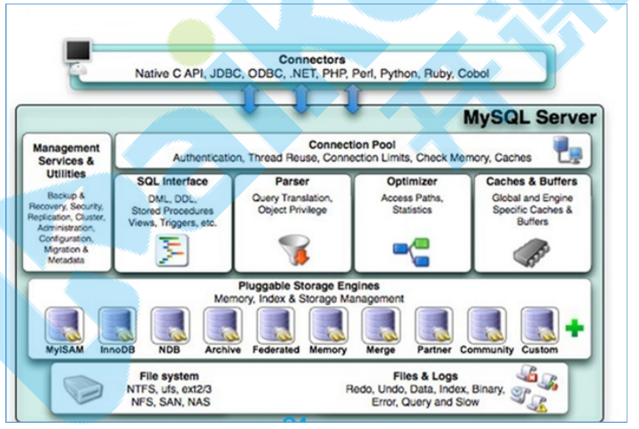

**连接器**（Connectors） 

**系统管理和控制工具**（Management Serveices & Utilities）

**连接池**（Connection Pool）

**SQL接口**（SQL Interface）

**解析器**（Parser）:词法分析，形成语法树

**查询优化器**（Optimizer）：包括索引使用最优 explain，where 从左到右 MySQL 找过滤力度最大的 先执行

**查询缓存**（Cache和Buffer）：hash(select语句) 查询结果，数据有变化，缓存清除。MySQL8.0后不再使用

**存储引擎**（Pluggable Storage Engines） 

以表为单位creat table xxx() engine=InnoDB/Memory/MyISAM

**详细执行流程**

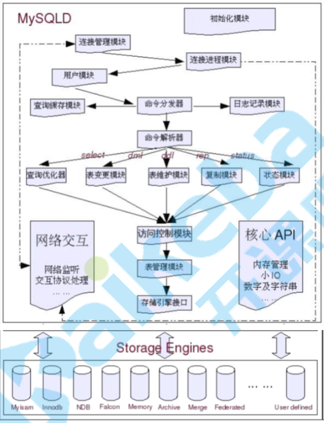

#### 6.1 存储引擎

MySQL的存储引擎是针对表进行指定的。

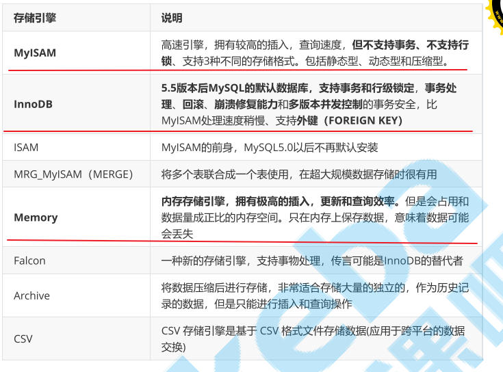

**InnoDB**：<u>支持事务处理，支持外键，支持崩溃修复能力和并发控制</u>。如果需要对事务的完整性要求比 较高（比如银行），要求实现并发控制（比如售票），那选择InnoDB有很大的优势。如果需要频繁的更新、删除操作的数据库，也可以选择InnoDB，因为支持事务的提交（commit）和回滚。

**MyISAM**：<u>插入数据快，空间和内存使用比较低</u>。如果表主要是用于插入新记录和读出记录，那么选择 MyISAM能实现处理高效率。如果应用的完整性、并发性要求比较低，也可以使用。

**MEMORY**：<u>所有的数据都在内存中，数据的处理速度快，但是安全性不高</u>。如果需要很快的读写速度， 对数据的安全性要求较低，不需要持久保存，可以选择MEMOEY。它对表的大小有要求，不能建立太大 的表。所以，这类数据库只使用在相对较小的数据库表。

同一个数据库也可以使用多种存储引擎的表。<u>如果一个表要求比较高的事务处理，可以选择 InnoDB。这个数据库中可以将查询要求比较高的表选择MyISAM存储</u>。如果该数据库需要一个用于查询 的临时表，可以选择MEMORY存储引擎。

#### 6.2 Mysql数据

MySQL从物理结构上可以分为日志文件和数据索引文件。

##### 6.2.1**日志文件采用顺序IO方式存储、数据文件采用随机IO方式存储。**

错误日志（errorlog）：默认是开启的，而且从5.5.7以后无法关闭错误日志，错误日志记录了运行过程中遇到的所有严重的错误 信息,以及 MySQL每次启动和关闭的详细信息。

重做日志（redo log） ：用于在崩溃时恢复数据

回滚日志（undo log） ：用于对事务的影响进行撤销

中继日志（relay log）:从节点单独进程会将binlog 拷贝至本地 relaylog,节点定时重放relay log

bin log 记录下所有数据的更改，可用于本机数据恢复和主从同步。

具体来说，redo log是物理日志，记录的是数据库页的物理修改操作。如果数据发生了丢失，数据库可以 根据redo log进行数据恢复。

undo log记录了数据在每个操作前的状态， 如果事务执行过程中需要回滚，就可以根据undo log进行回滚操作。
undo log的存储不同于redo log，它存放在数据库内部的一个特殊的段(segment)中，这个段称为回滚段。<u>回滚段位于共享表空间中</u>。

##### **6.2.2 数据文件 **

**InnoDB数据文件**
.frm文件：主要存放与表相关的数据信息,主要包括表结构的定义信息。

.ibd：使用独享表空间存储表数据和索引信息，一张表对应一个ibd文件。

ibdata文件：使用共享表空间存储表数据和索引信息，所有表共同使用一个或者多个ibdata文 件。

**MyIsam数据文件**

 .frm文件：主要存放与表相关的数据信息,主要包括表结构的定义信息 

.myd文件：主要用来存储表数据信息。

.myi文件：主要用来存储表数据文件中任何索引的数据树。

#### 6.3  事务

BEGIN 或 START TRANSACTION；显式地开启一个事务；

COMMIT使用COMMIT WORK，提交事务；

ROLLBACK 使用 ROLLBACK WORK，不过二者是等价的。回滚会结束用户的事务，并撤销正在进行的所有未提交的修改；

事务用来管理DDL、DML、DCL操作，比如Insert,update,delete 语句，默认是自动提交的

事务四大特性:

Atomicity（原子性）：构成事务的的所有操作必须是一个逻辑单元，要么全部执行，要么全部不执行。
Consistency（一致性）：数据库在事务执行前后状态都必须是稳定的或者是一致的。 

Isolation（隔离性）：事务之间不会相互影响。

Durability（持久性）：事务执行成功后必须全部写入磁盘。

##### 6.3.1  InnoDB与事务

InnoDB对于数据文件和日志文件的刷盘遵守WAL(Write ahead redo log) 和Force-log-at-commit两种规则，二者保证了事务的持久性。WAL要求数据的变更写入到磁盘前，首先必须将内存中的日志写入到磁盘；Force-log-at-commit要求当一个事务提交时，所有产生的日志都必须刷新到磁盘上，如果日志刷新成功后，缓冲池中的数据刷新到磁盘前数据库发生了宕机，那么重启时，数据库可以从日志中恢复数据。
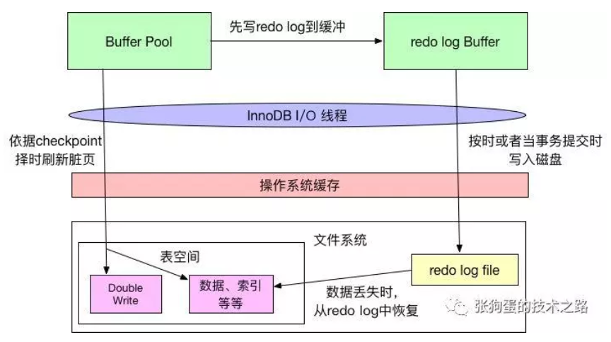

如上图所示，InnoDB在缓冲池中变更数据时，会首先将相关变更写入重做日志缓冲中，然后再按时或者当事务提交时写入磁盘，这符合Force-log-at-commit原则；当重做日志写入磁盘后，缓冲池中的变更数据才会依据checkpoint机制择时写入到磁盘中，这符合WAL原则。
checkpoint机制：缩短数据库恢复时间，重做日志中记录了的checkpoint的位置，这个点之前的页已经刷新回磁盘，只需要对checkpoint之后的重做日志进行恢复。

**重做日志的落盘机制**

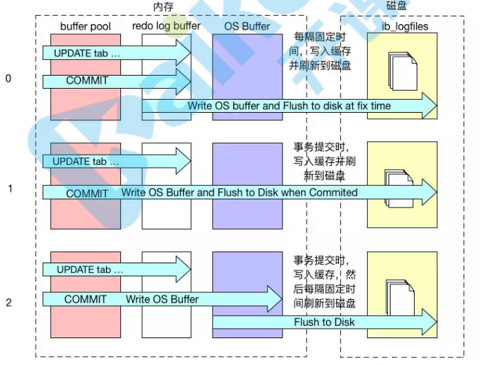

当属性值为0时，事务提交时，不会对重做日志进行写入操作，而是等待主线程按时写入；当属性值为1时，事务提交时，会将重做日志写入文件系统缓存，并且调用文件系统的fsync，将文件系统缓冲中的数据真正写入磁盘存储，确保不会出现数据丢失；当属性值为2时，事务提交时，也会将日志文件写入文件系统缓存，但是不会调用fsync，而是让文件系统自己去判断何时将缓存写入磁盘。


PS :Page是Innodb存储的最基本结构，也是Innodb磁盘管理的最小单位做增删改时缓存里的数据页和磁盘里的数据页不一致，该数据页为脏页。

#### 6.4  性能分析和性能优化

##### 6.4.1 性能分析的思路

1. 首先需要使用【慢查询日志】功能，去获取所有查询时间比较长的SQL语句

2. 其次【查看执行计划】查看有问题的SQL的执行计划 explain 

3. 最后可以使用【show profile[s]】 查看有问题的SQL的性能使用情况

#####  6.4.2  服务器层面优化

1、将数据保存在内存中，保证从内存读取数据

2、内存预热

3、降低磁盘写入次数，包括设置redolog策略

4、提高磁盘读写:SSD

##### 6.4.3 SQL设计层面优化

为减少关联查询，创建合理的冗余字段

对于字段太多的大表，考虑拆表

对于表中经常不被使用的字段或者存储数据比较多的字段，考虑拆表。

每张表建议都要有一个主键（主键索引），而且主键类型最好是int类型，建议自增主键。

##### 6.4.4 SQL语句优化

索引优化 where 字段 、组合索引 （最左前缀） 、 索引下推 （非选择行不加锁） 、索引覆盖（不回表） on 两边 排序 分组统计 不要用 * LIMIT优化 原SQL

#### 6.5 MVCC多版本并发控制机制

 Multi-Version Concurrency Control,翻译为中文即 多版本并发控制 .

 MVCC的实现，通过保存数据在某个时间点的快照来实现的。这意味着一个事务无论运行多长时间，在同一个事务里能够看到数据一致的视图。根据事务开始的时间不同，同时也意味着在同一个时刻不同事务看到的相同表里的数据可能是不同的。 


### 7  索引

#### 7.1 索引创建的情况？

**哪些情况需要创建索引：**

1、主键自动建立唯一索引 
2、频繁作为查询条件的字段应该创建索引
3、多表关联查询中，关联字段应该创建索引 on 两边都要创建索引 
4、查询中排序的字段，应该创建索引 B + tree 
5、覆盖索引 好处是？ 不需要回表
6、统计或者分组字段，应该创建索引

**哪些情况不需要创建索引** 

1、表记录太少 索引是要有存储的开销 
2、频繁更新 索引要维护 
3、查询字段使用频率不高

#### 7.2 索引原理

**MyISAM和InnoDB存储引擎**：只支持B+ TREE索引， 也就是说默认使用BTREE，不能够更换 

**MEMORY/HEAP存储引擎**：支持HASH和BTREE索引

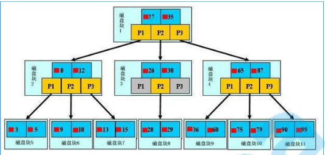

B树和B+树的最大区别在于非叶子节点是否存储数据的问题。

B+树只有叶子节点才会存储数据，而且存储的数据都是在一行上，而且这些数据都是有指针指向 的，也就是有顺序的。

如果是三层树结构---支撑的数据可以达到20G，如果是四层树结构---支撑的数据可以达到几十T,B树的高度一般都是在2-4这个高度。

**MyISAM**:主键索引和辅助索引基本差不多

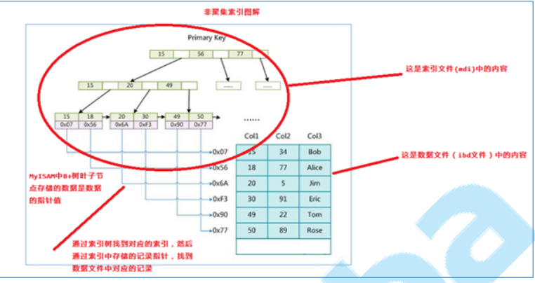

**InnoDB**:主键索引和辅助索引

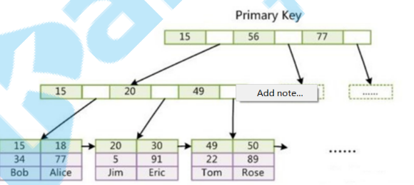

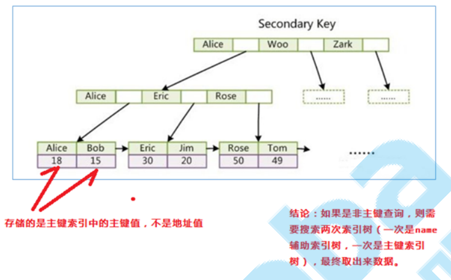

#### 7.3 索引分析

```mysql
ALTER TABLE table_name ADD INDEX index_name(col1,col2,col3）
show index from t1;  //显示表中所有索引
explain select * from tuser;//分析索引
```

在一颗索引树上由多个字段 优势： 效率高、省空间、容易形成覆盖索引;

##### **7.3.1索引分析参数说明**

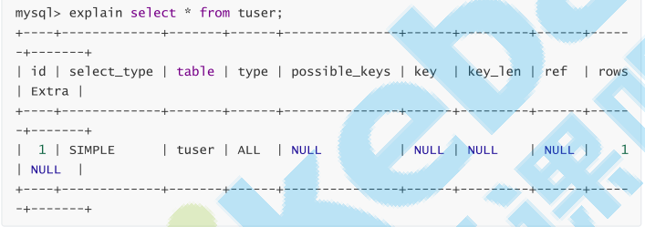

**id**:每个 SELECT语句都会自动分配的一个唯一标识符

**select_type:**查询类型，主要用于区别普通查询、联合查询(union、union all)、子查询等复杂查询

simple:表示不需要union操作或者不包含子查询的简单select查询。有连接查询时，外层的查询为simple，且只有一个

primary:一个需要union操作或者含有子查询的select，位于最外层的单位查询的select_type即为primary。且只有一个

subquery :除了from字句中包含的子查询外，其他地方出现的子查询都可能是subquery

**table**:显示的查询表名，如果查询使用了别名，那么这里显示的是别名

**type**：除了all之外，其他的type都可以使用到索引，除了index_merge之外，其他的type只可以用到一个索 引,优化器会选用最优索引 一个

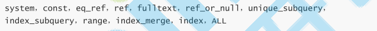

system: 表中只有一行数据或者是空表。

const（重要):使用唯一索引或者主键，返回记录一定是1行记录的等值where条件时，通常type是const。

eq_ref（重要）：连接字段主键或者唯一性索引。例如：select a.id from tuser a left join tdep b on a.dep=b.id;

ref（重要）：针对非唯一性索引，使用等值（=）查询非主键。或者是使用了最左前缀规则索引的查询。例如：select * from tuser where dep=1。

fulltext：全文索引检索，要注意，全文索引的优先级很高，若全文索引和普通索引同时存在时，mysql不管代 价，优先选择使用全文索引。例如：select * from taddr where match(addr) against('bei')。

unique_subquery：用于where中的in形式子查询，子查询返回不重复值唯一值 index_subquery

range（重要）：索引范围扫描，常见于使用>,<,is null,between ,in ,like等运算符的查询中。例如：select * from tuser where id>1;

index_merge：表示查询使用了两个以上的索引，最后取交集或者并集，常见and ，or的条件使用了不同的索引，

index（重要）：条件是出现在索引树中的节点的。可能没有完全匹配索引。索引全表扫描，把索引从头到尾扫一遍。例如：select loginname from tuser;

all（重要） 这个就是全表扫描数据文件，然后再在server层进行过滤返回符合要求的记录。select * from tuser;

**possible_keys**：此次查询中可能选用的索引，一个或多个 key

**key：**查询真正使用到的索引，select_type为index_merge时，这里可能出现两个以上的索引，其他的 select_type这里只会出现一个

**key_len：**用于处理查询的索引长度

**extra（重要）**：这个列包含不适合在其他列中显示但十分重要的额外的信息

using filesort（重要）：排序时无法使用到索引时，就会出现这个。常见于order by和group by语句中。

using index（重要）：查询时不需要回表查询，直接通过索引就可以获取查询的数据。

using temporary：表示使用了临时表存储中间结果

using where（重要）：表示存储引擎返回的记录并不是所有的都满足查询条件，需要在server层进行过滤。

##### 7.3.2  索引下推

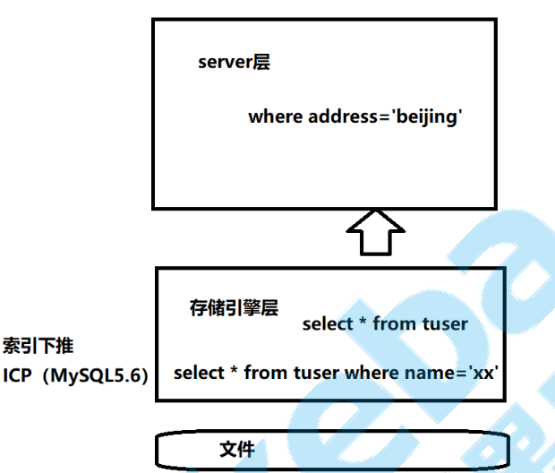

查询条件中分为**限制条件和检查条件**，5.6之前，存储引擎只能根据**限制条件**扫描数据并返回，然 后server层根据**检查条件**进行过滤再返回真正符合查询的数据。5.6.x之后支持ICP特性，可以把检查条件也下推到存储引擎层，不符合检查条件和限制条件的数据，直接不读取，这样就大大减少了 存储引擎扫描的记录数量。extra列显示using index condition

一个SQL中的where条件拆分：
**Index key**：pubtime > 1 and puptime < 20。此条件，用于确定SQL在idx_t1_pu索引上的查询范围。 

**Index Filter**：userid = ‘hdc’ 。此条件，可以在idx_t1_pu索引上进行过滤，但不属于Index Key。 

**Table Filter**：comment is not NULL。此条件，在idx_t1_pu索引上无法过滤，只能在聚簇索引 上过滤。

在where条件过滤时，先过滤index key（索引列为范围查询，起始条件为index First Key，截至条件为 index Last key），再过滤Index Filter（索引列），最后过滤Table Filter（非索引列）。在ICP(Index Condition Pushdown)过程中， 下推Index Filter。


##### 7.3.3索引失效分析

1.全值匹配我最爱；

2.最佳左前缀法则；带头索引不能死，中间索引不能断，中间索引断（带头索引生效，其他索引失效）

3.不要在索引上做计算

4.范围条件右边的列失效

5.尽量使用覆盖索引

6.索引字段上不要使用不等

7.主键索引字段上不可以判断null

8.索引字段使用like不以通配符开头，解决like ‘%字符串%’时，索引失效问题的方法？ 使用覆盖索引可以解决。

9.索引字段字符串要加单引号

10.索引字段不要使用or

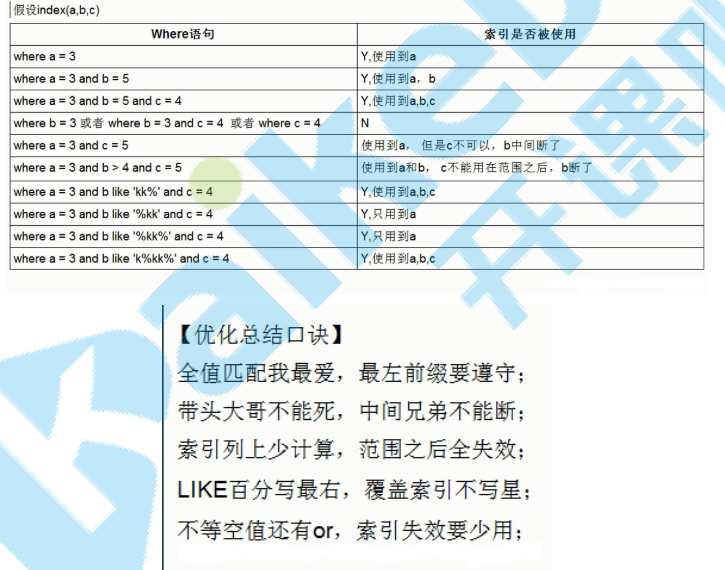

#### 补充

**MySQL B+树索引和哈希索引的区别**

 B+树是一个平衡的多叉树，从根节点到每个叶子节点的高度差值不超过1，而且同层级的节点间有指针相互链接。 

 哈希索引就是采用一定的哈希算法，把键值换算成新的哈希值，检索时不需要类似B+树那样从根节点到叶子节点逐级查找，只需一次哈希算法即可立刻定位到相应的位置，速度非常快。 

``` xml
- 如果是等值查询，那么哈希索引明显有绝对优势，因为只需要经过一次算法即可找到相应的键值；当然了，这个前提是，键值都是唯一的。如果键值不是唯一的，就需要先找到该键所在位置，然后再根据链表往后扫描，直到找到相应的数据；
- 从示意图中也能看到，如果是范围查询检索，这时候哈希索引就毫无用武之地了，因为原先是有序的键值，经过哈希算法后，有可能变成不连续的了，就没办法再利用索引完成范围查询检索；
- 同理，哈希索引也没办法利用索引完成排序，以及like ‘xxx%’ 这样的部分模糊查询（这种部分模糊查询，其实本质上也是范围查询）；
- 哈希索引也不支持多列联合索引的最左匹配规则；
- B+树索引的关键字检索效率比较平均，不像B树那样波动幅度大，在有大量重复键值情况下，哈希索引的效率也是极低的，因为存在所谓的哈希碰撞问题。
```

**唯一索引和主键索引区别**

```xml
主键是一种约束，唯一索引是一种索引，两者在本质上是不同的。
主键创建后一定包含一个唯一性索引，唯一性索引并不一定就是主键。
唯一性索引列允许空值，而主键列不允许为空值。
主键列在创建时，已经默认为空值 + 唯一索引了。
主键可以被其他表引用为外键，而唯一索引不能。
一个表最多只能创建一个主键，但可以创建多个唯一索引。
```


###  8  Mysql锁介绍

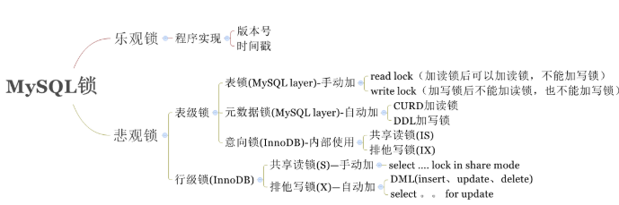

#### 8.1  表锁

表锁：表共享读锁（Table Read Lock)和表独占写锁（Table Write Lock）

```
lock table 表名称 read(write),表名称2 read(write)，其他;
show open tables;
unlock tables;
```

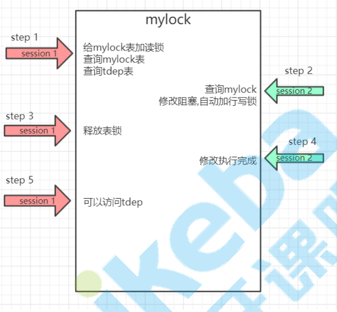

#### 8.2 行锁(共享锁S锁,排它锁X锁)

未使用索引行锁升级为表锁

InnoDB的行级锁，按照锁定范围来说，分为三种： 

**记录锁**（Record Locks）:锁定索引中一条记录。 主键指定 where id=3 

**间隙锁**（Gap Locks）: 锁定记录前、记录中、记录后的行 RR隔离级，防止插入间隙内的数据；防止已有数据更新为间隙内的数据。

**Next-Key 锁**: 记录锁 + 间隙锁

自动加：对于UPDATE、DELETE和INSERT语句，InnoDB会自动给涉及数据集加排他锁（X)；

手动加：SELECT * FROM table_name WHERE ... FOR UPDATE


案例一：id非唯一索引+RC

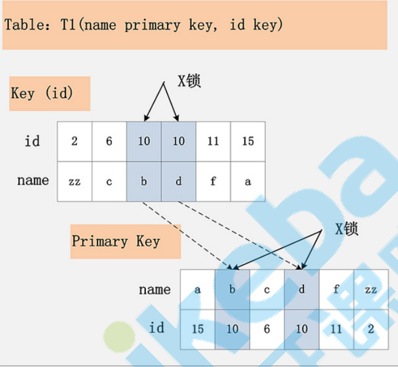

案例二：id非唯一索引+RR

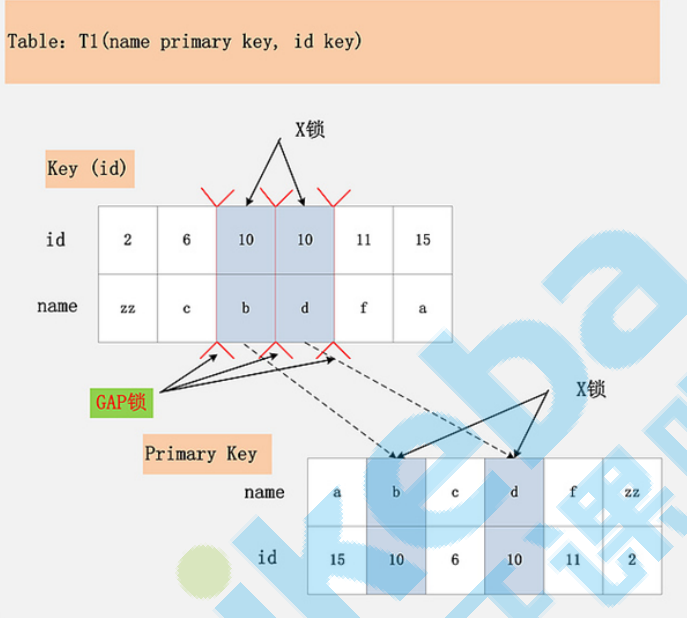

#### 8.3 间隙锁

间隙锁防止两种情况 ：
1、防止插入间隙内的数据 
2、防止已有数据更新为间隙内的数据

案例：
update news set number=3 where number=4; 
number : 2 3 4 
id: 2 4 5 
间隙情况： id、number均在间隙内 id、number均在间隙外 id在间隙内、number在间隙外 id在间隙外，number在间隙内 id、number为边缘数据

只要number在间隙里（2 3 4），不包含最后一个数则不管id是多少都会阻塞。
只要id在间隙里(2 4 5)，则不管number是多少都会阻塞。

### 9 Mysql 集群

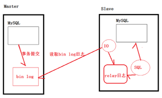

主从集群的问题：只有主对外工作，从不对外工作。主既要负责写操作，也要负责读操作。 对于主从集群来说，只是保证了数据的安全备份。 **主：负责部分读 、写 。从：负责读**

#### 9.1 分库分表介绍

**使用背景**
当【表的数量】达到了几百上千张表时，众多的业务模块都访问这个数据库，压力会比较大，考虑对其 进行分库。
当【表的数据】达到了几千万级别，在做很多操作都比较吃力,所以，考虑对其进行分库或者分表

**数据切分方案:**

垂直切分：

1、垂直分库：按照业务模块进行切分，将不同模块的表切分到不同的数据库中。

2、垂直分表：大表拆小表，字段拆分

水平切分：将一张大表按照一定的切分规则，按照行切分成不同的表或者切分到不同的库中范围式拆分
好处：数据迁移是部分迁移，扩展性好 ，坏处：热点数据分布不均，压力不能负载。

解决：hash式拆分，热点数据分布均匀，访问压力能负载，但扩展能力差，数据都要迁移

**分布式主键ID问题**

多个库中表的主键冲突，采用雪花算法生成主键ID。

**分库分表实现技术**

基于阿里Cobar开发的Mycat ，当当网的sharding-jdbc

Sharding JDBC核心概念 数据分片：

这样一个Hash函数，其值空间为（0到2的32次方-1) ，也就是说，其hash值是个32位无整型数字 ，这些数字组成一个环。

然后，对机器进行hash(比如根据机器的ip)，算出每台机器在这个环上的位置； 再对key进行hash，算出该key在环上的位置，然后从这个位置往前走，遇到的第一台机器就是该key对应的机器，就把该(key, value) 存储到该机器上。

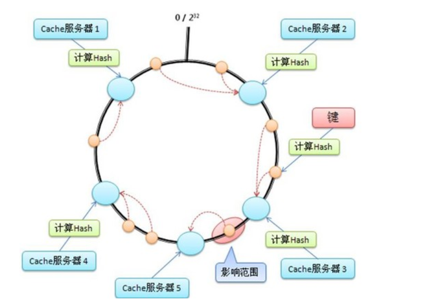

一致性Hash原理

 但是普通的余数hash（hash(比如用户id)%服务器机器数）算法伸缩性很差，当新增或者下线服务器机器时候，用户id与服务器的映射关系会大量失效。一致性hash则利用hash环对其进行了改进。 

当ip2的服务器挂了的时候，一致性hash环大致如下图：


根据顺时针规则可知user1,user2的请求会被服务器ip3进行处理，而其它用户的请求对应的处理服务器不变，也就是只有之前被ip2处理的一部分用户的映射关系被破坏了，并且其负责处理的请求被顺时针下一个节点委托处理。

当新增一个ip5的服务器后，一致性hash环大致如下图：


根据顺时针规则可知之前user5的请求应该被ip5服务器处理，现在被新增的ip5服务器处理，其他用户的请求处理服务器不变，也就是新增的服务器顺时针最近的服务器的一部分请求会被新增的服务器所替代。

**虚拟节点**

当服务器节点比较少的时候会出现上节所说的一致性hash倾斜的问题，一个解决方法是多加机器，但是加机器是有成本的，那么就加虚拟节点，比如上面三个机器，每个机器引入1个虚拟节点后的一致性hash环的图如下：


其中ip1-1是ip1的虚拟节点，ip2-1是ip2的虚拟节点，ip3-1是ip3的虚拟节点。
 可知当物理机器数目为M，虚拟节点为N的时候，实际hash环上节点个数为M*N。比如当客户端计算的hash值处于ip2和ip3或者处于ip2-1和ip3-1之间时候使用ip3服务器进行处理。

### P2 Mysql笔试问题

#### 1  部门工资最高的员工

Employee表包含所有员工信息，每个员工有其对应的 Id, salary 和 department Id。

```
Employee 表包含所有员工信息，每个员工有其对应的 Id, salary 和 department Id。

+----+-------+--------+--------------+
| Id | Name  | Salary | DepartmentId |
+----+-------+--------+--------------+
| 1  | Joe   | 70000  | 1            |
| 2  | Henry | 80000  | 2            |
| 3  | Sam   | 60000  | 2            |
| 4  | Max   | 90000  | 1            |
+----+-------+--------+--------------+

Department 表包含公司所有部门的信息。

+----+----------+
| Id | Name     |
+----+----------+
| 1  | IT       |
| 2  | Sales    |
+----+----------+
编写一个 SQL 查询，找出每个部门工资最高的员工。例如，根据上述给定的表格，Max 在 IT 部门有最高工资，Henry 在 Sales 部门有最高工资。

+------------+----------+--------+
| Department | Employee | Salary |
+------------+----------+--------+
| IT         | Max      | 90000  |
| Sales      | Henry    | 80000  |
+------------+----------+--------+

```

```sql
select b.Name as Department,a.Name as Employee,max(a.Salary) as Salary 
from Employee a join Deparment b on a.DeparmentId=b.Id
Group by a.DepartmentId

```

```sql
select Department.Name as Department ,Employee.Name as Employee ,Employee.Salary 
from Employee join Department on Employee.DepartmentId  = Department.id
where (Salary,DepartmentId) in 
(select max(Salary) as Salary,DepartmentId from Employee
group by DepartmentId );
```

#### 2  分数排名

```
编写一个 SQL 查询来实现分数排名。如果两个分数相同，则两个分数排名（Rank）相同。请注意，平分后的下一个名次应该是下一个连续的整数值。换句话说，名次之间不应该有“间隔”。

+----+-------+
| Id | Score |
+----+-------+
| 1  | 3.50  |
| 2  | 3.65  |
| 3  | 4.00  |
| 4  | 3.85  |
| 5  | 4.00  |
| 6  | 3.65  |
+----+-------+
例如，根据上述给定的 Scores 表，你的查询应该返回（按分数从高到低排列）：

+-------+------+
| Score | Rank |
+-------+------+
| 4.00  | 1    |
| 4.00  | 1    |
| 3.85  | 2    |
| 3.65  | 3    |
| 3.65  | 3    |
| 3.50  | 4    |
+-------+------+
```

```sql
select s1.Score,count(distinct(s2.score)) Rank
from
Scores s1,Scores s2
where
s1.score<=s2.score## 分数不小于s1.score
group by s1.Id # a表中每个数据都进行排名
order by Rank # 升序排列
```


#### 3  第二高的薪水

编写一个 SQL 查询，获取 `Employee` 表中第二高的薪水（Salary） 。

```SQL
select IFNULL(
    # DISTINCT 去重
    (select DISTINCT Salary 
    from Employee 
    # GROUP BY 字段 DESC 逆向排序
    ORDER By  Salary DESC 
    # 含义是说从第一条开始（不包含）数据开始读取1条数据， limit后面跟的是1条数据， offset后面跟的是从第一条开始读取，即读取第2条
     limit 1 offset 1),
     NULL)as SecondHighestSalary
```
#### 4  第N高的薪水

编写一个 SQL 查询，获取 `Employee` 表中第 *n* 高的薪水（Salary）。


```sql
CREATE FUNCTION getNthHighestSalary(N INT) RETURNS INT
BEGIN
    SET N = N - 1;
  RETURN (
      # Write your MySQL query statement below.

      SELECT DISTINCT salary FROM employee ORDER BY salary DESC LIMIT N, 1
      
  );
END
```

