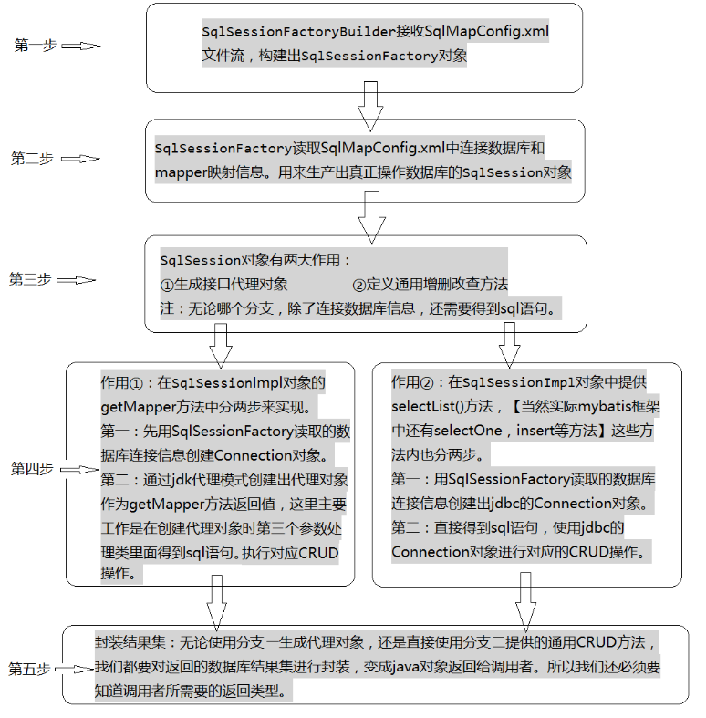
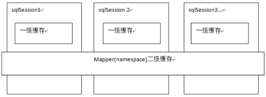
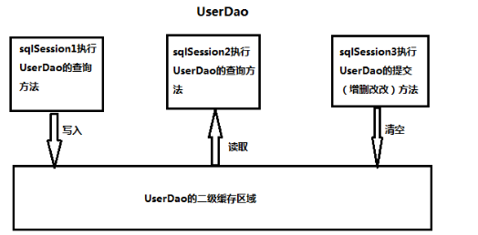
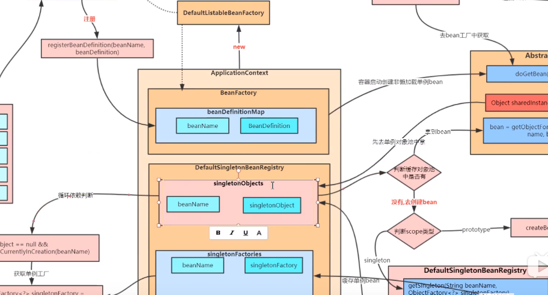
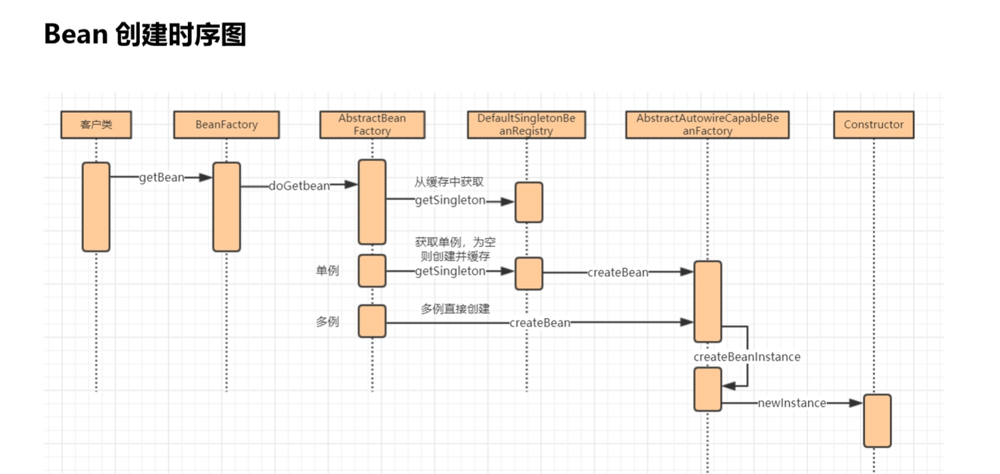
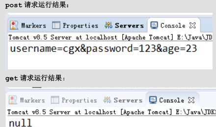

## 一、Mybatis框架


### 1.1  Mybatis 案例

第一步：Maven中添加Mybatis3.4.5 的坐标

第二步：编写User 实体类

```java
public class User implements Serializable {
    private Integer id;
    public Integer getId() {
        return id;
    }
    public void setId(Integer id) {
        this.id = id;
    }
    public String toString() { 
        return "id=" + id;
}}
```

第三步：编写持久层接口IUserDao

```java
public interface IUserDao{
	List<User> findAll(); 
}

//注解 
public interface IUserDao{
    @Select("select * from user")
	List<User> findAll(); 
}
```

第四步：编写持久层接口的映射文件 IUserDao.xml（使用基于注解的 Mybatis 配置时，移除 xml的映射配置）

```xml
<!--创建位置：必须和持久层接口在相同的包中。 名称：必须以持久层接口名称命名文件名，扩展名是.xml-->
<mapper namespace="com.itheima.dao.IUserDao"> <!-- 配置查询所有操作 -->
    <select id="findAll" resultType="com.itheima.domain.User"> 
        select * from user
	</select>
</mapper>
```

第五步：编写 SqlMapConfig.xml 配置文件

```xml
<configuration>
    <!-- 配置 mybatis 的环境 -->
    <environments default="mysql"> 
        <!-- 配置 mysql的环境 --> 
        <environment id="mysql">
            <!-- 配置事务的类型 --> 
            <transactionManager type="JDBC"></transactionManager> 
            <!-- 配置连接数据库的信息：用的是数据源(连接池) --> 
            <dataSource type="POOLED"> 
                <property name="driver" value="com.mysql.jdbc.Driver"/> 
                <property name="url" value="jdbc:mysql://localhost:3306/ee50"/> 
                <property name="username" value="root"/> 
                <property name="password" value="1234"/>
			</dataSource> 
        </environment> 
    </environments>
<!-- 告知 mybatis 映射配置的位置 --> 
<mappers><mapper resource="com/itheima/dao/IUserDao.xml"/></mappers> 
<!-- 基于注解版本-----告知 mybatis 映射配置的位置 -->
<mappers><mapper class="com.itheima.dao.IUserDao"/></mappers>
</configuration>

<!--注册指定包下的所有 mapper 接口 如：-->
<package name="cn.itcast.mybatis.mapper"/> 

```

第六步：编写测试类

```java
//1.读取配置文件 
InputStream in = Resources.getResourceAsStream("SqlMapConfig.xml"); 
//2.创建 SqlSessionFactory 的构建者对象 
SqlSessionFactoryBuilder builder = new SqlSessionFactoryBuilder(); 
//3.使用构建者创建工厂对象 
SqlSessionFactory SqlSessionFactory factory = builder.build(in); 
//4.使用 SqlSessionFactory 生产SqlSession 对象 
SqlSession session = factory.openSession(); 
//5.使用 SqlSession 创建 dao 接口的代理对象 
IUserDao userDao = session.getMapper(IUserDao.class); 
//6.使用代理对象执行查询所有方法 
List<User> users = userDao.findAll(); 
for(User user : users) { 
    System.out.println(user);
}
//7.释放资源 
session.close(); 
in.close();
```

### 1.2 Mybatis 框架源码




### 1.3 基于代理 Dao 实现 CRUD操作

**1)保存操作**

```xml
int saveUser(User user);

<insert id="saveUser" parameterType="com.itheima.domain.User"> 
    insert into user(username,birthday,sex,address) values(#{username},#{birthday},#{sex},#{address})
</insert>
<!--
parameterType 属性： 代表参数的类型，因为我们要传入的是一个类的对象，所以类型就写类的全名称。
sql 语句中使用#{}字符： 它代表占位符，相当于原来 jdbc 部分所学的?，都是用于执行语句时替换实际的数据。 具体的数据是由#{}里面的内容决定的。
#{}中内容的写法：由于我们保存方法的参数是 一个 User 对象，此处要写User对象中的属性名称。-->


<!--问题扩展：返回新增用户返回值-->
<insert id="saveUser" parameterType="USER">
    <!-- 配置保存时获取插入的 id -->
    <selectKey keyColumn="id" keyProperty="id" resultType="int"> 
        select last_insert_id();
	</selectKey> 
	insert into user(username,birthday,sex,address) values(#{username},#{birthday},#{sex},#{address})
</insert>
```

**2)用户更新**

```xml
int updateUser(User user);//持久层接口
<!--映射配置文件-->
<update id="updateUser" parameterType="com.itheima.domain.User"> 
    update user set username=#{username},birthday=#{birthday},sex=#{sex}, address=#{address} where id=#{id}
</update>
```

**3）用户删除**

```xml
int deleteUser(Integer userId);

<!-- 删除用户 --> 
<delete id="deleteUser"  parameterType="java.lang.Integer">
    delete from user where id = #{uid}
</delete>
```

 **4)用户模糊查询**

```xml
List<User> findByName(String username);

<!-- 根据名称模糊查询   List<User> users = userDao.findByName("%王%");--> 
<select id="findByName" resultType="com.itheima.domain.User" parameterType="String"> 
    select * from user where username like #{username}
</select>
<!--模糊查询的另一种配置方式  -->
<!-- List<User> users = serDao.findByName("王");--> 
<select id="findByName" parameterType="string" resultType="com.itheima.domain.User"> 
    select * from user where username like '%${value}%'
</select>
#{}表示一个占位符号有效防止 sql 注入,接收简单类型值或 pojo 属性值
${}表示拼接 sql串,接收简单类型值或 pojo 属性值 
```

**5)查询使用聚合函数**

```xml
int findTotal();

<select id="findTotal" resultType="int"> 
select count(*) from user;
</select>
```

### 1.4 Mybatis 与 JDBC 编程的比较

**1.数据库链接创建、释放频繁造成系统资源浪费**从而影响系统性能，如果使用数据库链接池可解决此问题。 解决：在 SqlMapConfig.xml中配置数据链接池，使用连接池管理数据库链接。

**2.Sql语句写在代码中造成代码不易维护**，实际应用 sql变化的可能较大，sql 变动需要改变 java代码。 解决：将 Sql语句配置在 XXXXmapper.xml文件中与 java 代码分离。

**3.向sql语句传参数麻烦**，因为sql语句的where条件不一定，可能多也可能少，占位符需要和参数对应。 解决：Mybatis自动将java对象映射至sql语句，通过statement中的parameterType定义输入参数的类型。

**4.对结果集解析麻烦**，sql变化导致解析代码变化，且解析前需要遍历，如果能将数据库记录封装成pojo对
象解析比较方便。 解决：Mybatis自动将sql执行结果映射至java对象，通过statement中的resultType定义输出结果的类型。

```xml
结果集解析表名与类属性不一致时解决方法：
1使用别名查询
<!-- 配置查询所有操作 -->
<select id="findAll" resultType="com.itheima.domain.User"> 
    select id as userId,username as userName,birthday as userBirthday, sex as userSex,address as userAddress from user
</select>
2使用resultMap
<resultMap type="com.itheima.domain.User" id="userMap"> 
    <id column="id" property="userId"/> 
    <result column="username" property="userName"/>
    <result column="sex" property="userSex"/> 		
    <result column="address" property="userAddress"/> 
    <result column="birthday" property="userBirthday"/>
<select id="findAll" resultMap="userMap"> select * from user
</select>
```

### 1.5  Mybatis 的动态SQL语句

#### 1.5.1 动态 SQL 之\<if>标签

```xml
<select id="findByUser" resultType="user" parameterType="user"> 
    select * from user where 1=1 
    <if test="username!=null and username != '' "> 
    	and username like #{username}
    </if> 
    <if test="address != null"> 
    	and address like #{address}
    </if>
</select> 
注意：<if>标签的 test属性中写的是对象的属性名。where 1=1 的作用
User u = new User(); 
u.setUsername("%王%"); 
u.setAddress("%顺义%"); //6.执行操作 
List<User> users = userDao.findByUser(u);

```

### 1.6 Mybatis 多表查询

#### 1.6.1 多表查询 一对多

```xml
<mapper namespace="com.itheima.dao.IAccountDao"> 
<!-- 配置查询所有操作-->
<select id="findAll" resultType="accountuser"> 
    select a.*,u.username,u.address from account a,user u where a.uid =u.id;
</select>
</mapper>
```

```xml
private Integer id; 
private String username;
private Date birthday;
private String sex;
private String address;
private List<Account> accounts;
    
<mapper namespace="com.itheima.dao.IUserDao">
    <resultMap type="user" id="userMap"> 
        <id column="id" property="id"></id> 
        <result column="username" property="username"/> 
        <result column="address" property="address"/> 
        <result column="sex" property="sex"/> 
        <result column="birthday" property="birthday"/> 
        <!-- collection是用于建立一对多中集合属性的对应关系 ofType用于指定集合元素的数据类型
        -->
        <collection property="accounts" ofType="account"> 
            <id column="aid" property="id"/> 
            <result column="uid" property="uid"/> 
            <result column="money" property="money"/>
        </collection>
    </resultMap>
<!-- 配置查询所有操作 --> 
<select id="findAll" resultMap="userMap"> 
    select u.*,a.id as aid ,a.uid,a.money from user u left outer join account a on u.id =a.uid 
    </select>
</mapper>
```

#### 1.6.2 多表查询之多对多

```xml
用户与角色的多对多关系模型如下：
class Role:
private Integer roleId; 
private String roleName;
private String roleDesc;
private List<User> users;

<mapper namespace="com.itheima.dao.IRoleDao">
<!--定义 role表的ResultMap--> 
<resultMap id="roleMap" type="role"> 
    <id property="roleId" column="rid"></id> 
    <result property="roleName" column="role_name"></result> 
    <result property="roleDesc" column="role_desc"></result> 
    <collection property="users" ofType="user"> 
        <id column="id" property="id"></id> 
        <result column="username" property="username"></result> 
        <result column="address" property="address"></result> 
        <result column="sex" property="sex"></result> 
        <result column="birthday" property="birthday"></result>
    </collection> 
</resultMap>
<!--查询所有--> 
<select id="findAll" resultMap="roleMap"> 
  select u.*,r.id as rid,r.role_name,r.role_desc from role r left outer join user_role ur on r.id = ur.rid 
    </select>
</mapper>
```


### 1.7 Mybatis 延迟加载策略

**延迟加载也称懒加载**：需要用到数据时才进行加载，不需要用到数据时就不加载数据。
**好处：**先从单表查询，需要时再从关联表去关联查询，大大提高数据库性能，因为查询单表要比关联查询多张表速度要。

**坏处**：因为只有当需要用到数据时，才会进行数据库查询，这样在大批量数据查询时，因为查询工作也要消耗时间，所以可能造成用户等待时间变长，造成用户体验下降。

**需求**：查询账户(Account)信息并且关联查询用户(User)信息。如果先查询账户(Account)信息即可满足要求，当我们需要查询用户(User)信息时再查询用户(User)信息。把对用户(User)信息的按需去查询就是延迟加载。

**使用**：resultMap来实现一对一，一对多，多对多关系的操作。主要是通过 association、collection 实现一对一及一对多映射。association、collection 具备延迟加载功能。

#### 1.7.1  使用 assocation /Collection实现延迟加载

```xml
<mapper namespace="com.itheima.dao.IAccountDao"> 
    <!-- 建立对应关系 --> 
<resultMap type="account" id="accountMap"> 
    <id column="aid" property="id"/> 
    <result column="uid" property="uid"/> 
    <result column="money" property="money"/>
    <!-- 它是用于指定从表方的引用实体属性的 --> 
    <association property="user" javaType="user" select="com.itheima.dao.IUserDao.findById" column="uid">
    </association> 
</resultMap>
<select id="findAll" resultMap="accountMap"> select * from account</select>
<!-- 根据 id查询 --> 
<select id="findById" resultType="user" parameterType="int" > select * from user where id = #{uid}</select>
</mapper>
select：填写我们要调用的 select 映射的 id 
column：填写我们要传递给 select 映射的参数
<!--开启Mybatis 的延迟加载策略-->
<settings>
<setting name="lazyLoadingEnabled" value="true"/>
<setting name="aggressiveLazyLoading" value="false"/>
</settings>
```

### 1.8 Mybatis 缓存

Mybatis 中缓存分为一级缓存，二级缓存



**一级缓存**是 SqlSession级别的缓存，只要SqlSession 没有 flush或 close，它就存在。当调用 SqlSession 的修改，添加，删除，commit()，close()等方法时，就会清空一级缓存。

**二级缓存**是 mapper 映射级别的缓存，多个 SqlSession 去操作同一个 Mapper 映射的 sql 语句，多个 SqlSession可以共用二级缓存，二级缓存是跨 SqlSession 的。



sqlSession1 去查询用户信息，查询到用户信息会将查询数据存储到二级缓存中。

sqlSession2 去查询与 sqlSession1 相同的用户信息，首先会去缓存中找是否存在数据，如果存在直接从缓存中取出数据。

如果 SqlSession3 去执行相同 mapper映射下 sql，执行 commit 提交，将会清空该 mapper 映射下的二级缓存区域的数据。

```xml
<settings>
    <!-- 开启二级缓存的支持 --> 
    <setting name="cacheEnabled" value="true"/>
</settings> 

<mapper namespace="com.itheima.dao.IUserDao"> 
    <!-- 开启二级缓存的支持 --> 
    <cache></cache>
    <select id="findById" resultType="user" parameterType="int" useCache="true"> 
    select * from user where id = #{uid}
</select>
</mapper>

```

### 1.9 Mybatis 注解实现基本 CRUD

使用注解方式开发持久层接口

```java
public interface IuserDao{
    //查询所有用户
    @Select("select * from user") 
    @Results(id="userMap", value= {
        @Result(id=true,column="id",property="userId"), 
        @Result(column="username",property="userName"),
        @Result(column="sex",property="userSex"), 
        @Result(column="address",property="userAddress"), 
        @Result(column="birthday",property="userBirthday")
    })
    List<User> findAll();
    //根据id 查询一个用户
    @Select("select * from user where id = #{uid} ") 
    @ResultMap("userMap") 
    User findById(Integer userId);
    
    //保存操作
    @Insert("insert into user(username,sex,birthday,address)values(#{username},#{sex},#{birthday},#{address} )")
    @SelectKey(keyColumn="id",keyProperty="id",resultType=Integer.class,before =
false, statement = { "select last_insert_id()" }) 
    int saveUser(User user);

     //更新操作
    @Update("update user set username=#{username},address=#{address},sex=#{sex},birthday=#{birthday} where id =#{id} ")
    int updateUser(User user
                   
    // 删除用户 
    @Delete("delete from user where id = #{uid} ") 
    int deleteUser(Integer userId);
    //查询使用聚合函数 
    @Select("select count(*) from user ") 
    int findTotal();
    //模糊查询
    @Select("select * from user where username like #{username} ") 
    List<User> findByName(String name);
}
```

编写 SqlMapConfig 配置文件

```
<mappers>
 <package name="com.itheima.dao"/>
</mappers>
```

### 1.10 Mybatis面试题

#### 1.10.1 Mybatis 中#和$的区别？

#相当于对数据 加上 双引号，$相当于直接显示数据

1. #将传入的数据都当成一个字符串，会对自动传入的数据加一个双引号。
2. $将传入的数据直接显示生成在 sql 中。
3. #方式能够很大程度防止 sql 注入。$方式无法防止 Sql 注入。
4. $方式一般用于传入数据库对象，例如传入表名.

#### 1.10.2  Mybatis 的编程步骤是什么样的

1、创建 SqlSessionFactory 

2、通过 SqlSessionFactory 创建 SqlSession 

3、通过 sqlsession 执行数据库操作 

4、调用 session.commit()提交事务 

5、调用 session.close()关闭会话

#### 1.10.3 JDBC 编程有哪些不足之处，MyBatis 是如何解决这些问题的

1. 数据库链接创建、释放频繁造成系统资源浪费从而影响系统性能，如果使用数据库链接池可解决此问题。 解决：在 SqlMapConfig.xml 中配置数据链接池，使用连接池管理数据库链接。

2. Sql 语句写在代码中造成代码不易维护，实际应用 sql 变化的可能较大，sql 变动需要改变 java 代码。 解决：将 Sql 语句配置在 XXXXmapper.xml 文件中与 java 代码分离。

3. 向 sql 语句传参数麻烦，因为 sql 语句的 where 条件不一定，可能多也可能少，占位符需要和参数一一对应。 解决： Mybatis 自动将 java 对象映射至 sql 语句。

4. 对结果集解析麻烦，sql 变化导致解析代码变化，且解析前需要遍历，如果能将数据库记录封装成 pojo 对象解 析比较方便。解决：Mybatis 自动将 sql 执行结果映射至 java 对象。

#### 1.10.4  Mybatis 中一级缓存与二级缓存

1. 一级缓存: 基于 PerpetualCache 的 HashMap 本地缓存，其存储作用域为 Session，当 Session flush 或close 之后，该 Session 中的所有 Cache 就将清空。

2. 二级缓存与一级缓存其机制相同，默认也是采用 PerpetualCache，HashMap 存储，不同在于其存储作用域为 Mapper(Namespace)，并且可自定义存储源，如 Ehcache。作用域为 namespance 是指对该 namespance 对应的 配置文件中所有的 select 操作结果都缓存，这样不同线程之间就可以共用二级缓存。启动二级缓存：在 mapper 配置 文件中：<cache />。

对于缓存数据更新机制，当某一个作用域(一级缓存 Session/二级缓存 Namespaces)的进行了 C/U/D 操作后，  默认该作用域下所有 select 中的缓存将被 clear

## 二、Spring 框架

IoC（Inverse Of Control：反转控制）和 AOP（Aspect Oriented Programming：面向切面编程）为内核。提供了展现层 Spring MVC 和持久层 Spring JDBC 以及业务层事务管理等众多的企业级应用技术。





spring 的优势：

方便解耦，简化开发。避免硬编码所造成的过度程序耦合。

AOP编程的支持。方便进行面向切面的编程

### 2.1 IoC的实现

1）持久层接口和实现类；

```java
public interface IAccountDao {
    /** * 保存账户 */
	void saveAccount();}
	//** * 账户的持久层实现类 
public class AccountDaoImpl implements IAccountDao { 
    @Override 
    public void saveAccount(){ 
        System.out.println("保存了账户");} }
```

2）业务层接口和实现类；

```java
public interface IAccountService {
    /** * 保存账户（此处只是模拟，并不是真的要保存） */
	void saveAccount(); }
//** * 账户的业务层实现类
public class AccountServiceImpl implements IAccountService { 
    private IAccountDao accountDao = new AccountDaoImpl();//此处的依赖关系有待解决
    @Override 
	public void saveAccount() { 
    	accountDao.saveAccount();
}}
```

3)在类的根路径下创建一个任意名称的 xml 文件

```xml
<!-- 配置 service -->
<bean id="accountService" class="com.itheima.service.impl.AccountServiceImpl"> </bean> 
<!-- 配置 dao --> 
<bean id="accountDao" class="com.itheima.dao.impl.AccountDaoImpl"></bean>
```

4)测试配置

```java
//1.使用 ApplicationContext 接口，就是在获取 spring 容器 
ApplicationContext ac = new ClassPathXmlApplicationContext("bean.xml"); 
//2.根据 bean 的 id 获取对象
IAccountService aService = (IAccountService) ac.getBean("accountService"); System.out.println(aService);
IAccountDao aDao = (IAccountDao) ac.getBean("accountDao"); 
System.out.println(aDao);
```

**BeanFactory** 才是 Spring 容器中的顶层接口。**ApplicationContext** 是它的子接口。 BeanFactory 和 ApplicationContext 的区别： 创建对象的时间点不一样。 ApplicationContext：只要一读取配置文件，默认情况下就会创建对象。 BeanFactory：什么使用什么时候创建对象。

**ClassPathXmlApplicationContext**：它是从类的根路径下加载配置文件（推荐使用） 

**FileSystemXmlApplicationContext**：它是从磁盘路径上加载配置文件，配置文件可以在磁盘的任意位置。 **AnnotationConfigApplicationContext**: 当我们使用注解配置容器对象时，需要使用此类来创建 spring 容器。

### 2.2 IOC中 bean标签

**作用：**用于配置对象让 spring 来创建的。 默认情况下它调用的是类中的无参构造函数。如果没有无参构造函数则不能创建成功。

**属性**：**id**：给对象在容器中提供一个唯一标识。用于获取对象。

**class**：指定类的全限定类名。用于反射创建对象。默认情况下调用无参构造函数。 

**scope**：指定对象的作用范围。 

* singleton :默认值，单例的。作用范围就是整个引用。 生命周期：应用加载，创建容器时，对象就被创建；应用卸载，销毁容器时，对象就被销毁

* prototype :多例的. 每次访问对象时，都会重新创建对象实例。生命周期：使用对象时，创建新的对象实例，对象长时间不用时，被 java 的垃圾回收器回收。

*  request :WEB 项目中,Spring 创建一个 Bean 的对象,将对象存入到 request 域中. 

*  session :WEB 项目中,Spring 创建一个 Bean 的对象,将对象存入到 session 域中. 

* global session：globalSession 相当于 session. :WEB 项目中,应用在 Portlet 环境.如果没有 Portlet 环境那么

**init-method**：指定类中的初始化方法名称。 
**destroy-method**：指定类中销毁方法名称。

### 2.3 实例化 Bean的三种方式

第一种方式：**使用默认无参构造函数**。

它会根据默认无参构造函数来创建类对象。如果 bean 中没有默认无参构造函数，将会创建失败。

第二种方式：**spring管理静态工厂**-使用静态工厂的方法创建对象。

```xml
public class StaticFactory { 
public static IAccountService createAccountService(){ 
return new AccountServiceImpl();} }

<bean id="accountService" class="com.itheima.factory.StaticFactory" factory-method="createAccountService"></bean>
<!--factory-method 属性：指定生产对象的静态方法-->
```

第三种方式：**spring管理实例工厂**-使用实例工厂的方法创建对象.

```xml
public class InstanceFactory { 
public IAccountService createAccountService(){ 
return new AccountServiceImpl();} }

<bean id="instancFactory" class="com.itheima.factory.InstanceFactory"></bean>
<bean id="accountService" factory-bean="instancFactory" factory-method="createAccountService"></bean>

<!--factory-bean 属性：用于指定实例工厂 bean 的 id。 factory-method 属性：用于指定实例工厂中创建对象的方法。-->
```

### 2.4 spring 的依赖注入（Dependency Injection）

理解：通过控制反转，把对象的创建交给了 spring，ioc 解耦只是降低他们的依赖关系，但不会消除。例如：我们的业务层仍会调用持久层的方法。业务层和持久层的依赖关系通过依赖注入可以解决。

**1）构造函数注入**

使用类中的**构造函数**，给成员变量赋值。注意，赋值的操作不是我们自己做的，而是通过配置的方式，让 spring 框架来为我们注入。

```xml
<bean id="accountService" class="com.itheima.service.impl.AccountServiceImpl"> 		
    <constructor-arg name="name" value="张三"></constructor-arg> 
    <constructor-arg name="age" value="18"></constructor-arg>
    <constructor-arg name="birthday" ref="now"></constructor-arg>
</bean>
<bean id="now" class="java.util.Date"></bean>
```

**2) set 方法注入**

在类中提供需要注入成员的 set 方法。

```xml
<bean id="accountService" class="com.itheima.service.impl.AccountServiceImpl"> 
	<property name="name" value="test"></property>
    <property name="age" value="21"></property>
    <property name="birthday" ref="now"></property>
</bean> 
<bean id="now" class="java.util.Date"></bean>

<bean id="accountService" class="com.itheima.service.impl.AccountServiceImpl4"  p:name="test" p:age="21" p:birthday-ref="now"/></beans>

<!-- 在注入集合数据时，只要结构相同，标签可以互换 -->
<!-- 注入 set 集合数据 --> 
<property name="mySet"> 
    <list> 
        <value>AAA</value> 
        <value>BBB</value> 
        <value>CCC</value>
	</list>
</property> 
<!-- 注入 Map 数据 --> 
<property name="myMap">
    <props> 
        <prop key="testA">aaa</prop>
        <prop key="testB">bbb</prop>
	</props>
</property>
```

### 2.5 基于注解的 IOC配置

```xml
@Component("accountService")
public class AccountServiceImpl implements IAccountService {
private IAccountDao accountDao;
public void setAccountDao(IAccountDao accountDao){ this.accountDao = accountDao;}}

@Component("accountDao") 
public class AccountDaoImpl implements IAccountDao {
private DBAssit dbAssit;} 
///1、当我们使用注解注入时，set 方法不用写


<!-- 告知 spring 创建容器时要扫描的包 -->
<context:component-scan base-package="com.itheima"></context:component-scan>
<!-- 配置 dbAssit --> 
<bean id="dbAssit" class="com.itheima.dbassit.DBAssit"> 
	<property name="dataSource" ref="dataSource"></property>
</bean>
<!-- 配置数据源 --> 
<bean id="dataSource" class="com.mchange.v2.c3p0.ComboPooledDataSource">
    <property name="driverClass" value="com.mysql.jdbc.Driver"></property> 
    <property name="jdbcUrl" value="jdbc:mysql:///spring_day02"></property>
    <property name="user" value="root"></property>
    <property name="password" value="1234"></property>
</bean>
```

**@Component：@Controller @Service @Repository**

相当于：<bean id="" class="">

他们三个注解都是针对一个的衍生注解，他们的作用及属性都是一模一样的。 他们只不过是提供了更加明确的语义化。(如果不指定 value 属性，默认 bean 的 id 是当前类的类名。首字母小写。)

@Controller：一般用于表现层的注解。

@Service：一般用于业务层的注解。

@Repository：一般用于持久层的注解

**@Autowired** 

作用：自动按照类型注入。当使用注解注入属性时，set方法可以省略。它只能注入其他bean类型。当有多个类型匹配时，使用要注入的对象变量名称作为 bean 的 id（**@Qualifier**）。

**@Value**

作用：注入基本数据类型和 String 类型数据的

**@Scope** 

作用：指定 bean 的作用范围。

相当于：<bean id="" class="" scope="">

**@PostConstruct @PreDestroy**

相当于：<bean id="" class="" init-method="" destroy-method="" />

作用：用于指定初始化方法和销毁方法。

**@Configuration**

作用：用于指定当前类是一个 spring 配置类，当创建容器时会从该类上加载注解。获取容器时需要使用AnnotationApplicationContext(有@Configuration 注解的类.class)

**@ComponentScan**

 作用：用于指定 spring 在初始化容器时要扫描的包。作用和在 spring 的 xml 配置文件中的。

```java
@Configuration 
@ComponentScan("com.itheima") 
public class SpringConfiguration { }
```

**@Bean** 

作用：该注解只能写在方法上，表明使用此方法创建一个对象，并且放入 spring 容器。name给当前@Bean 注解方法创建的对象指定一个名称(即 bean 的 id）

```java
@Bean(name="dataSource") 
public DataSource createDataSource()

@Bean(name="dbAssit") 
public DBAssit createDBAssit(DataSource dataSource) {
```

**@PropertySource**

作用：用于加载.properties 文件中的配置。例如我们配置数据源时，可以把连接数据库的信息写到properties 配置文件中，就可以使用此注解指定 properties 配置文件的位置。

```java
jdbc.properties 文件： 
jdbc.driver=com.mysql.jdbc.Driver	
jdbc.url=jdbc:mysql://localhost:3306/day44_ee247_spring
@Configuration 
@PropertySource("classpath:jdbc.properties") 
public class JdbcConfig{
    @Value("${jdbc.driver}")
    private String driver; 
    @Value("${jdbc.url}") 
    private String url;
}

```

**@Import**

作用：用于导入其他配置类，在引入其他配置类时，可以不用再写@Configuration 注解。

```java
@Configuration 
@ComponentScan(basePackages = "com.itheima.spring")
@Import({ JdbcConfig.class}) 
public class SpringConfiguration { }
```

### 2.6 Spring 整合Junit进行测试

```java
原有代码：
ApplicationContext ac = new ClassPathXmlApplicationContext("bean.xml"); 
IAccountService as = ac.getBean("accountService",IAccountService.class);
优化后
@RunWith(SpringJUnit4ClassRunner.class)
@ContextConfiguration(locations= {"classpath:bean.xml"}) 
public class AccountServiceTest {
    @Autowired
    private IAccountService as ;}

```

### 2.7 AOP 的相关概念

AOP：全称是 Aspect Oriented Programming 即：面向切面编程

主要运用动态代理：1、JDK官方的 Proxy 类创建代理对象；2、CGLib 的 Enhancer 类创建代理对象。

AOP相关术语：

**Joinpoint**(连接点)：所谓连接点是指那些被拦截到的点。在 spring 中,这些点指的是方法,因为 spring 只支持方法类型的连接点。

**Pointcut(切入点):**所谓切入点是指我们要对哪些 Joinpoint 进行拦截的定义

Advice(通知/增强)：所谓通知是指拦截到 Joinpoint 之后所要做的事情就是通知。 通知的类型：前置通知,后置通知,异常通知,最终通知,环绕通知。

Target(目标对象): 代理的目标对象。

Weaving(织入):是指把增强应用到目标对象来创建新的代理对象的过程。

**Aspect(切面):** 是切入点和通知（引介）的结合。

### 2.8 基于 XML的 AOP配置

```java
//抽取公共代码制作成通知
public class TransactionManager {
//定义一个 
DBAssit private DBAssit dbAssit ;
public void setDbAssit(DBAssit dbAssit) { 
	this.dbAssit = dbAssit;
}
//开启事务 
public void beginTransaction() { 
    try {
        dbAssit.getCurrentConnection().setAutoCommit(false);
    } catch (SQLException e) { 
        e.printStackTrace();
    } }
//环绕通知
public Object transactionAround(  pjp) {
        //定义返回值 
        Object rtValue = null; 
        try {
			//获取方法执行所需的参数 
            Object[] args = pjp.getArgs(); 
            //前置通知：开启事务 
            beginTransaction(); 
            //执行方法 
            rtValue = pjp.proceed(args); 
            //后置通知：提交事务 
            commit();
		}catch(Throwable e) { 
            //异常通知：回滚事务 
            rollback(); 
            e.printStackTrace();
		}finally { 
            //最终通知：释放资源 
            release();
		}  
    return rtValue;

}
```


```xml
<!-- 配置 service --> 
<bean id="accountService" class="com.itheima.service.impl.AccountServiceImpl">
	<property name="accountDao" ref="accountDao"></property>
</bean>
<!-- 配置 dao --> 
<bean id="accountDao" class="com.itheima.dao.impl.AccountDaoImpl">
    <property name="dbAssit" ref="dbAssit"></property> 
</bean>

<!-- 配置数据源 --> 
<bean id="dataSource" class="com.mchange.v2.c3p0.ComboPooledDataSource"> 
    <property name="driverClass" value="com.mysql.jdbc.Driver"></property>
    <property name="jdbcUrl" value="jdbc:mysql:///spring_day02"></property>
    <property name="user" value="root"></property>
    <property name="password" value="1234"></property>
</bean>
<!-- 配置通知 -->
<bean id="txManager" class="com.itheima.utils.TransactionManager"> 
    <property name="dbAssit" ref="dbAssit"></property>
</bean>
<aop:config>
    <aop:pointcut expression="execution( public void com.itheima.service.impl.AccountServiceImpl.transfer(java.lang.String, java.lang.String, java.lang.Float)
)" id="pt1"/>
    <!-- 配置的代码都写在此处 id：给切面提供一个唯一标识。 ref：引用配置好的通知类 bean 的 id。 --> 
    <aop:aspect id="txAdvice" ref="txManager">
        <aop:before method="beginTransaction" pointcut-ref="pt1"/>
        <aop:after-returning method="commit" pointcut-ref="pt1"/>
        <aop:after-throwing method="rollback" pointcut-ref="pt1"/>
        <aop:after method="release" pointcut-ref="pt1"/>
        <aop:around method="transactionAround" pointcut-ref="pt1"/>
    </aop:aspect>
</aop:config>
```

**execution**:匹配方法的执行

表达式语法：execution([修饰符] 返回值类型 包名.类名.方法名(参数))

通常情况下，我们都是对业务层的方法进行增强，所以切入点表达式都是切到业务层实现类。 execution(* com.itheima.service.impl.\*.*(..))

### 2.9  基于注解的AOP配置

```java
@Component("txManager") 
@Aspect//表明当前类是一个切面类 
public class TransactionManager{
//开启事务 
    
    
@Before("execution(* com.itheima.service.impl.*.*(..))") 
public void beginTransaction() { 
try {
dbAssit.getCurrentConnection().setAutoCommit(false);
} catch (SQLException e) { 
e.printStackTrace();
} }}


@Pointcut("execution(* com.itheima.service.impl.*.*(..))")
private void pt1() {}
引用方式：
@Around("pt1()")//注意：千万别忘了写括号 
public Object transactionAround(ProceedingJoinPoint pjp){}


@Configuration 
@ComponentScan(basePackages="com.itheima") 
@EnableAspectJAutoProxy 
public class SpringConfiguration {}
```

### 2.10 配置事务管理器

**基于XML实现**

```xml
<!-- 配置一个事务管理器 -->
<bean id="transactionManager" class="org.springframework.jdbc.datasource.DataSourceTransactionManager"
	<property name="dataSource" ref="dataSource"></property>
</bean> 

<!-- 事务的配置 --> 
<tx:advice id="txAdvice" transaction-manager="transactionManager"> </tx:advice>

<tx:attributes>
    <!-- 指定方法名称：是业务核心方法 
read-only：是否是只读事务。默认 false，不只读。 
isolation：指定事务的隔离级别。默认值是使用数据库的默认隔离级别。 
propagation：指定事务的传播行为。 
timeout：指定超时时间。默认值为：-1。永不超时。 
rollback-for：用于指定一个异常，当执行产生该异常时，事务回滚。产生其他异常，事务不回滚。
没有默认值，任何异常都回滚。 
no-rollback-for：用于指定一个异常，当产生该异常时，事务不回滚，产生其他异常时，事务回 滚。没有默认值，任何异常都回滚。 --> 
    <tx:method name="*" read-only="false" propagation="REQUIRED"/> 
    <tx:method name="find*" read-only="true" propagation="SUPPORTS"/>
</tx:attributes>

<!-- 配置 aop --> 
<aop:config> <!-- 配置切入点表达式 --> 
    <aop:pointcut expression="execution(* com.itheima.service.impl.*.*(..))"
id="pt1"/> 
</aop:config>

<!-- 在 aop:config标签内部：建立事务的通知和切入点表达式的关系 -->
<aop:advisor advice-ref="txAdvice" pointcut-ref="pt1"/>
```

**基于注解实现**

```java
@Transactional(readOnly=true,propagation=Propagation.SUPPORTS)
public class AccountServiceImpl implements IAccountService

@Transactional(readOnly=false,propagation=Propagation.REQUIRED) 
public void transfer(String sourceName, String targeName, Float money)

该注解的属性和 xml 中的属性含义一致。该注解可以出现在接口上，类上和方法上。 
出现接口上，表示该接口的所有实现类都有事务支持。 
出现在类上，表示类中所有方法有事务支持 
出现在方法上，表示方法有事务支持。 
以上三个位置的优先级：方法>类>接口
```

### 2.11 spring面试题

#### 2.11.1 谈谈你对 Spring 的理解

Spring 容器的主要核心是： 

控制反转（IOC），传统的 java 开发模式中，当需要一个对象时，我们会自己使用 new 或者 getInstance 等直接或者间接调用构造方法创建一个对象。而在 spring 开发模式中，spring 容器使用了工厂模式为我们创建了所需要的对象，不需要我们自己创建了，直接调用 spring 提供的对象就可以了，这是控制反转的思想。 

依赖注入（DI），spring 使用 javaBean 对象的 set 方法或者带参数的构造方法为我们在创建所需对象时将其属性自动设置所需要的值的过程，就是依赖注入的思想。 

面向切面编程（AOP），在面向对象编程（oop）思想中，我们将事物纵向抽成一个个的对象。而在面向切面编程中，我们将一个个的对象某些类似的方面横向抽成一个切面，对这个切面进行一些如权限控制、事物管理，记录日志等 公用操作处理的过程就是面向切面编程的思想。AOP 底层是动态代理，如果是接口采用 JDK 动态代理，如果是类采用 CGLIB 方式实现动态代理。

#### 2.11.2 Spring优点

a.Spring 能帮我们根据配置文件创建及组装对象之间的依赖关系。 
b.Spring 面向切面编程能帮助我们无耦合的实现日志记录，性能统计，安全控制。 Spring 面向切面编程能提供一种更好的方式来完成，一般通过配置方式，而且不需要在现有代码中添加任何额外代码，现有代码专注业务逻辑。
c. Spring 能非常简单的帮我们管理数据库事务。 采用 Spring，我们只需获取连接，执行 SQL，其他事物相关的都交给 Spring 来管理了。
d. Spring 还能与第三方数据库访问框架（如 Hibernate、JPA）无缝集成，而且自己也提供了一套 JDBC访问模板，来方便数据库访问。 
e.Spring 还能与第三方 Web（如 Struts、JSF）框架无缝集成

#### 2.11.3 不同类型的 IOC（依赖注入）方式

Spring 提供了多种依赖注入的方式。 1.Set 注入； 2.构造器注入； 3.静态工厂的方法注入；4.实例工厂的方法注入。

#### 2.11.4 Spring 支持的几种 bean 的作用域

Spring 框架支持以下五种 bean 的作用域： 

**singleton** : bean 在每个 Spring ioc 容器中只有一个实例。 

**prototype**：一个 bean 的定义可以有多个实例。
request：每次 http 请求都会创建一个 bean，该作用域仅在基于 web 的 Spring  ApplicationContext 情形下有
session ： 在 一 个 HTTP Session 中 ，一 个 bean 定 义 对 应 一 个 实 例 。 该 作 用 域 仅 在 基 于 web 的Spring ApplicationContext 情形下有效。 

global-session：在一个全局的 HTTP Session 中，一个 bean 定义对应一个实例。该作用域仅在基于 web 的Spring ApplicationContext 情形下有效。 

缺省的 Spring bean 的作用域是 Singleton

#### 2.11.5  在 Spring 中如何注入一个 java 集合

Spring 提供以下几种集合的配置元素：

 \<list>类型用于注入一列值，允许有相同的值。

 \<set> 类型用于注入一组值，不允许有相同的值。

\<map> 类型用于注入一组键值对，键和值都可以为任意类型。 

\<props>类型用于注入一组键值对，键和值都只能为 String 类型。

```xml
<property name="mySet"> 
    <list> 
        <value>AAA</value> 
        <value>BBB</value> 
        <value>CCC</value>
	</list>
</property> 
<!-- 注入 Map 数据 --> 
<property name="myMap">
    <props> 
        <prop key="testA">aaa</prop>
        <prop key="testB">bbb</prop>
	</props>
</property>
```


#### 2.11.6 解释不同方式的自动装配 

无须在 Spring 配置文件中描述 javaBean 之间的依赖关系（如配置<property>、<constructor-arg>）。IOC 容 器会自动建立 javabean 之间的关联关系。

有五种自动装配的方式，可以用来指导 Spring 容器用自动装配方式来进行依赖注入。 

1）no：默认的方式是不进行自动装配，通过显式设置 ref 属性来进行装配。 

2）byName：通过参数名自动装配，Spring 容器在配置文件中发现 bean 的 autowire 属性被设置成 byname，之后容器试图匹配、装配和该 bean 的属性具有相同名字的 bean。

3）byType:：通过参数类型自动装配，Spring 容器在配置文件中发现 bean 的 autowire 属性被设置成 byType，之后容器试图匹配、装配和该 bean 的属性具有相同类型的 bean。如果有多个 bean 符合条件，则抛出错误。

4）constructor：这个方式类似于 byType， 但是要提供给构造器参数，如果没有确定的带参数的构造器参数类 型，将会抛出异常。 

5）autodetect：首先尝试使用 constructor 来自动装配，如果无法工作，则使用 byType 方式。

## 三、SpringMVC框架学习

### 3.1 MVC模型

MVC 全名是 Model View Controller，是模型(model)－视图(view)－控制器(controller)的缩写，是一种用于设计创建 Web 应用程序表现层的模式。MVC 中每个部分各司其职

**Model（模型）**：通常指的就是我们的数据模型。作用一般情况下用于封装数据。

**View（视图）：**通常指的就是我们的 jsp 或者 html。作用一般就是展示数据的。

**Controller（控制器）：**是应用程序中处理用户交互的部分。作用一般就是处理程序逻辑的。

### 3.2  SpringMVC案例

```xml
<!-- 配置 spring mvc 的核心控制器 --> 
<servlet> 
    <servlet-name>SpringMVCDispatcherServlet</servlet-name> 
    <servlet-class>org.springframework.web.servlet.DispatcherServlet</servlet-class> 
    <!-- 配置初始化参数，用于读取 SpringMVC 的配置文件 --> 
    <init-param> 
        <param-name>contextConfigLocation</param-name> 
        <param-value>classpath:SpringMVC.xml</param-value>
	</init-param> 
    <!-- 配置 servlet 的对象的创建时间点：应用加载时创建。 取值只能是非 0 正整数，表示启动顺序 --> 
    <load-on-startup>1</load-on-startup>
</servlet> 
<servlet-mapping> 
    <servlet-name>SpringMVCDispatcherServlet</servlet-name> 
    <url-pattern>/</url-pattern>
</servlet-mapping>

<!--spring mvc配置文件-->
<context:component-scan base-package="com.itheima"></context:component-scan>
<!-- 配置视图解析器 --> 
<bean class="org.springframework.web.servlet.view.InternalResourceViewResolver"> 
    <property name="prefix" value="/WEB-INF/pages/"></property> 
    <property name="suffix" value=".jsp"></property>
</bean>


@Controller("helloController") 
public class HelloController {
@RequestMapping("/hello")
public String sayHello() { 
    System.out.println("HelloController 的 sayHello 方法执行了。。。。");
    return "success";
}}

1、服务器启动，应用被加载。读取到 web.xml 中的配置创建 spring 容器并且初始化容器中的对象。
2、浏览器发送请求，被 DispatherServlet 捕获，该 Servlet 并不处理请求，而是把请求转发出去。转发 的路径是根据请求 URL，匹配@RequestMapping 中的内容。
3、匹配到了后，执行对应方法。该方法有一个返回值。 
4、根据方法的返回值，借助 InternalResourceViewResolver 找到对应的结果视图。 
5、渲染结果视图，响应浏览器
```

### 3.3 请求参数的绑定

支持数据类型：基本类型参数：包括基本类型和 String 类型 
POJO 类型参数： 包括实体类，以及关联的实体类
数组和集合类型参数： 包括 List 结构和 Map 结构的集合（包括数组

 ```java
<a href="account/findAccount?accountId=10&accountName=zhangsan">查询账户</a>

@RequestMapping("/findAccount") 
public String findAccount(Integer accountId,String accountName)
    
 <!-- pojo 类型演示 --> 
<form action="account/saveAccount" method="post"> 
    账户名称：<input type="text" name="name" ><br/>
    账户金额：<input type="text" name="money" ><br/> 
    账户省份：<input type="text" name="address.provinceName" ><br/> 
    账户城市：<input type="text" name="address.cityName" ><br/> 
    <input type="submit" value="保存">
</form>
@RequestMapping("/saveAccount") 
public String saveAccount(Account account)
  
<!-- POJO 类包含集合类型演示 -->
<form action="account/updateAccount" method="post"> 
    用户名称：<input type="text" name="username" ><br/> 
    用户密码：<input type="password" name="password" ><br/> 
    用户年龄：<input type="text" name="age" ><br/> 
    账户 1 名称：<input type="text" name="accounts[0].name" ><br/> 
    账户 1 金额：<input type="text" name="accounts[0].money" ><br/> 
    账户 2 名称：<input type="text" name="accounts[1].name" ><br/> 
    账户 2 金额：<input type="text" name="accounts[1].money" ><br/> 
    <input type="submit" value="保存">
</form>    
 ```

**请求参数乱码问题**
post请求方式：

```xml
<!-- 配置 springMVC 编码过滤器 --> 
<filter> 
	<filter-name>CharacterEncodingFilter</filter-name> 
	<filter-class>org.springframework.web.filter.CharacterEncodingFilter </filter-class>
<!-- 设置过滤器中的属性值 -->
    <init-param> 
        <param-name>encoding</param-name> 
        <param-value>UTF-8</param-value>
    </init-param> 
<!-- 启动过滤器 --> 
    <init-param> 
        <param-name>forceEncoding</param-name>
        <param-value>true</param-value>
    </init-param>
</filter> 
<!-- 过滤所有请求 --> 
<filter-mapping> 
	<filter-name>CharacterEncodingFilter</filter-name> 
	<url-pattern>/*</url-pattern>
</filter-mapping>

在 springmvc 的配置文件中可以配置，静态资源不过滤：
<!-- location 表示路径，mapping 表示文件，**表示该目录下的文件以及子目录的文件 --> 
<mvc:resources location="/css/" mapping="/css/**"/>
<mvc:resources location="/images/" mapping="/images/**"/> 
<mvc:resources location="/scripts/" mapping="/javascript/**"/>

```

get请求方式：

```xml
<Connector connectionTimeout="20000" port="8080" protocol="HTTP/1.1" redirectPort="8443"/>
改为：
<Connector connectionTimeout="20000" port="8080" protocol="HTTP/1.1" redirectPort="8443" useBodyEncodingForURI="true"/>
如果遇到 ajax 请求仍然乱码，请把： useBodyEncodingForURI="true"改为 URIEncoding="UTF-8"
即可.
```

### 3.4  常用注解

**RequestParam**:把请求中指定名称的参数给控制器中的形参赋值.

```java
<a href="springmvc/useRequestParam?name=test">requestParam 注解</a>

@RequestMapping("/useRequestParam") 
public String useRequestParam(@RequestParam("name")String username, @RequestParam(value="age",required=false)Integer age)
```

**RequestBody**:用于获取请求体内容。直接使用得到是 key=value&key=value...结构的数据。

```java
<form action="springmvc/useRequestBody" method="post"> 
    用户名称：<input type="text" name="username" ><br/> 
    用户密码：<input type="password" name="password" ><br/> 
    用户年龄：<input type="text" name="age" ><br/> 
    <input type="submit" value="保存">
</form>
<a href="springmvc/useRequestBody?body=test">requestBody 注解 get 请求</a>

@RequestMapping("/useRequestBody") 
public String useRequestBody(@RequestBody(required=false) String body)
```



**PathVaribale**:用于绑定 url 中的占位符。例如：请求 url 中 /delete/{id}，这个{id}就是 url 占位符。

```java
<a href="springmvc/usePathVariable/100">pathVariable 注解</a>
@RequestMapping("/usePathVariable/{id}") 
public String usePathVariable(@PathVariable("id") Integer id)
```

**REST风格 URL**: HTTP 协议里面，四个表示操作方式的动词：GET、POST、PUT、 DELETE。

```xml
/account/1   		HTTP GET ： 得到 id = 1 的 account
/account/1 			HTTP DELETE： 删除 id = 1 的 account
/account/1			HTTP PUT： 更新 id = 1 的 account
/account 			HTTP POST： 新增 account

由于浏览器 form 表单只支持 GET 与 POST 请求，而DELETE、PUT 等 method 并不支持，Spring3.0 添加了一个过滤器，可以将浏览器请求改为指定的请求方式，发送给我们的控制器方法，使得支持 GET、POST、PUT 与 DELETE 请求。
使用方法： 第一步：在 web.xml 中配置该过滤器。 
第二步：请求方式必须使用 post 请求。 
第三步：按照要求提供_method 请求参数，该参数的取值就是我们需要的请求方式

<form action="springmvc/testRestPOST" method="post">
用户名称：<input type="text" name="username"><br/>
<!-- <input type="hidden" name="_method" value="POST"> --> 
<input type="submit" value="保存">
</form>
```

**RequestHeader**:用于获取请求消息头

```java
<a href="springmvc/useRequestHeader">获取请求消息头</a>
@RequestMapping("/useRequestHeader") 
public String useRequestHeader(@RequestHeader(value="Accept-Language", required=false)String requestHeader)
```

**CookieValue:**用于把指定 cookie 名称的值传入控制器方法参数

```java
<a href="springmvc/useCookieValue">绑定 cookie 的值</a>
@RequestMapping("/useCookieValue") 
public String useCookieValue(@CookieValue(value="JSESSIONID",required=false)
String cookieValue)
```

**ModelAttribute**:出现在方法上，表示当前方法会在控制器的方法执行之前，先执行。它可以修饰没有返回值的方法，也可以修饰有具体返回值的方法
**SessionAttribute**:用于多次执行控制器方法间的参数共享。

```java
@RequestMapping("/springmvc") 
@SessionAttributes(value ={"username","password"},types={Integer.class}) 
public class SessionAttributeController {
    @RequestMapping("/testPut")
    public String testPut(Model model){ 
        model.addAttribute("username", "泰斯特"); 
        model.addAttribute("password","123456");
		model.addAttribute("age", 31); 
        //跳转之前将数据保存到 username、password 和 age 中
        return "success";
    @RequestMapping("/testGet") 
    public String testGet(ModelMap model){ 	     System.out.println(model.get("username")+";"+model.get("password")+";"+model.get("a ge"));
            return "success";
        }
    @RequestMapping("/testClean") 
    public String complete(SessionStatus sessionStatus){ 
            sessionStatus.setComplete(); 
            return "success";
} }
        
} 
```

**ModelAndView:**是 SpringMVC 为我们提供的一个对象，该对象也可以用作控制器方法的返回值

```java
@RequestMapping("/testReturnModelAndView") 
public ModelAndView testReturnModelAndView() { 
    ModelAndView mv = new ModelAndView(); 
    mv.addObject("username", "张三"); 
    mv.setViewName("success");
    return mv;}
//success.jsp
<body> 执行成功！${requestScope.username} </body>
结果：执行成功！张三
```

****

### **3.5 转发和重定向**

**forward转发**:由服务器端进行的页面跳转

```java
//如果用了 formward：则路径必须写成实际视图 url，不能写逻辑视图。
1,return "forward:/WEB-INF/pages/success.jsp"
//在controller方法形参上可以定义request和response，使用request或response指定响应结果：
2,request.getRequestDispatcher("url").forward(request,response)
```

**Redirect 重定向**:由浏览器端进行的页面跳转

```java
return "redirect:testReturnModelAndView";
相当于response.sendRedirect(url)
如果是重定向到 jsp 页面，则 jsp 页面不 能写在 WEB-INF 目录中，否则无法找到。
```

### 3.6  SpringMVC面试题

#### 3.6.1 SpringMVC 的工作原理

a. 用户向服务器发送请求，请求被 springMVC 前端控制器 DispatchServlet 捕获； 
b. DispatcherServle 对请求 URL 进行解析，得到请求资源标识符（URL），然后根据该 URL 调用 HandlerMapping将请求映射到处理器 HandlerExcutionChain； 
c. DispatchServlet 根据获得 Handler 选择一个合适的 HandlerAdapter 适配器处理； 
d. Handler 对数据处理完成以后将返回一个 ModelAndView（）对象给 DisPatchServlet; 
e. Handler 返回的 ModelAndView()只是一个逻辑视图并不是一个正式的视图， DispatcherSevlet 通过ViewResolver 视图解析器将逻辑视图转化为真正的视图 View; 
h. DispatcherServle 通过 model 解析出 ModelAndView()中的参数进行解析最终展现出完整的 view 并返回给客户端;

#### 3.6.2  SpringMVC 常用注解都有哪些？

@requestMapping 用于请求 url 映射。 

@RequestBody 注解实现接收 http 请求的 json 数据，将 json 数据转换为 java 对象。 

@ResponseBody 注解实现将 controller 方法返回对象转化为 json 响应给客户。

#### 3.6.3 如何解决 get 和 post 乱码问题

解决 post 请求乱码:我们可以在 web.xml 里边配置一个 CharacterEncodingFilter 过滤器。 设置为 utf-8.
解决 get 请求的乱码:有两种方法。对于 get 请求中文参数出现乱码解决方法有两个:

1. 修改 tomcat 配置文件添加编码与工程编码一致。 
2. 另 外 一 种 方 法 对 参 数 进 行 重 新 编 码 String userName = New String(Request.getParameter(“userName”).getBytes(“ISO8859-1”), “utf-8”);