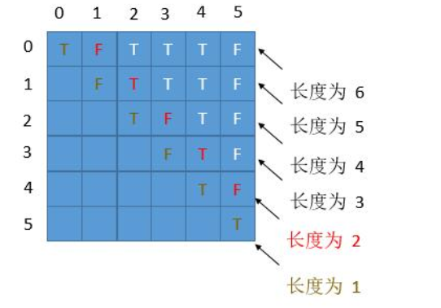

**LeetCode**

**Java  start**

```java
import java.util.*;
 
public class Main {
    public static void main(String[] args) {
        Scanner scanner = new Scanner(System.in);
        String input = scanner.nextLine();
    }
```


### 1、动态规划

#### 1.1 最大子序和

 给定一个整数数组 `nums` ，找到一个具有最大和的连续子数组（子数组最少包含一个元素），返回其最大和。 

```
输入: [-2,1,-3,4,-1,2,1,-5,4],
输出: 6
解释: 连续子数组 [4,-1,2,1] 的和最大，为 6。
```

时间复杂度：O(n)

```java
class Solution {
    public int maxSubArray(int[] nums) {
        int ans = nums[0];
        int sum = 0;
        for(int num: nums) {
            if(sum > 0) {
                sum += num;
            } else {
                sum = num;
            }
            ans = Math.max(ans, sum);
        }
            return ans;
    }
}
```

#### 1.2 爬楼梯

假设你正在爬楼梯。需要 *n* 阶你才能到达楼顶。

每次你可以爬 1 或 2 个台阶。你有多少种不同的方法可以爬到楼顶呢？

```java
输入： 2
输出： 2
解释： 有两种方法可以爬到楼顶。
1.  1 阶 + 1 阶
2.  2 阶
```

```java

public class Solution {
    public int climbStairs(int n) {
        if (n == 1) {
            return 1;
        }
        int[] dp = new int[n + 1];
        dp[1] = 1;
        dp[2] = 2;
        for (int i = 3; i <= n; i++) {
            dp[i] = dp[i - 1] + dp[i - 2];
        }
        return dp[n];
    }
}
```

#### 1.3 最长回文子串

给定一个字符串 `s`，找到 `s` 中最长的回文子串。你可以假设 `s` 的最大长度为 1000。

```java
输入: "babad"
输出: "bab"
注意: "aba" 也是一个有效答案。
```

```java
public String longestPalindrome(String s) {
    int n = s.length();
    String res = "";
    boolean[][] dp = new boolean[n][n];
    for (int i = n - 1; i >= 0; i--) {
        for (int j = i; j < n; j++) {
            dp[i][j] = s.charAt(i) == s.charAt(j) && (j - i < 2 || dp[i + 1][j - 1]); 
            //j - i 代表长度减去 1        
            if (dp[i][j] &&  j - i + 1 > res.length()) {
                res = s.substring(i, j + 1);
            }
        }
    }
    return res;
}

```

#### 1.4 丑数

丑数就是只包含质因数 `2, 3, 5` 的**正整数**。

```
输入: n = 10
输出: 12
解释: 1, 2, 3, 4, 5, 6, 8, 9, 10, 12 是前 10 个丑数。
```

```

class Solution {
    public int nthUglyNumber(int n) {
        int[] dp = new int[n];
        dp[0] = 1;
        int i2 = 0, i3 = 0, i5 = 0;
        for (int i = 1; i < n; i++) {
            int min = Math.min(dp[i2] * 2, Math.min(dp[i3] * 3, dp[i5] * 5));
            if (min == dp[i2] * 2) i2++;
            if (min == dp[i3] * 3) i3++;
            if (min == dp[i5] * 5) i5++;
            dp[i] = min;
        }
        return dp[n - 1];
    }
}
```

#### 1.5 超级丑数

超级丑数是指其所有质因数都是长度为 `k` 的质数列表 `primes` 中的正整数。

```
输入: n = 12, primes = [2,7,13,19]
输出: 32 
解释: 给定长度为 4 的质数列表 primes = [2,7,13,19]，前 12 个超级丑数序列为：[1,2,4,7,8,13,14,16,19,26,28,32] 。
```

```JAVA
public int nthSuperUglyNumber(int n, int[] primes) {

    int[] dp = new int[n];
    dp[0] = 1;

    int k = primes.length;
    int[] index = new int[k];

    for (int i = 1; i < n; i++) {
        int min = Integer.MAX_VALUE;
        for (int j = 0; j < k; j++) {
            if (min > dp[index[j]] * primes[j]) {
                min = dp[index[j]] * primes[j];
            }
            dp[i] = min;
        }
        for (int j = 0; j < k; j++) {
            if (min == dp[index[j]] * primes[j]) {
                index[j]++;
            }
        }
    }
    return dp[n - 1];
}
```


### 2、数组

#### 2.1两数之和

给定 nums = [2, 7, 11, 15], target = 9。因为 nums[0] + nums[1] = 2 + 7 = 9
所以返回 [0, 1]

```java

class Solution {
  public int[] twoSum(int[] nums, int target) {
     int[] indexs = new int[2];
     // 建立k-v ，一一对应的哈希表
     HashMap<Integer,Integer> hash = new HashMap<Integer,Integer>();
     for(int i = 0; i < nums.length; i++){
       if(hash.containsKey(nums[i])){
         indexs[0] = i;
         indexs[1] = hash.get(nums[i]);
         return indexs;
       }
       // 将数据存入 key为补数 ，value为下标
       hash.put(target-nums[i],i);
     }
     return indexs;
  }

}
```

#### 2.2 盛最多水的容器


图中垂直线代表输入数组 [1,8,6,2,5,4,8,3,7]。在此情况下，容器能够容纳水（表示为蓝色部分）的最大值为 49。

```java 
class Solution {
    public int maxArea(int[] height) {
        int i = 0;
        int j = height.length - 1;
        int max = 0;
        while (i < j) {
            if (height[i] <= height[j]) {
                max = Math.max(max, height[i] * (j - i));
                i++;
            } else {
                max = Math.max(max, height[j] * (j - i));
                j--;
            }
        }
        return max;
    }
}
```

#### 2.3 接雨水

给定 n 个非负整数表示每个宽度为 1 的柱子的高度图，计算按此排列的柱子，下雨之后能接多少雨水。


上面是由数组 [0,1,0,2,1,0,1,3,2,1,2,1] 表示的高度图，在这种情况下，可以接 6 个单位的雨水（蓝色部分表示雨水）。 

```
输入: [0,1,0,2,1,0,1,3,2,1,2,1]
输出: 6
```

```java
class Solution {
    public int trap(int[] height) {
        int sum=0,arm=0;
        int left=0,right=height.length-1;
        //双指针找到left，right中小的那个-->arm
        //将l,r中间内容遍历:把少于arm的补齐--补齐的即为水量;
        //补齐的相等层高快速过掉 
        while(left<right){ 
            while(left<=right && height[left]==arm) left++;
            while(right>=left && height[right]==arm) right--;
            if(left>right ) break;
            arm=Math.min(height[left],height[right]);
            for(int i=left;i<=right;i++){
                if(height[i]<arm) {
                    sum+=arm-height[i];
                    height[i]=arm;
                } 
            } 
        }
        return sum; 
    }
} 
```

#### 2.4  数组中的第K个最大元素

```
输入: [3,2,3,1,2,4,5,5,6] 和 k = 4
输出: 4
```


```
class Solution {
    public int findKthLargest(int[] nums, int k) {
        // init heap 'the smallest element first'
        PriorityQueue<Integer> heap =
            new PriorityQueue<Integer>((n1, n2) -> n1 - n2);

        for (int n: nums) {
          heap.add(n);
          if (heap.size() > k)
            heap.poll();
        }
        return heap.poll();        
  }
}
```

#### 2.5 合并排序的数据

给定两个排序后的数组 A 和 B，其中 A 的末端有足够的缓冲空间容纳 B。 编写一个方法，将 B 合并入 A 并排序。

```
输入:
A = [1,2,3,0,0,0], m = 3
B = [2,5,6],       n = 3

输出: [1,2,2,3,5,6]
```

```java
class Solution {
    public void merge(int[] A, int m, int[] B, int n) {
    int k = m+n-1,i=m-1,j=n-1;
	while(i>=0&&j>=0) {
		if (A[i]<B[j]) {
			A[k--]=B[j--];
		}else {
			A[k--]=A[i--];
		}
	}
	while(j>=0) A[k--]=B[j--];
}
}
```


### 3 树

#### 3.1 树的前序、中序和后序遍历

  

```java
public class TreeNode{
    int   val;
    TreeNode left;
    TreeNode right;
    TreeNode(int x){
        val = x;
    }
}
//前序遍历结果：ABDECF
public void preOrder(TreeNode biTree){
    System.out.printf(biTree.val+"");
    TreeNode leftTree=biTree.left;
    if(leftTree!=null){
        preOrder(leftTree);
    }
    TreeNode rightTree=biTree.right;
    if(rightTree!=null){
        preOrder(rightTree);
    }
}
//中序遍历结果：DBEAFC
class Solution {
    public List < Integer > inorderTraversal(TreeNode root) {
        List < Integer > res = new ArrayList < > ();
        helper(root, res);
        return res;
    }

    public void helper(TreeNode root, List < Integer > res) {
        if (root != null) {
            helper(root.left, res);
            res.add(root.val);
            helper(root.right, res);
        }
    }
}
//中序遍历结果（递归）：DBEAFC
//     public List<Integer> inorderTraversal(TreeNode root) {
//             List<Integer> list = new ArrayList<>();
//             Stack<TreeNode> stack = new Stack<>();
//             TreeNode cur = root;
//             while (cur != null || !stack.isEmpty()) {
//                 if (cur != null) {
//                     stack.push(cur);
//                     cur = cur.left;
//                 } else {
//                     cur = stack.pop();
//                     list.add(cur.val);
//                     cur = cur.right;
//                 }
//             }
//             return list;


//后序遍历结果：DEBFCA
public void postOrder(TreeNode biTree){
    TreeNode leftTree = biTree.left;
    if (leftTree != null) {
        postOrder(leftTree);
    }
    TreeNode rightTree = biTree.right;
    if(rightTree != null){
        postOrder(rightTree);
    }
    System.out.printf(biTree.val+"");
}
```

#### 3.2 不同的二叉搜索树

给定一个整数 *n*，求以 1 ... *n* 为节点组成的二叉搜索树有多少种？

```java
输入: 3
输出: 5
解释:
给定 n = 3, 一共有 5 种不同结构的二叉搜索树:

   1         3     3      2      1
    \       /     /      / \      \
     3     2     1      1   3      2
    /     /       \                 \
   2     1         2                 3
```

```java
public class Solution {
  public int numTrees(int n) {
    int[] G = new int[n + 1];
    G[0] = 1;
    G[1] = 1;
    for (int i = 2; i <= n; ++i) {
      for (int j = 1; j <= i; ++j) {
        G[i] += G[j - 1] * G[i - j];
      }
    }
    return G[n];
  }
}
```

#### 3.3 从前序与中序遍历序列构造二叉树

根据一棵树的前序遍历与中序遍历构造二叉树。
你可以假设树中没有重复的元素

```
前序遍历 preorder = [3,9,20,15,7]
中序遍历 inorder = [9,3,15,20,7]
    3
   / \
  9  20
    /  \
   15   7
```

```java
class Solution {
  // start from first preorder element
  int pre_idx = 0;
  int[] preorder;
  int[] inorder;
  HashMap<Integer, Integer> idx_map = new HashMap<Integer, Integer>();

  public TreeNode helper(int in_left, int in_right) {
    // if there is no elements to construct subtrees
    if (in_left == in_right) 
      return null;

    // pick up pre_idx element as a root
    int root_val = preorder[pre_idx];
    TreeNode root = new TreeNode(root_val);

    // root splits inorder list
    // into left and right subtrees
    int index = idx_map.get(root_val);

    // recursion 
    pre_idx++;
    // build left subtree
    root.left = helper(in_left, index);
    // build right subtree
    root.right = helper(index + 1, in_right);
    return root;
  }

  public TreeNode buildTree(int[] preorder, int[] inorder) {
    this.preorder = preorder;
    this.inorder = inorder;

    // build a hashmap value -> its index
    int idx = 0;
    for (Integer val : inorder)
      idx_map.put(val, idx++);
    return helper(0, inorder.length);
  }
}
```

#### 3.4 从中序与后序遍历序列构造二叉树

```java
中序遍历 inorder = [9,3,15,20,7]
后序遍历 postorder = [9,15,7,20,3]
    3
   / \
  9  20
    /  \
   15   7
```

```java
class Solution {
  int post_idx;
  int[] postorder;
  int[] inorder;
  HashMap<Integer, Integer> idx_map = new HashMap<Integer, Integer>();

  public TreeNode helper(int in_left, int in_right) {
    // if there is no elements to construct subtrees
    if (in_left > in_right)
      return null;

    // pick up post_idx element as a root
    int root_val = postorder[post_idx];
    TreeNode root = new TreeNode(root_val);

    // root splits inorder list
    // into left and right subtrees
    int index = idx_map.get(root_val);

    // recursion 
    post_idx--;
    // build right subtree
    root.right = helper(index + 1, in_right);
    // build left subtree
    root.left = helper(in_left, index - 1);
    return root;
  }

  public TreeNode buildTree(int[] inorder, int[] postorder) {
    this.postorder = postorder;
    this.inorder = inorder;
    // start from the last postorder element
    post_idx = postorder.length - 1;

    // build a hashmap value -> its index
    int idx = 0;
    for (Integer val : inorder)
      idx_map.put(val, idx++);
    return helper(0, inorder.length - 1);
  }
}
```

#### 3.5有序链表转换二叉搜索树

给定一个单链表，其中的元素按升序排序，将其转换为高度平衡的二叉搜索树。

本题中，一个高度平衡二叉树是指一个二叉树每个节点 的左右两个子树的高度差的绝对值不超过 1。

```
给定的有序链表： [-10, -3, 0, 5, 9],

一个可能的答案是：[0, -3, 9, -10, null, 5], 它可以表示下面这个高度平衡二叉搜索树：

      0
     / \
   -3   9
   /   /
 -10  5
```

```java
class Solution {

  private ListNode findMiddleElement(ListNode head) {

    // The pointer used to disconnect the left half from the mid node.
    ListNode prevPtr = null;
    ListNode slowPtr = head;
    ListNode fastPtr = head;

    // Iterate until fastPr doesn't reach the end of the linked list.
    while (fastPtr != null && fastPtr.next != null) {
      prevPtr = slowPtr;
      slowPtr = slowPtr.next;
      fastPtr = fastPtr.next.next;
    }

    // Handling the case when slowPtr was equal to head.
    if (prevPtr != null) {
      prevPtr.next = null;
    }

    return slowPtr;
  }

  public TreeNode sortedListToBST(ListNode head) {

    // If the head doesn't exist, then the linked list is empty
    if (head == null) {
      return null;
    }
    // Find the middle element for the list.
    ListNode mid = this.findMiddleElement(head);

    // The mid becomes the root of the BST.
    TreeNode node = new TreeNode(mid.val);

    // Base case when there is just one element in the linked list
    if (head == mid) {
      return node;
    }
    // Recursively form balanced BSTs using the left and right halves of the original list.
    node.left = this.sortedListToBST(head);
    node.right = this.sortedListToBST(mid.next);
    return node;
  }
}
```


#### 3.6 被围绕的区域

给定一个二维的矩阵，包含 `'X'` 和 `'O'`（**字母 O**）。找到所有被 `'X'` 围绕的区域，并将这些区域里所有的 `'O'` 用 `'X'` 填充。

```
X X X X         
X O O X
X X O X
X O X X    
输出：
X X X X
X X X X
X X X X
X O X X
```

```java
class Solution {
    public void solve(char[][] board) {
        if (board == null || board.length == 0) return;
        int m = board.length;
        int n = board[0].length;
        for (int i = 0; i < m; i++) {
            for (int j = 0; j < n; j++) {
                // 从边缘o开始搜索
                boolean isEdge = i == 0 || j == 0 || i == m - 1 || j == n - 1;
                if (isEdge && board[i][j] == 'O') {
                    dfs(board, i, j);
                }
            }
        }

        for (int i = 0; i < m; i++) {
            for (int j = 0; j < n; j++) {
                if (board[i][j] == 'O') {
                    board[i][j] = 'X';
                }
                if (board[i][j] == '#') {
                    board[i][j] = 'O';
                }
            }
        }
    }

    public void dfs(char[][] board, int i, int j) {
        if (i < 0 || j < 0 || i >= board.length  || j >= board[0].length || board[i][j] == 'X' || board[i][j] == '#') {
            // board[i][j] == '#' 说明已经搜索过了. 
            return;
        }
        board[i][j] = '#';
        dfs(board, i - 1, j); // 上
        dfs(board, i + 1, j); // 下
        dfs(board, i, j - 1); // 左
        dfs(board, i, j + 1); // 右
    }
}
```

#### 3.7 岛屿数量

给定一个由 '1'（陆地）和 '0'（水）组成的的二维网格，计算岛屿的数量。一个岛被水包围，并且它是通过水平方向或垂直方向上相邻的陆地连接而成的。你可以假设网格的四个边均被水包围。

```
输入:
11110
11010
11000
00000

输出: 1
```

```java
class Solution {
  void dfs(char[][] grid, int r, int c) {
    int nr = grid.length;
    int nc = grid[0].length;

    if (r < 0 || c < 0 || r >= nr || c >= nc || grid[r][c] == '0') 		{
          return;
        }

        grid[r][c] = '0';
        dfs(grid, r - 1, c);
        dfs(grid, r + 1, c);
        dfs(grid, r, c - 1);
        dfs(grid, r, c + 1);
    }
  public int numIslands(char[][] grid) {
    if (grid == null || grid.length == 0) {
      return 0;
    }
    int nr = grid.length;
    int nc = grid[0].length;
    int num_islands = 0;
    for (int r = 0; r < nr; ++r) {
      for (int c = 0; c < nc; ++c) {
        if (grid[r][c] == '1') {
          ++num_islands;
          dfs(grid, r, c);
        }
      }
    }

    return num_islands;
  }
}
```


### 4 排序

#### 4.1 合并重叠区间

 给出一个区间的集合，请合并所有重叠的区间。 

```java
输入: [[1,3],[2,6],[8,10],[15,18]]
输出: [[1,6],[8,10],[15,18]]
解释: 区间 [1,3] 和 [2,6] 重叠, 将它们合并为 [1,6].

```

```java

class Solution {
    public int[][] merge(int[][] arr) {
        if(arr == null || arr.length<=1)
            return arr;
        List<int[]> list = new ArrayList<>();
        //Arrays.sort(arr,(a,b)->a[0]-b[0]);
        Arrays.sort(arr,new Comparator<int[]>(){
            @Override
            public int compare(int[] a,int[] b){
                return a[0]-b[0];
            }
        });
        int i=0;
        int n = arr.length;
        while(i<n){
            int left = arr[i][0];
            int right = arr[i][1];
            while(i<n-1 && right>=arr[i+1][0]){
                right = Math.max(right,arr[i+1][1]);
                i++;
            }
            list.add(new int[] {left,right});
            i++;
        }
        return list.toArray(new int[list.size()][2]);

    }
}
```

#### 4.2 数据流中的中位数

```java
import java.util.PriorityQueue;
public class MedianFinder {
    private int count;
    private PriorityQueue<Integer> maxheap;
    private PriorityQueue<Integer> minheap;
    public MedianFinder() {
        count = 0;
        maxheap = new PriorityQueue<>((x, y) -> y - x);
        minheap = new PriorityQueue<>();
    }

    public void addNum(int num) {
        count += 1;
        maxheap.offer(num);
        minheap.add(maxheap.poll());
        // 如果两个堆合起来的元素个数是奇数，小顶堆要拿出堆顶元素给大顶堆
        if ((count & 1) != 0) {
            maxheap.add(minheap.poll());
        }
    }

    public double findMedian() {
        if ((count & 1) == 0) {
            // 如果两个堆合起来的元素个数是偶数，数据流的中位数就是各自堆顶元素的平均值
            return (double) (maxheap.peek() + minheap.peek()) / 2;
        } else {
            // 如果两个堆合起来的元素个数是奇数，数据流的中位数大顶堆的堆顶元素
            return (double) maxheap.peek();
        }
    }
}

```

#### 4.3 颜色分类

给定一个包含红色、白色和蓝色，一共 n 个元素的数组，原地对它们进行排序，使得相同颜色的元素相邻，并按照红色、白色、蓝色顺序排列。(内存限制）

```
输入: [2,0,2,1,1,0]
输出: [0,0,1,1,2,2]
```


```java

class Solution {
  /*
  荷兰三色旗问题解
  */
  public void sortColors(int[] nums) {
    // 对于所有 idx < i : nums[idx < i] = 0
    // j是当前考虑元素的下标
    int p0 = 0, curr = 0;
    // 对于所有 idx > k : nums[idx > k] = 2
    int p2 = nums.length - 1;

    int tmp;
    while (curr <= p2) {
      if (nums[curr] == 0) {
        // 交换第 p0个和第curr个元素
        // i++，j++
        tmp = nums[p0];
        nums[p0++] = nums[curr];
        nums[curr++] = tmp;
      }
      else if (nums[curr] == 2) { 
        // 交换第k个和第curr个元素
        // p2--
        tmp = nums[curr];
        nums[curr] = nums[p2];
        nums[p2--] = tmp;
      }
      else curr++;
    }
  }
}
```

#### 4.4 最大数

给定一组非负整数，重新排列它们的顺序使之组成一个最大的整数。

```
输入: [10,2]
输出: 210
```


```java
class Solution {
    public String largestNumber(int[] nums) {
        List<String> list = new ArrayList<>(nums.length);
        for (int num : nums) {
            list.add(Integer.toString(num));
        }
        list.sort((a, b) -> (b + a).compareTo(a + b));
        StringBuilder sb = new StringBuilder();
        boolean flag = true;
        for (String num : list) {
            if (flag && "0".equals(num)) {
                continue;
            }
            sb.append(num);
            flag = false;
        }
        return sb.length() == 0 ? "0" : sb.toString();
    }  
}
```


### 5 链表

#### 5.1  两数相加

给出两个非空 的链表用来表示两个非负的整数。其中，它们各自的位数是按照逆序的方式存储的，并且它们的每个节点只能存储一位数字。如果，我们将这两个数相加起来，则会返回一个新的链表来表示它们的和。

```java
输入：(2 -> 4 -> 3) + (5 -> 6 -> 4)
输出：7 -> 0 -> 8
原因：342 + 465 = 807
```

```java
public ListNode addTwoNumbers(ListNode l1, ListNode l2) {
    ListNode dummyHead = new ListNode(0);
    ListNode p = l1, q = l2, curr = dummyHead;
    int carry = 0;
    while (p != null || q != null) {
        int x = (p != null) ? p.val : 0;
        int y = (q != null) ? q.val : 0;
        int sum = carry + x + y;
        carry = sum / 10;
        curr.next = new ListNode(sum % 10);
        curr = curr.next;
        if (p != null) p = p.next;
        if (q != null) q = q.next;
    }
    if (carry > 0) {
        curr.next = new ListNode(carry);
    }
    return dummyHead.next;
}

```

#### 5.2合并K个排序链表

合并 *k* 个排序链表，返回合并后的排序链表。请分析和描述算法的复杂度。

```
输入:
[
  1->4->5,
  1->3->4,
  2->6
]
输出: 1->1->2->3->4->4->5->6
```

```java
class Solution {
   public ListNode mergeKLists(ListNode[] lists) {
        if (lists == null || lists.length == 0) return null;
        PriorityQueue<ListNode> queue = new PriorityQueue<>(lists.length, new Comparator<ListNode>() {
            @Override
            public int compare(ListNode o1, ListNode o2) {
                if (o1.val < o2.val) return -1;
                else if (o1.val == o2.val) return 0;
                else return 1;
            }
        });
        ListNode dummy = new ListNode(0);
        ListNode p = dummy;
        for (ListNode node : lists) {
            if (node != null) queue.add(node);
        }
        while (!queue.isEmpty()) {
            p.next = queue.poll();
            p = p.next;
            if (p.next != null) queue.add(p.next);
        }
        return dummy.next;
    }
}
```


### 6 字符串

#### 6.1 无重复字符的最长子串

给定一个字符串，请你找出其中不含有重复字符的 **最长子串** 的长度。

```java
输入: "abcabcbb"
输出: 3 
解释: 因为无重复字符的最长子串是 "abc"，所以其长度为 3。
```

```java

public class Solution {
    public int lengthOfLongestSubstring(String s) {
        int n = s.length(), ans = 0;
        Map<Character, Integer> map = new HashMap<>(); // current index of character
        for (int j = 0, i = 0; j < n; j++) {
            if (map.containsKey(s.charAt(j))) {
                i = Math.max(map.get(s.charAt(j)), i);
            }
            ans = Math.max(ans, j - i + 1);
            map.put(s.charAt(j), j + 1);
        }
        return ans;
    }
}
```

#### 6.2 Z字形变换

将一个给定字符串根据给定的行数，以从上往下、从左到右进行 Z 字形排列。

比如输入字符串为 `"LEETCODEISHIRING"` 行数为 3 时，排列如下：

```
L   C   I   R
E T O E S I I G
E   D   H   N
输入：LEETCODEISHIRING
输出：LCIRETOESIIGEDHN
```


```java
class Solution {
    public String convert(String s, int numRows) {

        if (numRows == 1) return s;

        List<StringBuilder> rows = new ArrayList<>();
        for (int i = 0; i < Math.min(numRows, s.length()); i++)
            rows.add(new StringBuilder());

        int curRow = 0;
        boolean goingDown = false;

        for (char c : s.toCharArray()) {
            rows.get(curRow).append(c);
            if (curRow == 0 || curRow == numRows - 1) goingDown = !goingDown;
            curRow += goingDown ? 1 : -1;
        }

        StringBuilder ret = new StringBuilder();
        for (StringBuilder row : rows) ret.append(row);
        return ret.toString();
    }
}
```

#### 6.3 括号生成

给出 n 代表生成括号的对数，请你写出一个函数，使其能够生成所有可能的并且有效的括号组合。

例如，给出 n = 3，生成结果为：

```
[
  "((()))",
  "(()())",
  "(())()",
  "()(())",
  "()()()"
]
```

```java
class Solution {
    public List<String> generateParenthesis(int n) {
        List<String> ans = new ArrayList();
        backtrack(ans, "", 0, 0, n);
        return ans;
    }

    public void backtrack(List<String> ans, String cur, int open, int close, int max){
        if (cur.length() == max * 2) {
            ans.add(cur);
            return;
        }

        if (open < max)
            backtrack(ans, cur+"(", open+1, close, max);
        if (close < open)
            backtrack(ans, cur+")", open, close+1, max);
    }
}
```


### 7 栈

#### 7.1 有效的括号

给定一个只包括 `'('`，`')'`，`'{'`，`'}'`，`'['`，`']'` 的字符串，判断字符串是否有效。

```
输入: "()[]{}"
输出: true
```

```java
class Solution {
  private HashMap<Character, Character> mappings;
  public Solution() {
    this.mappings = new HashMap<Character, Character>();
    this.mappings.put(')', '(');
    this.mappings.put('}', '{');
    this.mappings.put(']', '[');
  }
  public boolean isValid(String s) {
    // Initialize a stack to be used in the algorithm.
    Stack<Character> stack = new Stack<Character>();
    for (int i = 0; i < s.length(); i++) {
      char c = s.charAt(i);
      if (this.mappings.containsKey(c)) {
        char topElement = stack.empty() ? '#' : stack.pop();
        if (topElement != this.mappings.get(c)) {
          return false;
        }
      } else {
        stack.push(c);
      }
    }
    return stack.isEmpty();
  }
}
```

#### 7.2 简化路径

以 Unix 风格给出一个文件的**绝对路径**，你需要简化它。或者换句话说，将其转换为规范路径。请注意，返回的规范路径必须始终以斜杠 / 开头，并且两个目录名之间必须只有一个斜杠 /。最后一个目录名（如果存在）不能以 / 结尾。此外，规范路径必须是表示绝对路径的最短字符串。

```
输入："/a/./b/../../c/"
输出："/c"
```

```java
  public String simplifyPath(String path) {
        String[] s = path.split("/");
        Stack<String> stack = new Stack<>();
        
        for (int i = 0; i < s.length; i++) {
            if (!stack.isEmpty() && s[i].equals(".."))
                stack.pop();
            else if (!s[i].equals("") && !s[i].equals(".") && !s[i].equals(".."))
                stack.push(s[i]);
        }
        if (stack.isEmpty())
            return "/";

        StringBuffer res = new StringBuffer();
        for (int i = 0; i < stack.size(); i++) {
            res.append("/" + stack.get(i));
        }
        return res.toString();
    }
```

#### 7.3前K个高频元素

给定一个非空的整数数组，返回其中出现频率前 **k** 高的元素。

```
输入: nums = [1,1,1,2,2,3], k = 2
输出: [1,2]
```

```
class Solution {
  public List<Integer> topKFrequent(int[] nums, int k) {
    // build hash map : character and how often it appears
    HashMap<Integer, Integer> count = new HashMap();
    for (int n: nums) {
      count.put(n, count.getOrDefault(n, 0) + 1);
    }

    // init heap 'the less frequent element first'
    PriorityQueue<Integer> heap =
            new PriorityQueue<Integer>((n1, n2) -> count.get(n1) - count.get(n2));

    // keep k top frequent elements in the heap
    for (int n: count.keySet()) {
      heap.add(n);
      if (heap.size() > k)
        heap.poll();
    }

    // build output list
    List<Integer> top_k = new LinkedList();
    while (!heap.isEmpty())
      top_k.add(heap.poll());
    Collections.reverse(top_k);
    return top_k;
  }
}
```

### 8 、贪心算法

#### 8.1 跳跃游戏2

```
输入: [2,3,1,1,4]
输出: 2
解释: 跳到最后一个位置的最小跳跃数是 2。
     从下标为 0 跳到下标为 1 的位置，跳 1 步，然后跳 3 步到达数组的最后一个位置。
```


```java
public int jump(int[] nums) {
	int ans = 0;
	int end = 0;
	int maxPos = 0;
	for (int i = 0; i < nums.length - 1; i++)
	{
		maxPos = Math.max(nums[i] + i, maxPos);
		if (i == end)
		{
			end = maxPos;
			ans++;
		}
	}
	return ans;
}
```

#### 8.2 加油站

在一条环路上有 N 个加油站，其中第 i 个加油站有汽油 gas[i] 升。

你有一辆油箱容量无限的的汽车，从第 i 个加油站开往第 i+1 个加油站需要消耗汽油 cost[i] 升。你从其中的一个加油站出发，开始时油箱为空。

如果你可以绕环路行驶一周，则返回出发时加油站的编号，否则返回 -1。

```
输入: 
gas  = [1,2,3,4,5]
cost = [3,4,5,1,2]
输出: 3
```

```
class Solution {
  public int canCompleteCircuit(int[] gas, int[] cost) {
    int n = gas.length;
    int total_tank = 0;
    int curr_tank = 0;
    int starting_station = 0;
    for (int i = 0; i < n; ++i) {
      total_tank += gas[i] - cost[i];
      curr_tank  += gas[i] - cost[i];
      // If one couldn't get here,
      if (curr_tank < 0) {
        // Pick up the next station as the starting one.
        starting_station = i + 1;
        // Start with an empty tank.
        curr_tank = 0;
      }
    }
    return total_tank >= 0 ? starting_station : -1;
  }
}
```

#### 8.3 分发糖果

老师想给孩子们分发糖果，有 N 个孩子站成了一条直线，老师会根据每个孩子的表现，预先给他们评分。

你需要按照以下要求，帮助老师给这些孩子分发糖果：

每个孩子至少分配到 1 个糖果。
相邻的孩子中，评分高的孩子必须获得更多的糖果。
那么这样下来，老师至少需要准备多少颗糖果呢？

```
输入: [1,0,2]
输出: 5
解释: 你可以分别给这三个孩子分发 2、1、2 颗糖果。
```

```java
class Solution {
    public int candy(int[] ratings) {
        int[] left = new int[ratings.length];
        int[] right = new int[ratings.length];
        Arrays.fill(left, 1);
        Arrays.fill(right, 1);
        for(int i = 1; i < ratings.length; i++)
            if(ratings[i] > ratings[i - 1]) left[i] = left[i - 1] + 1;
        int count = left[ratings.length - 1];
        for(int i = ratings.length - 2; i >= 0; i--) {
            if(ratings[i] > ratings[i + 1]) right[i] = right[i + 1] + 1;
            count += Math.max(left[i], right[i]);
        }
        return count;
    }
}
```


#### 8.4 去除重复字母

给定一个仅包含小写字母的字符串，去除字符串中重复的字母，使得每个字母只出现一次。需保证返回结果的字典序最小（要求不能打乱其他字符的相对位置）。

```
输入: "bcabc"
输出: "abc"
```


```java
import java.util.Stack;

public class Solution {

    public String removeDuplicateLetters(String s) {
        int len = s.length();
        // 特判
        if (len < 2) {
            return s;
        }

        // 记录是否在已经得到的字符串中
        boolean[] set = new boolean[26];

        // 记录每个字符出现的最后一个位置
        int[] lastAppearIndex = new int[26];
        for (int i = 0; i < len; i++) {
            lastAppearIndex[s.charAt(i) - 'a'] = i;
        }

        Stack<Character> stack = new Stack<>();
        for (int i = 0; i < len; i++) {
            char currentChar = s.charAt(i);
            if (set[currentChar - 'a']) {
                continue;
            }

            while (!stack.empty() && stack.peek() > currentChar && lastAppearIndex[stack.peek() - 'a'] >= i) {
                char top = stack.pop();
                set[top - 'a'] = false;
            }

            stack.push(currentChar);
            set[currentChar - 'a'] = true;
        }

        StringBuilder stringBuilder = new StringBuilder();
        while (!stack.empty()) {
            stringBuilder.insert(0, stack.pop());
        }
        return stringBuilder.toString();
    }
}

```

### 9 位运算

#### 9.1 只出现一次的数字

给定一个非空整数数组，除了某个元素只出现一次以外，其余每个元素均出现了三次。找出那个只出现了一次的元素。

```
输入: [2,2,3,2]
输出: 3
```


```java
class Solution {
  public int singleNumber(int[] nums) {
    int seenOnce = 0, seenTwice = 0;

    for (int num : nums) {
      seenOnce = ~seenTwice & (seenOnce ^ num);
      seenTwice = ~seenOnce & (seenTwice ^ num);
    }

    return seenOnce;
  }
}

```

#### 9.2  数字范围按位与

给定范围 [m, n]，其中 0 <= m <= n <= 2147483647，返回此范围内所有数字的按位与（包含 m, n 两端点）。

```
输入: [5,7]
输出: 4
```

```java
class Solution
{
public int rangeBitwiseAnd(int m, int n)
    {
        int count = 0; // 统计移位次数
        while (m != n)
        {
            m >>= 1;
            n >>= 1;
            count++;
        }
        n <<= count;
        return n;
    }
}
```

#### 9.3 只出现一次数字2

给定一个整数数组 `nums`，其中恰好有两个元素只出现一次，其余所有元素均出现两次。 找出只出现一次的那两个元素。

```
输入: [1,2,1,3,2,5]
输出: [3,5]
```

```java
class Solution {
  public int[] singleNumber(int[] nums) {

    int bitmask = 0;
    for (int num : nums) bitmask ^= num;
    int diff = bitmask & (-bitmask);

    int x = 0;
    for (int num : nums) if ((num & diff) != 0) x ^= num;

    return new int[]{x, bitmask^x};
  }
}
```

### 10  图

#### 10.1 课程表

现在你总共有 n 门课需要选，记为 0 到 n-1。在选修某些课程之前需要一些先修课程。 例如，想要学习课程 0 ，你需要先完成课程 1 ，我们用一个匹配来表示他们: [0,1]

```
输入: 2, [[1,0]] 
输出: true
解释: 总共有 2 门课程。学习课程 1 之前，你需要完成课程 0。所以这是可能的。
```

```java
import java.util.HashSet;
import java.util.LinkedList;
import java.util.Queue;
public class Solution {
    public boolean canFinish(int numCourses, int[][] prerequisites) {
        if (numCourses <= 0) {
            return false;
        }
        // 特判
        int pLen = prerequisites.length;
        if (pLen == 0) {
            return true;
        }
        int[] inDegree = new int[numCourses];
        HashSet<Integer>[] adj = new HashSet[numCourses];
        for (int i = 0; i < numCourses; i++) {
            adj[i] = new HashSet<>();
        }
        for (int[] p : prerequisites) {
            inDegree[p[0]]++;
            adj[p[1]].add(p[0]);
        }
        Queue<Integer> queue = new LinkedList<>();
        // 首先加入入度为 0 的结点
        for (int i = 0; i < numCourses; i++) {
            if (inDegree[i] == 0) {
                queue.add(i);
            }
        }
        // 记录已经出队的课程数量
        int cnt = 0;
        while (!queue.isEmpty()) {
            Integer top = queue.poll();
            cnt += 1;
            // 遍历当前出队结点的所有后继结点
            for (int successor : adj[top]) {
                inDegree[successor]--;
                if (inDegree[successor] == 0) {
                    queue.add(successor);
                }
            }
        }
        return cnt == numCourses;
    }
}
```

#### 10.2 最小高度树（310）

对于一个具有树特征的无向图，我们可选择任何一个节点作为根。图因此可以成为树，在所有可能的树中，具有最小高度的树被称为最小高度树。给出这样的一个图，写出一个函数找到所有的最小高度树并返回他们的根节点。

    输入: n = 6, edges = [[0, 3], [1, 3], [2, 3], [4, 3], [5, 4]]
    0  1  2
      \ | /
        3
        |
        4
        |
        5 


```java
class Solution {
public List<Integer> findMinHeightTrees(int n, int[][] edges) {
        List<Integer> ans = new ArrayList<>();
        if (n == 1) {
            ans.add(0);
            return ans;
        }
        int[] degree = new int[n];
        List<List<Integer>> map = new ArrayList<>();
        for (int i = 0; i < n; i++) {
            map.add(new ArrayList<>());
        }
        for (int[] edge : edges) {
            degree[edge[0]]++;
            degree[edge[1]]++;
            map.get(edge[0]).add(edge[1]);
            map.get(edge[1]).add(edge[0]);
        }
        Queue<Integer> queue = new LinkedList<>();
        for (int i = 0; i < n; i++) {
            if (degree[i] == 1) {
                queue.offer(i);
            }
        }
        while (!queue.isEmpty()) {
            ans = new ArrayList<>();
            int size = queue.size();
            for (int i = 0; i < size; i++) {
                int cur = queue.poll();
                ans.add(cur);
                List<Integer> nexts = map.get(cur);
                for (Integer next : nexts) {
                    degree[next]--;
                    if (degree[next] == 1) {
                        queue.offer(next);
                    }
                }
            }
        }
        return ans;
    }
}
```

